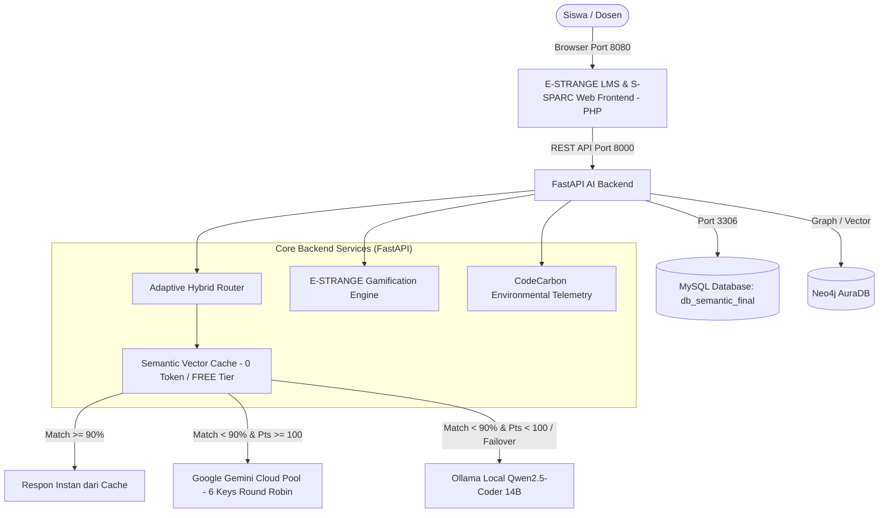

# 📘 S-SPARC AI & E-STRANGE Platform - Official Production Deployment Guide

Dokumentasi resmi dan panduan teknis langkah demi langkah untuk melakukan instalasi, konfigurasi, dan deployment sistem **S-SPARC AI Assistant (FastAPI)** yang terintegrasi dengan **E-STRANGE Learning Management Platform (PHP)**.

---

## 📑 Daftar Isi
1. [Arsitektur Sistem](#1-arsitektur-sistem)
2. [Kebutuhan Sistem (Prerequisites)](#2-kebutuhan-sistem-prerequisites)
3. [Struktur Direktori Proyek](#3-struktur-direktori-proyek)
4. [Langkah 1: Setup Database MySQL](#langkah-1-setup-database-mysql)
5. [Langkah 2: Konfigurasi Environment (.env)](#langkah-2-konfigurasi-environment-env)
6. [Langkah 3: Setup Ollama Local Runtime (Model AI Lokal)](#langkah-3-setup-ollama-local-runtime)
7. [Langkah 4: Setup & Menjalankan Backend FastAPI](#langkah-4-setup--menjalankan-backend-fastapi)
8. [Langkah 5: Setup & Menjalankan Web Frontend (E-STRANGE)](#langkah-5-setup--menjalankan-web-frontend-e-strange)
9. [Langkah 6: Cara Cepat 1-Click Launch (Windows)](#langkah-6-cara-cepat-1-click-launch-windows)
10. [Langkah 7: Deployment Server Produksi (Linux VPS / Ubuntu)](#langkah-7-deployment-server-produksi-linux-vps)
11. [Langkah 8: Verifikasi & Uji Coba Sistem](#langkah-8-verifikasi--uji-coba-sistem)
12. [Troubleshooting & Solusi Masalah Umum](#troubleshooting--solusi-masalah-umum)

---

## 1. Arsitektur Sistem

S-SPARC dan E-STRANGE mengadopsi arsitektur **Hybrid AI Engine**:



### Komponen Utama:
1. **FastAPI Backend (Port 8000)**: Gateway AI, routing adaptif, autentikasi, manajemen token, kalkulasi jejak karbon (Wh, CO2e, mL H2O), dan integrasi poin gamifikasi.
2. **E-STRANGE PHP Web (Port 8080)**: Portal pembelajaran, submission tugas kode, peer review rating, plagiarism check, dan antarmuka AI Assistant.
3. **MySQL Database (Port 3306)**: Menyimpan tabel pengguna, riwayat chat, course, embedding kode, dan log emisi.
4. **Ollama Local Engine (Port 11434)**: Menjalankan model `qwen2.5-coder:14b` untuk inferensi on-premise / offline fallback.
5. **Google Gemini Pool (Cloud)**: Rotasi 6 API Keys (`GEMINI_API_KEY_1..6`) dengan model `gemini-2.0-flash-lite`.

---

## 2. Kebutuhan Sistem (Prerequisites)

### A. Kebutuhan Hardware
| Komponen | Spesifikasi Minimum | Spesifikasi Rekomendasi (GPU) |
| :--- | :--- | :--- |
| **CPU** | 4 Cores (Intel i5 / AMD Ryzen 5) | 8+ Cores (Intel i7 / Ryzen 7) |
| **RAM** | 16 GB | 32 GB |
| **GPU** | Tidak wajib (CPU Inference) | NVIDIA RTX 3060 / 4060 (12GB+ VRAM, CUDA 12.1) |
| **Penyimpanan** | 20 GB SSD kosong | 50 GB NVMe SSD |
| **OS** | Windows 10/11 atau Ubuntu 22.04 LTS | Ubuntu 22.04 LTS Server / Windows Server |

### B. Kebutuhan Software
1. **Python**: Versi 3.10 hingga 3.13 (disarankan 3.11/3.12).
2. **PHP**: Versi 8.1 atau lebih tinggi (dengan ekstensi `pdo_mysql`, `curl`, `mbstring`, `openssl`).
3. **Composer**: Versi 2.x (Dependency manager PHP).
4. **MySQL / MariaDB**: Versi MySQL 8.0+ atau MariaDB 10.5+.
5. **Ollama**: Versi terbaru ([Download Ollama](https://ollama.com/download)).
6. **Docker & Docker Compose** (Opsional untuk containerized database).

---

## 3. Struktur Direktori Proyek

```text
c:\S-SPARC_DEPLOY\
├── backend/                   # Core FastAPI Backend
│   ├── api/                   # Router endpoints (auth, ai_chat, domain, admin, health)
│   ├── core/                  # Database connectors, prompts, security
│   ├── models/                # Pydantic schemas & DTOs
│   ├── services/              # Adaptive Router, AI Engine, Gamification, Sustainability
│   └── main.py                # FastAPI Application Factory
├── estrange/                  # E-STRANGE LMS & S-SPARC Web Portal (PHP)
│   ├── assets/                # CSS, JS, Vendor UI
│   ├── config/                # Konfigurasi database & koneksi PHP
│   └── index.php              # Entrypoint Web LMS
├── frontend/                  # Standalone S-SPARC PHP Web Frontend
├── database/                  # Skema dan dump database SQL
│   └── db_semantic_vfinal.sql # Initial Dump Database S-SPARC
├── semantic_similarity/       # Model pkl dan modul retrieval semantik
├── pretrained_model/          # Bobot embedding lokal (LaBSE, E5, MPNet)
├── docs/                      # Dokumentasi teknis & OpenAPI specs
├── .env                       # File konfigurasi environment aktif
├── .env.example               # Template variabel environment
├── docker-compose.yml         # Konfigurasi Docker MySQL & PHPMyAdmin
├── requirements.txt           # Python production dependencies
├── run_fastapi.py             # Script runner FastAPI
├── start_backend.bat          # 1-Click launcher backend (Windows)
├── start_frontend.bat         # 1-Click launcher frontend (Windows)
└── start_full_system.bat      # 1-Click launcher seluruh sistem (Windows)
```

---

## Langkah 1: Setup Database MySQL

### Opsi A: Menggunakan MySQL Lokal (XAMPP / Native MySQL)
1. Buka MySQL client (HeidiSQL / DBeaver / phpMyAdmin / CLI).
2. Buat database baru bernama `db_semantic_final`:
   ```sql
   CREATE DATABASE db_semantic_final CHARACTER SET utf8mb4 COLLATE utf8mb4_unicode_ci;
   ```
3. Import file `database/db_semantic_vfinal.sql`:
   ```bash
   # Via Command Prompt / Terminal:
   mysql -u root -p db_semantic_final < database/db_semantic_vfinal.sql
   ```

### Opsi B: Menggunakan Docker Compose (Instan)
Jalankan container MySQL 8 dan PHPMyAdmin:
```bash
docker compose up -d
```
- **MySQL Port**: `3306` (User: `root`, Password: `passwordku`, DB: `db_semantic`)
- **PHPMyAdmin Port**: Akses di `http://localhost:8080` untuk mengelola tabel.

---

## Langkah 2: Konfigurasi Environment (.env)

1. Salin template `.env.example` menjadi `.env`:
   ```bash
   # Windows (CMD / PowerShell):
   copy .env.example .env
   
   # Linux / macOS:
   cp .env.example .env
   ```

2. Buka file `.env` dengan text editor dan sesuaikan isinya:

```env
# === 1. Google Gemini Multi-Provider Pool (Cloud LLM) ===
GEMINI_API_KEY_1=AIzaSy...IsiKey1Anda...
GEMINI_API_KEY_2=AIzaSy...IsiKey2Anda...
GEMINI_API_KEY_3=AIzaSy...IsiKey3Anda...
GEMINI_API_KEY_4=AIzaSy...IsiKey4Anda...
GEMINI_API_KEY_5=
GEMINI_API_KEY_6=
GEMINI_MODEL=gemini-2.0-flash-lite

# === 2. Ollama Local LLM Runtime (On-Premises) ===
OLLAMA_BASE_URL=http://localhost:11434
OLLAMA_MODEL=qwen2.5-coder:14b

# === 3. Hybrid Routing & Gamification Rules ===
MIN_POINTS_CLOUD=100
POINTS_PER_CLOUD_REQUEST=10
GAME_OFF_TOKEN_LIMIT=5000

# === 4. Application Security ===
SECRET_KEY=isi-random-string-rahasia-minimal-32-karakter
FLASK_SECRET_KEY=isi-random-string-rahasia-minimal-32-karakter

# === 5. MySQL Database Configuration ===
MYSQL_HOST=127.0.0.1
MYSQL_PORT=3306
MYSQL_USER=root
MYSQL_PASSWORD=password_database_anda
MYSQL_DB=db_semantic_final

# === 6. Sustainability / CodeCarbon Defaults ===
CODECARBON_COUNTRY_ISO_CODE=IDN
CODECARBON_PUE=1.12
```

---

## Langkah 3: Setup Ollama Local Runtime

Model AI lokal digunakan ketika:
- Siswa memiliki poin gamifikasi < 100 (pada Game ON course).
- Token kuota telah melampaui 5000 (pada Game OFF course).
- Seluruh Gemini API Key mengalami HTTP 429 Rate Limit (Failover otomatis).

### Cara Instalasi & Menjalankan Ollama:
1. Unduh dan install Ollama dari [https://ollama.com](https://ollama.com).
2. Buka Terminal / PowerShell dan unduh model:
   ```bash
   ollama pull qwen2.5-coder:14b
   ```
   *(Untuk perangkat dengan RAM < 16GB, Anda dapat menggunakan model yang lebih ringan: `ollama pull qwen2.5-coder:7b` lalu ubah `OLLAMA_MODEL=qwen2.5-coder:7b` di `.env`)*.
3. Pastikan service Ollama aktif di background pada `http://localhost:11434`.

---

## Langkah 4: Setup & Menjalankan Backend FastAPI

### 1. Buat Virtual Environment Python
```bash
# Di direktori c:\S-SPARC_DEPLOY
python -m venv .venv

# Aktivasi di Windows:
.venv\Scripts\activate

# Aktivasi di Linux/macOS:
source .venv/bin/activate
```

### 2. Install Dependencies
```bash
pip install --upgrade pip
pip install -r requirements.txt
```

> **Catatan untuk Akselerasi GPU NVIDIA (CUDA):**
> Jika server memiliki GPU NVIDIA, install PyTorch dengan CUDA 12.1:
> ```bash
> pip install torch torchvision torchaudio --index-url https://download.pytorch.org/whl/cu121
> ```

### 3. Jalankan Server FastAPI
- **Mode Development (Hot-Reload):**
  ```bash
  python -m uvicorn backend.main:app --host 0.0.0.0 --port 8000 --reload
  ```
- **Mode Production (Multi-Worker):**
  ```bash
  python -m uvicorn backend.main:app --host 0.0.0.0 --port 8000 --workers 4
  ```

---

## Langkah 5: Setup & Menjalankan Web Frontend (E-STRANGE)

### 1. Install Dependensi PHP (Composer)
```bash
cd estrange
composer install --no-dev --optimize-autoloader
cd ..
```

### 2. Jalankan Web Server Frontend
- **Mode Development / Testing Cepat (Built-in Server PHP):**
  ```bash
  cd estrange
  php -S 0.0.0.0:8080
  ```
- **Mode Production (Web Server):**
  Arahkan Virtual Host Apache atau Nginx ke direktori `c:\S-SPARC_DEPLOY\estrange` (atau `/var/www/s-sparc/estrange`).

---

## Langkah 6: Cara Cepat 1-Click Launch (Windows)

Untuk lingkungan Windows, Anda cukup menggunakan script batch yang telah disediakan:

1. **Jalankan Seluruh Sistem (Backend + Frontend):**
   - Dobel klik file `start_full_system.bat`.
   - Sistem akan membuka dua jendela terminal: Backend pada Port 8000 dan Frontend pada Port 8080.
2. **Jalankan Komponen Terpisah:**
   - `start_backend.bat` -> Memulai FastAPI Backend.
   - `start_frontend.bat` -> Memulai E-STRANGE Web Portal.

---

## Langkah 7: Deployment Server Produksi (Linux VPS)

Untuk deployment permanen di server Ubuntu / Debian VPS:

### 1. Buat Systemd Service untuk Backend FastAPI
Buat file `/etc/systemd/system/ssparc-backend.service`:
```ini
[Unit]
Description=S-SPARC FastAPI AI Backend Service
After=network.target mysql.service

[Service]
User=www-data
Group=www-data
WorkingDirectory=/var/www/s-sparc
Environment="PATH=/var/www/s-sparc/.venv/bin"
ExecStart=/var/www/s-sparc/.venv/bin/uvicorn backend.main:app --host 127.0.0.1 --port 8000 --workers 4
Restart=always
RestartSec=5

[Install]
WantedBy=multi-user.target
```

Aktifkan service:
```bash
sudo systemctl daemon-reload
sudo systemctl enable ssparc-backend
sudo systemctl start ssparc-backend
```

### 2. Konfigurasi Nginx Reverse Proxy
Buat file `/etc/nginx/sites-available/ssparc`:
```nginx
server {
    listen 80;
    server_name s-sparc.yourdomain.com;

    # Document root untuk PHP Frontend (E-STRANGE)
    root /var/www/s-sparc/estrange;
    index index.php index.html;

    location / {
        try_files $uri $uri/ /index.php?$query_string;
    }

    # Pass PHP scripts ke PHP-FPM
    location ~ \.php$ {
        include snippets/fastcgi-php.conf;
        fastcgi_pass unix:/var/run/php/php8.2-fpm.sock;
    }

    # Reverse proxy untuk FastAPI Backend Endpoints
    location /api/ {
        proxy_pass http://127.0.0.1:8000/api/;
        proxy_set_header Host $host;
        proxy_set_header X-Real-IP $remote_addr;
        proxy_set_header X-Forwarded-For $proxy_add_x_forwarded_for;
        proxy_set_header X-Forwarded-Proto $scheme;
        proxy_buffering off;
        proxy_read_timeout 300s;
    }

    # Dokumentasi API Swagger & Redocly
    location /docs {
        proxy_pass http://127.0.0.1:8000/docs;
    }
    location /openapi.json {
        proxy_pass http://127.0.0.1:8000/openapi.json;
    }
    location /redocly {
        proxy_pass http://127.0.0.1:8000/redocly;
    }
}
```

Aktifkan dan pasang SSL HTTPS:
```bash
sudo ln -s /etc/nginx/sites-available/ssparc /etc/nginx/sites-enabled/
sudo nginx -t
sudo systemctl restart nginx
sudo certbot --nginx -d s-sparc.yourdomain.com
```

---

## Langkah 8: Verifikasi & Uji Coba Sistem

Setelah sistem berjalan, uji seluruh endpoint berikut:

| No | Layanan / Halaman | URL Akses | Ekspektasi Hasil |
| :--- | :--- | :--- | :--- |
| 1 | **E-STRANGE Web Portal** | `http://localhost:8080` | Halaman login / dashboard LMS terbuka |
| 2 | **Swagger Interactive API Docs** | `http://localhost:8000/docs` | Dokumentasi API interaktif terbuka |
| 3 | **Redocly Reference Docs** | `http://localhost:8000/redocly` | Tampilan dokumentasi API modern terbuka |
| 4 | **Backend Health Check** | `http://localhost:8000/api/health` | Status JSON: `{"status": "healthy"}` |
| 5 | **Ollama Local LLM** | `http://localhost:11434/api/tags` | List model terpasang (`qwen2.5-coder:14b`) |

---

## Troubleshooting & Solusi Masalah Umum

### 1. Error: `Can't connect to MySQL server`
- **Penyebab**: Service MySQL belum berjalan atau kredensial di `.env` salah.
- **Solusi**: Periksa `MYSQL_HOST`, `MYSQL_PORT`, `MYSQL_USER`, dan `MYSQL_PASSWORD` di `.env`. Pastikan MySQL aktif di Port 3306.

### 2. Error: `Failed to connect to Ollama (Connection Refused)`
- **Penyebab**: Aplikasi Ollama belum dibuka atau belum diinstall.
- **Solusi**: Jalankan aplikasi Ollama. Uji di browser: `http://localhost:11434`. Pastikan model telah di-pull (`ollama pull qwen2.5-coder:14b`).

### 3. Error: `HTTP 429 - Resource has been exhausted (Gemini API)`
- **Penyebab**: Kuota rate limit per-menit Gemini API Key habis.
- **Solusi**: Sistem S-SPARC memiliki fitur failover otomatis. Jika semua 6 keys di `.env` terkena limit, sistem akan otomatis mengalihkan inferensi ke **Ollama Local Engine** tanpa kegagalan request.

### 4. Error: `No module named 'fastapi'` atau paket Python lainnya
- **Penyebab**: Dependencies belum terinstall atau virtual environment belum diaktifkan.
- **Solusi**: Aktifkan venv (`.venv\Scripts\activate` di Windows atau `source .venv/bin/activate` di Linux), lalu jalankan `pip install -r requirements.txt`.

### 5. Masalah CORS (Cross-Origin Resource Sharing)
- **Penyebab**: Domain/port frontend diblokir oleh backend.
- **Solusi**: Backend S-SPARC telah dikonfigurasi dengan `allow_origins=["*"]` secara default. Untuk produksi dengan domain khusus, atur daftar origin yang diizinkan pada `backend/main.py`.

---

## 📞 Kontak & Dukungan
- **Repository Maintenance**: Tim Riset S-SPARC & E-STRANGE
- **Dokumentasi Lanjutan**: Lihat folder `docs/` (`docs/SYSTEM_STARTUP_GUIDE.md` & `docs/system_flow_diagrams.md`).
