# Dokumentasi Lengkap Diagram Alir Alur Proses Sistem E-STRANGE & S-SPARC (Terperbarui)

Dokumen ini berisi dokumentasi visual alur proses (flowchart & sequence diagram) menyeluruh yang terjadi pada sistem **E-STRANGE** (PHP E-Learning & Assessment Framework) dan **S-SPARC** (FastAPI AI Assistant Backend) setelah pembaruan arsitektur **Hybrid LLM** (Gemini Flash Lite 6-Key Pool, Ollama Qwen2.5-Coder 14B, & Adaptive Router).

---

## Daftar Diagram Alir:

### BAGIAN A: Alur Proses Utama Sistem E-STRANGE (PHP Web Framework)
1. **Diagram 1: E-STRANGE Student Code Submission & Automated Similarity Check Engine**
2. **Diagram 2: E-STRANGE Peer Review Workflow & Review Rating Sequence Diagram**
3. **Diagram 3: E-STRANGE Plagiarism Suspicion Detection & Student Defense Response Flowchart**
4. **Diagram 4: E-STRANGE Course Administration & Gamification Activation Flowchart (`game_course.is_active`)**
5. **Diagram 5: E-STRANGE Gamification Leaderboard & Point Aggregation Pipeline**

### BAGIAN B: Alur Proses Utama Sistem S-SPARC AI (FastAPI Python Backend)
6. **Diagram 6: Arsitektur Umum & Alur Data Lintas Sistem (E-STRANGE <-> S-SPARC)**
7. **Diagram 7: Alur Keputusan Adaptive Router (Semantic Cache, Game ON/OFF, & Failover)**
8. **Diagram 8: Alur Rotasi Key & Rate Limit Failover Multi-Provider Gemini Gateway (6 API Keys)**
9. **Diagram 9: Sequence Diagram Agregasi Poin Gamification E-STRANGE & Pemotongan Poin**
10. **Diagram 10: Siklus Hidup Knowledge Base (Self-Growing Auto-Ingestion & Evaluator Service)**
11. **Diagram 11: Pipeline Pelacakan Jejak Lingkungan & Keberlanjutan (Eco-Aware Footprint)**

---

# BAGIAN A: ALUR PROSES UTAMA SISTEM E-STRANGE (PHP)

## 1. Diagram 1: E-STRANGE Student Code Submission & Automated Similarity Check Engine

Diagram ini memperlihatkan alur pengiriman tugas koding oleh mahasiswa pada sistem E-STRANGE, analisis kemiripan kode (plagiarism/similarity check), serta ekstraksi nilai Originalitas (`originality_point`) dan Efisiensi (`efficiency_point`).

Klik untuk melihat kode Mermaid Diagram 1

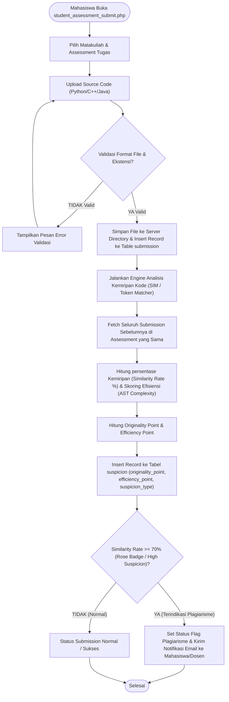

---

## 2. Diagram 2: E-STRANGE Peer Review Workflow & Review Rating Sequence Diagram

Diagram ini menggambarkan alur penilaian antar sejawat (Peer Review) di mana mahasiswa saling memeriksa kode rekan sejawat dan memberikan penilaian kejelasan kode (`quality_point`).

Klik untuk melihat kode Mermaid Diagram 2

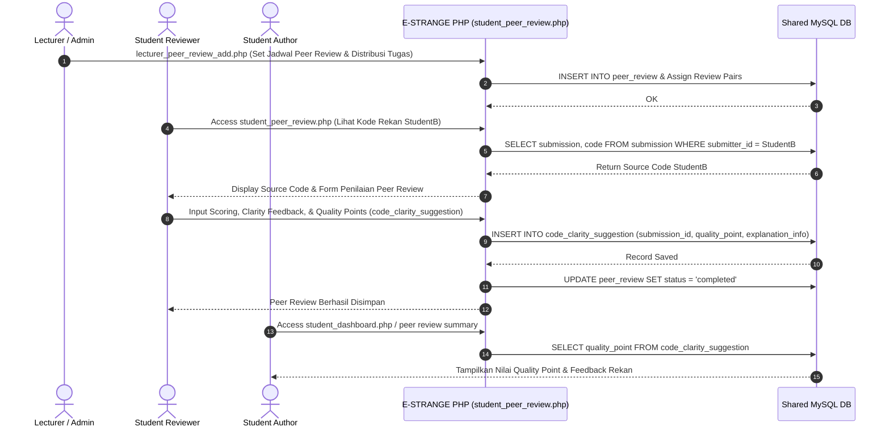

---

## 3. Diagram 3: E-STRANGE Plagiarism Suspicion Detection & Student Defense Response Flowchart

Diagram ini memperlihatkan prosedur penanganan ketika mahasiswa terdeteksi memiliki kemiripan kode tinggi (Suspicion Report), lalu mahasiswa mengajukan klarafikasi/pembelaan (defense response).

Klik untuk melihat kode Mermaid Diagram 3

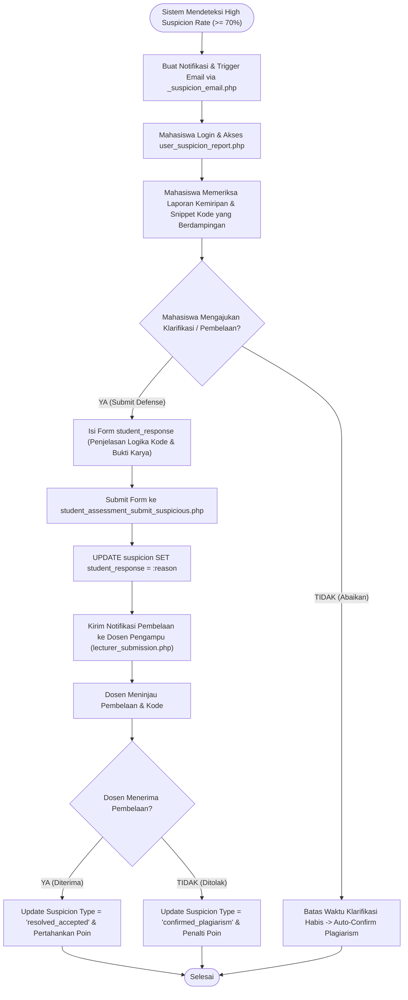

---

## 4. Diagram 4: E-STRANGE Course Administration & Gamification Activation Flowchart (`game_course.is_active`)

Diagram ini memperlihatkan alur kerja Admin/Dosen dalam membuat mata kuliah, menambah assessment, serta mengaktifkan atau mematikan fitur gamifikasi (`game_course.is_active = 1` atau `0`).

Klik untuk melihat kode Mermaid Diagram 4

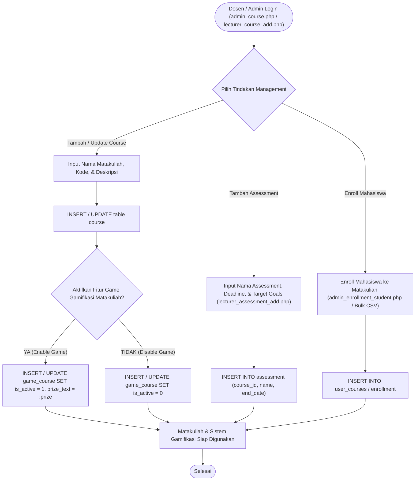

---

## 5. Diagram 5: E-STRANGE Gamification Leaderboard & Point Aggregation Pipeline

Diagram ini menggambarkan alur perhitungan akumulasi poin gamifikasi siswa dari 3 tabel E-STRANGE, serta opsi mahasiswa untuk mengaktifkan/mematikan keikutsertaan game (`student_game_toggle.php`).

Klik untuk melihat kode Mermaid Diagram 5

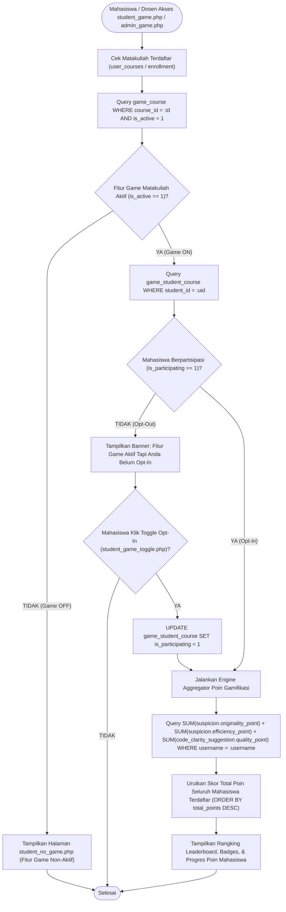

---

# BAGIAN B: ALUR PROSES UTAMA SISTEM S-SPARC AI (FASTAPI PYTHON)

## 6. Diagram 6: Arsitektur Umum & Alur Data Lintas Sistem (E-STRANGE <-> S-SPARC)

Diagram ini menggambarkan hubungan dan alur komunikasi data antara Pengguna, Frontend E-STRANGE (PHP), Backend S-SPARC (FastAPI), Database MySQL Bersama, Cloud Gemini Gateway, Local Ollama, dan Evaluator Service.

Klik untuk melihat kode Mermaid Diagram 6

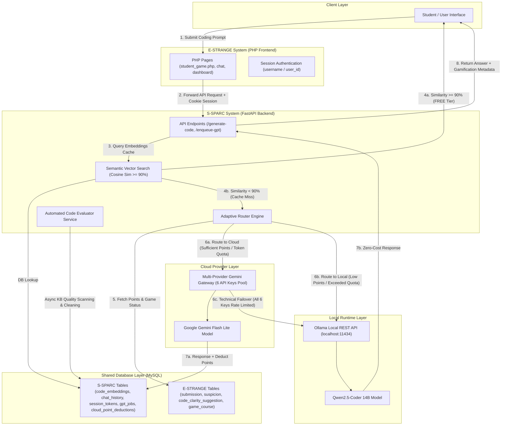

---

## 7. Diagram 7: Alur Keputusan Adaptive Router (Decision Flowchart)

Diagram ini memperlihatkan alur logika eksekusi keputusan pada `AdaptiveRouter`, mulai dari pengecekan cache vektor, penentuan status game matakuliah (`game_course.is_active`), pengecekan poin gamifikasi/kuota token, hingga failover teknis.

Klik untuk melihat kode Mermaid Diagram 7

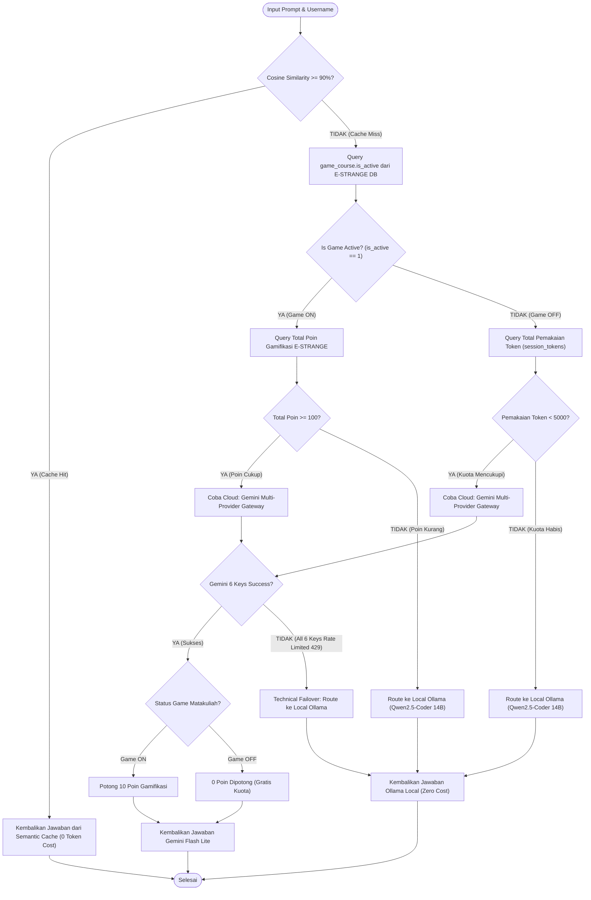

---

## 8. Diagram 8: Alur Rotasi Key & Rate Limit Failover Multi-Provider Gemini Gateway

Diagram ini memperlihatkan mekanisme rotasi 6 API Key Gemini Flash Lite (`GEMINI_API_KEY_1..6`) dalam penanganan error HTTP 429 (Rate Limit).

Klik untuk melihat kode Mermaid Diagram 8

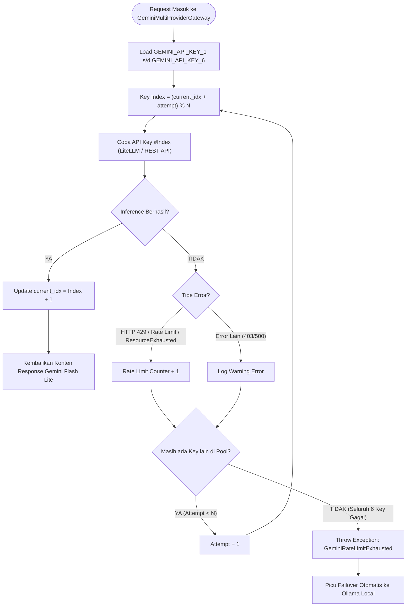

---

## 9. Diagram 9: Sequence Diagram Agregasi Poin Gamification E-STRANGE & Pemotongan Poin

Diagram ini menggambarkan urutan interaksi objek (sequence) antara FastAPI Handler, `PointsAggregator`, `AdaptiveRouter`, Database E-STRANGE, dan Gemini Gateway.

Klik untuk melihat kode Mermaid Diagram 9

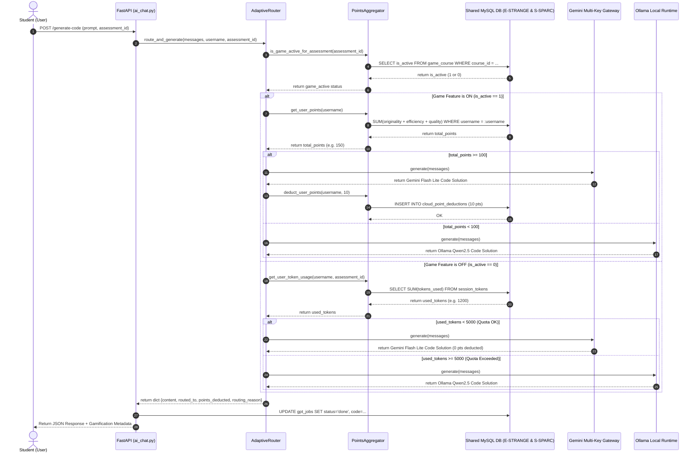

---

## 10. Diagram 10: Siklus Hidup Knowledge Base (Self-Growing Auto-Ingestion & Evaluator Service)

Diagram ini memperlihatkan bagaimana kode solusi baru yang dihasilkan LLM secara otomatis di-vektorisasi dan masuk ke knowledge base, serta bagaimana `Evaluator Service` melakukan pembersihan otomatis secara berkala.

Klik untuk melihat kode Mermaid Diagram 10

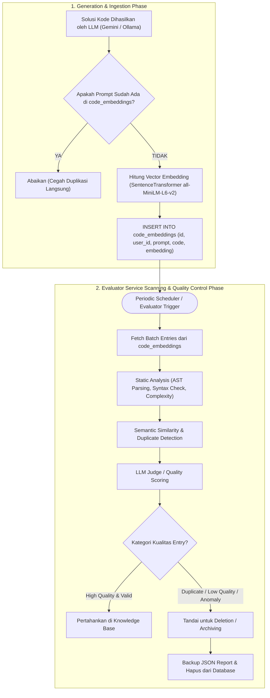

---

## 11. Diagram 11: Pipeline Pelacakan Jejak Lingkungan & Keberlanjutan (Eco-Aware Footprint)

Diagram ini menggambarkan bagaimana setiap request inferensi dihitung dampak konsumsi energi, emisi karbon, dan penggunaan airnya.

Klik untuk melihat kode Mermaid Diagram 11

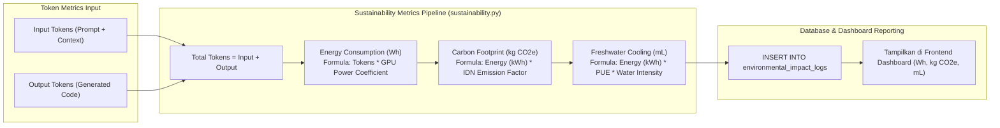

