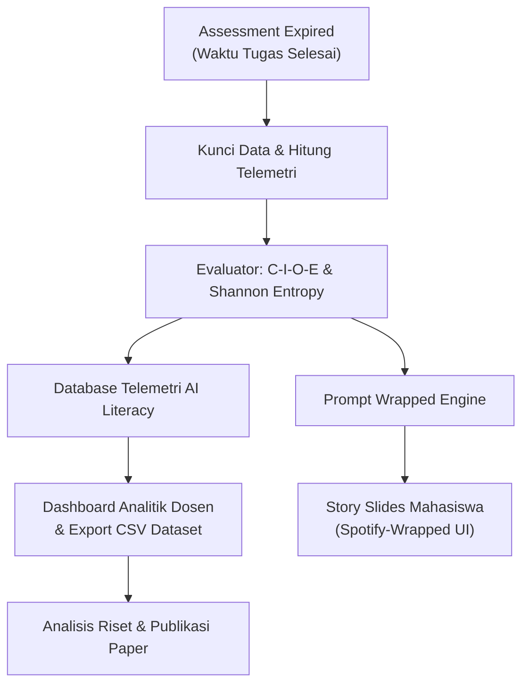

# Implementation Plan: S-SPARC "Prompt Wrapped" (Spotify-Wrapped Style AI Critic & Scientific Research Telemetry)

## 1. Overview & Dual-Purpose Architecture

Fitur **S-SPARC Prompt Wrapped** dirancang dengan arsitektur **Dual-Purpose**:
1. **Student Experience (Gamified & Educational):** Menyajikan kilas balik interaksi prompt dalam bentuk *Interactive Story Slides* bergaya Spotify Wrapped yang **hanya dapat diakses setelah suatu assessment resmi berakhir/expired**. Menyajikan snapshot interaksi, persona archetype (tanpa emoji), radar C-I-O-E, skor Shannon Entropy, ruang kritik AI, dan analisis jejak lingkungan dari penggunaan API key sendiri (BYOK).
2. **Researcher Experience (Educational Data Mining & Pure AI Literacy Analytics):** Dashboard analitik komprehensif bagi dosen/peneliti yang fokus murni pada evaluasi mutu dekomposisi komputasional mahasiswa (skor 4 pilar C-I-O-E, nilai entropi $H(X)$, skor komposit AI Literacy, sebaran persona, jejak energi BYOK) tanpa mencampurkan nilai tugas coding yang sudah dikelola terpisah oleh modul penilaian E-Strange, serta dilengkapi tombol **"Export Research Dataset (.CSV)"** untuk publikasi ilmiah (UNU Macau, IEEE, dsb.).



---

## 2. Aturan Trigger & Akses (Kapan Wrapped Muncul?)

* **Waktu Rilis:** Wrapped **HANYA BISA DIBUKA KETIKA ASSESSMENT SUDAH EXPIRED / SELESAI** (`submission_close_time < NOW()`).
* **Tujuan:** Menjaga integritas dan keadilan pengerjaan tugas. Selama assessment masih berlangsung (*open window*), Wrapped dikunci agar mahasiswa fokus menyelesaikan tugas dan evaluasi komparatif baru dihitung setelah seluruh kelas selesai mengumpulkan.
* **Titik Akses Mahasiswa Setelah Expired:**
  1. Tombol **"Buka S-SPARC Wrapped"** pada kartu assessment yang sudah berstatus *Completed/Closed* di [`student_assessment.php`](file:///c:/final_estrange/s-sparc/estrange/v2/v3/student_assessment.php).
  2. Tombol Wrapped pada riwayat pengumpulan tugas di [`student_submission.php`](file:///c:/final_estrange/s-sparc/estrange/v2/v3/student_submission.php).
  3. Menu tab **"Assessment Wrapped Archive"** di [`student_analytics.php`](file:///c:/final_estrange/s-sparc/estrange/v2/v3/ssparc/student_analytics.php).

---

## 3. Struktur 6 Slide Spotify-Wrapped (Sisi Mahasiswa - Tanpa Emoji)

Setiap assessment yang telah expired akan menghasilkan 1 set *Interactive Story Slides* (auto-timer progress bar di atas, tap kiri/kanan, responsive mobile & desktop, desain bersih dan profesional tanpa emoji):

| Slide | Nama Slide | Konten & Visualisasi |
| :--- | :--- | :--- |
| **Slide 1** | **The Assessment Snapshot** | Total prompt diajukan, frekuensi interaksi, durasi berpikir, dan predikat AI Literacy (Tier A/B/C/D). |
| **Slide 2** | **Prompt Persona (Archetype)** | Karakter mahasiswa berdasarkan gaya prompt (tanpa emoji, penjelasan lengkap di Bagian 5). |
| **Slide 3** | **C-I-O-E & Entropy Radar** | Visualisasi grafis radar 4 pilar (*Context, Input, Output, Error*) + Skor Keberagaman Kosakata (*Shannon Entropy $H(X)$*). |
| **Slide 4** | **Ruang Kritikus AI (The Verdict)** | Perbandingan nyata:<br>• **Prompt Terbaik:** Analisis kekuatan struktur dan kejelasan spesifikasi.<br>• **Prompt yang Perlu Ditingkatkan:** Ulasan kelemahan + contoh *rewrite* prompt yang ideal berbasis C-I-O-E. |
| **Slide 5** | **BYOK Environmental Impact** | Dampak lingkungan dari konsumsi API Key sendiri: Total energi yang dikonsumsi (Watt-hours / Joules), estimasi emisi karbon ($gCO_2e$), dan jejak air virtual ($mL$). |
| **Slide 6** | **Level-Up Checklist & Share** | 2–3 saran konkret untuk assessment berikutnya + opsi download/share kartu Wrapped. |

---

## 4. Tampilan & Fitur Dashboard Peneliti / Dosen (`lecturer_analytics.php`)

Dashboard untuk dosen dan peneliti berfokus murni pada **Metrik Kualitas Prompting & AI Literacy**:

```text
┌──────────────────────────────────────────────────────────────────────────────────────────────────┐
│ S-SPARC RESEARCH & LECTURER ANALYTICS DASHBOARD                                                  │
│ Filter: [ Pilih Mata Kuliah: Pemrograman Lanjut v ]  [ Pilih Assessment: Tugas #3 (Expired) v ]   │
├──────────────────────────────────────────────────────────────────────────────────────────────────┤
│ [ SUMMARY KPI CARDS ]                                                                            │
│ +----------------------+ +----------------------+ +----------------------+ +-------------------+ │
│ | Avg C-I-O-E Score    | | Avg Shannon Entropy  | | Total BYOK Footprint | | Total Prompts     | │
│ | 74.8% (Target: >70%) | | 0.76 H(X) (Optimal)  | | 12.4 Wh | 5.8g CO2e | | 482 Prompts       | │
│ +----------------------+ +----------------------+ +----------------------+ +-------------------+ │
├──────────────────────────────────────────────────────────────────────────────────────────────────┤
│ [ VISUAL RESEARCH ANALYTICS ]                                                                    │
│ +----------------------------------------------+ +---------------------------------------------+ │
│ | Cohort C-I-O-E Radar Mastery Chart           | | AI Literacy Tier Distribution               | │
│ | (Menampilkan pilar terlemah di satu kelas)   | | (Distribusi Predikat Tier A, B, C, D)       | │
│ +----------------------------------------------+ +---------------------------------------------+ │
│ +----------------------------------------------+ +---------------------------------------------+ │
│ | Student Archetype Distribution               | | BYOK Environmental Breakdown                | │
│ | (Donut Chart: % Socratic vs % Bug Hunter...) | | (Distribusi Konsumsi Energi per Model)      | │
│ +----------------------------------------------+ +---------------------------------------------+ │
├──────────────────────────────────────────────────────────────────────────────────────────────────┤
│ [ DETAILED AI LITERACY TELEMETRY TABLE ]         [ EXPORT RESEARCH DATASET (.CSV) BUTTON ]       │
│ +---------+-------------+--------------+-------------+--------------+-------------+------------+ │
│ | NIM     | Nama        | Prompt Count | C-I-O-E (%) | Entropy H(X) | Archetype   | Literacy   | │
│ +---------+-------------+--------------+-------------+--------------+-------------+------------+ │
│ | 2272001 | Mahasiswa A | 8 Prompts    | 87.5%       | 0.82 (High)  | Socratic    | Tier A     | │
│ | 2272002 | Mahasiswa B | 14 Prompts   | 52.0%       | 0.58 (Med)   | Speedrunner | Tier C     | │
│ +---------+-------------+--------------+-------------+--------------+-------------+------------+ │
└──────────────────────────────────────────────────────────────────────────────────────────────────┘
```

---

## 5. Penjelasan Lengkap Variabel Telemetri & Archetype

Untuk kebutuhan riset dan interpretasi dosen, berikut adalah definisi operasional setiap kolom dan metrik:

### A. Penjelasan Kolom Tabel Telemetri

1. **NIM (Student ID):** Nomor Induk Mahasiswa unik untuk pelacakan individual (dapat di-anonymize saat export publikasi).
2. **Nama Mahasiswa:** Nama lengkap mahasiswa terdaftar.
3. **Prompt Count (Frekuensi Interaksi):** Jumlah total prompt yang diajukan mahasiswa kepada AI selama rentang pengerjaan assessment tersebut.
4. **C-I-O-E (%) (Tingkat Kepatuhan Protokol):**
   * Persentase kelengkapan 4 pilar dekomposisi masalah (*Context, Input, Output, Error*).
   * Dihitung dari rata-rata kemunculan elemen: Bahasa/Topik (Context), Tipe Data/Ukuran $N$ (Input), Target Return/Kompleksitas $O(N)$ (Output), dan Pesan Error (Error).
5. **Entropy $H(X)$ (Shannon Entropy):**
   * Skor $0.0 - 1.0$ yang mengukur keberagaman kosakata dan densitas informasi dalam prompt.
   * Nilai tinggi ($\ge 0.70$) = Kosakata teknis bervariasi, deskripsi mendalam.
   * Nilai rendah ($< 0.50$) = Pengulangan karakter/kata (indikasi spam atau prompt malas seperti *"tolong benerin dong"*).
6. **Archetype (Profil Gaya Berpikir):** Klasifikasi gaya mahasiswa berinteraksi dengan AI (dijelaskan detail di bawah).
7. **Literacy Tier (Tingkat Kemahiran AI Literacy):**
   * Predikat mutu prompt komposit ($S_{\text{prompt}}$):
     * **Tier A ($\ge 80\%$):** *Prompt Architect* (Dekomposisi sangat matang & terstruktur).
     * **Tier B ($60 - 79\%$):** *Structured Prompter* (Cukup terstruktur dengan rincian teknis).
     * **Tier C ($40 - 59\%$):** *Developing Prompter* (Mulai berkembang, konteks parsial).
     * **Tier D ($< 40\%$):** *Novice Prompter* (Memerlukan bimbingan/scaffolding tambahan).
8. **BYOK Wh / CO2 (Dampak Lingkungan):**
   * Total energi listrik (Watt-hours) dan emisi karbon ($gCO_2e$) yang dihasilkan dari query model AI menggunakan API key pribadi mahasiswa.

---

### B. Penjelasan Detail 6 Profil Archetype (Gaya Mahasiswa)

| Nama Archetype | Kriteria Penentuan | Karakteristik & Perilaku Mahasiswa | Makna Pedagogis |
| :--- | :--- | :--- | :--- |
| **The Socratic Architect** | Skor C-I-O-E $\ge 70\%$ dan Entropi $H(X) \ge 0.70$ | Menyusun prompt dengan struktur sangat matang, menyertakan konteks bahasa, batasan prekondisi, dan target kompleksitas waktu. | Mahasiswa telah mencapai level *AI Literacy* tinggi dan mampu mendekomposisi masalah komputasi secara mandiri. |
| **The Fast-Path Prodigy** | Cache Hit $\ge 2$ kali atau $\ge 40\%$ total prompt | Mahir menyusun pertanyaan yang cocok dengan bank solusi kurikulum, memanfaatkan semantic cache 0-token. | Menunjukkan efisiensi tinggi dalam memahami repositori pengetahuan tanpa membebani komputasi cloud. |
| **The Bug Hunter** | Rasio kata kunci Error/Traceback $\ge 40\%$ | Berinteraksi dengan AI secara fokus saat debugging, menyertakan pesan compiler, line number, dan exception trace. | Menunjukkan kemampuan analisis kegagalan kode (*root-cause analysis*) dan teknik isolasi bug yang baik. |
| **The Code Craftsman** | Technical Token Density $\ge 50\%$ | Prompt dipenuhi istilah tipe data eksplisit (`list[int]`, `HashMap`), struktur data algoritma, dan notasi matematika. | Mahasiswa berpikir secara formal matematis dan berorientasi pada sintaks yang presisi. |
| **The Speedrunner** | Total prompt $\ge 8$ dengan rata-rata panjang prompt pendek | Bereksperimen dengan iterasi cepat, mengajukan banyak pertanyaan pendek bertahap untuk menguji hipotesis. | Gaya belajar *trial-and-error* yang dinamis; perlu didorong untuk lebih merencanakan prompt di awal. |
| **The Developing Prompter** | Default / C-I-O-E $< 50\%$ | Mengajukan pertanyaan umum atau singkat tanpa menyertakan batasan input/output yang spesifik. | Membutuhkan *scaffolding* (bimbingan terstruktur) dari dosen untuk membiasakan dekomposisi C-I-O-E. |

---

## 6. Rencana Tahapan Eksekusi

```
[Tahap 1] Backend Service, Aggregator & API Endpoints
   ├── Sempurnakan PromptCriticService: logic assessment expired check, BYOK env impact, persona clean naming
   ├── Buat endpoint Wrapped Mahasiswa: /api/domain/assessments/{id}/wrapped (dengan validasi status expired)
   └── Buat endpoint Riset Dosen & Export CSV: /api/admin/wrapped/analytics & /api/admin/wrapped/export-csv

[Tahap 2] Frontend Story Player Mahasiswa (Spotify-Wrapped UX)
   ├── Bangun student_prompt_wrapped.php (Dark neon glassmorphism, tanpa emoji, profesional)
   ├── Implementasikan Story Player (Timer bar, tap/swipe, sound toggle)
   └── Buat slide BYOK Environmental Impact & AI Critic Room

[Tahap 3] Dashboard Peneliti / Dosen & Integrasi Trigger
   ├── Tambahkan trigger button Wrapped pada assessment yang sudah expired di student_assessment.php & student_submission.php
   ├── Bangun tab Research Analytics & tombol Export CSV di lecturer_analytics.php
   └── Hubungkan routing proxy PHP ke backend FastAPI

[Tahap 4] Pengujian & Validasi
   ├── Verifikasi bahwa assessment aktif TIDAK BISA membuka Wrapped, dan hanya terbuka saat EXPIRED
   ├── Uji akurasi kalkulasi skor C-I-O-E, Shannon Entropy, dan metrik BYOK
   ├── Uji coba export file CSV dan verifikasi kelengkapan kolom dataset
   └── Validasi responsivitas tampilan di mobile & desktop
```

---

## 7. Status Dokumen
* **Status:** Rencana Diperbarui Sesuai Feedback (Menunggu Konfirmasi Eksekusi).
* **Mode:** Review Murni (Kode belum dijalankan/dimodifikasi).
