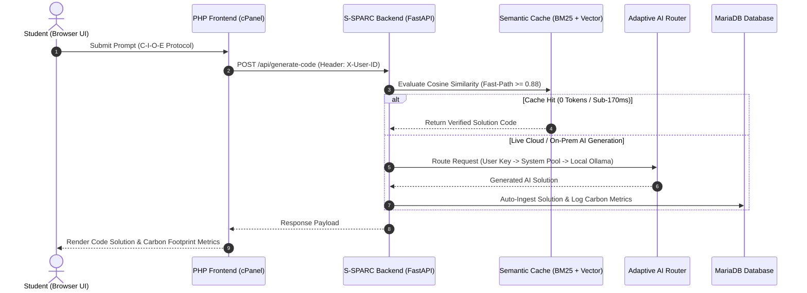

# S-SPARC AI: Smart Software Engineering & Pedagogical Adaptive Retrieval Assistant

> **An Enterprise-Grade, Pedagogically Scaffolded AI Learning Engine & High-Performance Retrieval System Built on top of the E-STRANGE™ LMS Platform.**

[](#)
[](https://python.org)
[](https://fastapi.tiangolo.com)
[](https://php.net)
[](https://mariadb.org)
[](https://ai.google.dev)
[](#sustainability)

---

## 📌 Executive Summary & Foundational Platform

**S-SPARC AI** (*Smart Software Engineering & Pedagogical Adaptive Retrieval Assistant*) is an advanced AI-powered educational engine specifically built to enhance programming and software engineering instruction in higher education institutions.

```
+---------------------------------------------------------------------------------------------------+
|                                     S-SPARC AI ENTERPRISE ECOSYSTEM                               |
+---------------------------------------------------------------------------------------------------+
|  1. C-I-O-E PROTOCOL         |  2. MULTI-TIER ROUTER        |  3. HYBRID SEMANTIC CACHE            |
|  - Context, Input, Output,   |  - Tier 1: User Key         |  - BM25 Sparse Search                |
|    Error Trace Scaffolding   |  - Tier 2: System Key Pool   |  - SentenceTransformers Dense        |
|  - Shannon Entropy Eval      |  - Tier 3: Local Ollama      |  - Reciprocal Rank Fusion (RRF)      |
|  - Bloom's Taxonomy Alignment|  - IPv4 Socket Optimizer     |  - Sub-150ms / 0 Token Overhead      |
+---------------------------------------------------------------------------------------------------+
|  FOUNDATION: E-STRANGE™ LMS Platform (Student Performance Support) & SSTRANGE LSH Engine          |
+---------------------------------------------------------------------------------------------------+
```

---

### 🏛️ The Foundational LMS Baseline: E-STRANGE™ & SSTRANGE

S-SPARC AI is engineered to integrate into **E-STRANGE™**, an established educational Learning Management System (LMS) and performance support platform:

- **E-STRANGE™ Platform**: Serves as the overarching student performance support and assessment environment. It helps students understand code ethics (originality/similarity), code quality (readability and modularity), and computational efficiency through formative feedback and academic gamification.
- **SSTRANGE Similarity Engine**: The foundational background code similarity detection engine powered by **Locality Sensitive Hashing (MinHash & Super-Bit)** across Java, Python, C#, Dart, and Web Stack submissions. SSTRANGE's algorithmic foundation is backed by peer-reviewed publications, including the **Best Discussion Paper Award at IEEE ICALT 2023** ([IEEE ICALT Paper](https://ieeexplore.ieee.org/abstract/document/10260942)), **MDPI Education Sciences 2023** ([MDPI Paper](https://www.mdpi.com/2227-7102/13/1/54)), and **IEEE EDUNINE 2024** ([IEEE EDUNINE Paper](https://ieeexplore.ieee.org/abstract/document/10500603/)).
- **Evolution to S-SPARC AI**: S-SPARC AI elevates E-STRANGE™ into a next-generation smart LMS by embedding real-time AI tutoring, sub-150ms vector semantic caching, multi-tier failover routing, and green computing sustainability analytics directly into the student learning workflow.

---

### Strategic Institutional Value Proposition:

1. **For University Deans & Executive Leadership**:
   - **Zero Institutional API Cost ($0/year)**: Through the **Distributed Student API Protocol**, institutions deliver high-speed AI tutoring without recurring cloud LLM bills.
   - **Green Campus Compliance**: Integrated carbon footprint tracking calibrated for the Indonesian power grid baseline ($0.78 \text{ kg CO}_2/\text{kWh}$).

2. **For Computer Science & IT Faculty**:
   - **Automated Academic Integrity**: Seamless integration with E-STRANGE™ and SSTRANGE LSH for code quality, structure, and originality assessment.
   - **Formative Pedagogical Feedback**: Automatic evaluation of code structure, readability, and algorithmic complexity.

3. **For Students**:
   - **Structured AI Guidance (C-I-O-E Protocol)**: Prevents dependency on copy-paste AI by requiring context, input, output, and error trace definition.
   - **Sub-150ms Semantic Cache**: Instant solution retrieval with zero token overhead.

---

## 🌟 Core S-SPARC AI Architecture & Technological Pillars

### 1. Standardized C-I-O-E Pedagogical Protocol & Prompt Literacy Evaluator
S-SPARC AI trains students to develop structured computational thinking by enforcing the **C-I-O-E Protocol**:
- **[C] Context**: Task background, problem domain, and algorithmic constraints.
- **[I] Input**: Data pre-conditions, input data structures, and sample test cases.
- **[O] Output**: Expected post-conditions, return data types, and target time/space complexity.
- **[E] Error Trace / Constraints**: Compiler/interpreter error trace, failing test cases (WA/TLE), and self-debugging steps taken.

The system automatically assesses student prompt quality using mathematical **Shannon Entropy** ($H$) and **Technical Token Density** ($D$), assigning a real-time **Literacy Grade** (*Grade A / B / C*) alongside automated pedagogical guidance aligned with Bloom's Taxonomy.

---

### 2. Multi-Tier Adaptive Router & High-Availability Engine
To guarantee zero service disruption regardless of network conditions or individual quota limits, S-SPARC AI employs a 3-tier failover routing engine:
- **Tier 1 (User Personal Gemini Key)**: Students register their personal Google Gemini API Key (available for free via Google AI Studio). Inference requests execute directly via REST with latencies of **~1.5 - 2.5 seconds**.
- **Tier 2 (System Key Pool Fallback)**: If a user key is unconfigured or rate-limited, the router seamlessly falls back to a load-balanced *System API Key Pool* managed on the server.
- **Tier 3 (Local Zero-Cost Offline Fallback - Ollama)**: Should cloud network connectivity fail completely or hit rate limits (HTTP 429), the platform automatically redirects inference to a local **Ollama Qwen2.5-Coder 14B** instance, ensuring 100% offline reliability.

---

### 3. Hybrid Vector Semantic Caching (BM25 + SentenceTransformers RRF)
S-SPARC AI features a high-performance *Retrieval-Augmented Caching Engine* that combines:
- **Sparse Search (BM25)** for exact keyword, syntax, and function signature matching.
- **Dense Vector Search (SentenceTransformers `all-MiniLM-L6-v2`)** for semantic context and problem intent matching.
- **Reciprocal Rank Fusion (RRF)** to fuse sparse and dense rankings into a unified high-precision score.

When a student prompt exhibits high cosine similarity ($\ge 0.88$) with a verified solution in the `code_embeddings` database, S-SPARC AI responds **instantly (0.11 - 0.17 seconds)** without consuming API tokens (0 Tokens / FREE Tier).

---

### 4. Windows Network IPv4 Socket Optimizer
When deployed in university computer laboratories operating on Windows environments, standard Python `requests` calls to `generativelanguage.googleapis.com` often experience severe socket stalls due to IPv6 DNS resolution attempts (causing delays up to 78 seconds per request).

S-SPARC AI incorporates a custom **IPv4 Socket Resolver Patch** at the socket layer (`_ipv4_getaddrinfo`), which slashes execution latency from **78 seconds down to 2.7 seconds** consistently.

---

### 5. Green Computing & Environmental Footprint Tracking
S-SPARC AI advances institutional *Green Campus* initiatives by calculating the environmental footprint of every AI prompt in real time:

$$\text{Energy (kWh)} = \text{Tokens} \times \text{kWh/token} \times \text{PUE}$$

$$\text{Carbon (gCO2)} = \text{Energy (kWh)} \times \text{CIF} \times 1000$$

*Parameters:*
- **CIF (Carbon Intensity Factor - Indonesia)**: $0.78 \text{ kg CO}_2/\text{kWh}$ (Indonesian Electrical Grid Baseline).
- **PUE (Power Usage Effectiveness)**: $1.5$ (Efficient Data Center Benchmark).
- **Tree Absorption Equivalent**: Calculated based on standard annual absorption rates ($21.77 \text{ kg CO}_2/\text{year}$).

---

### 6. E-STRANGE Gamification Integration & Quotas
- **Daily Quota Badges**: Displays student daily allowance transparently (1,500 Requests/Day & 15 Requests/Minute for Gemini Free Tier).
- **Cooldown Rate Limiting**: Prevents automated spamming via enforced timers (60s for Live AI generation / 15s for Database Cache Hits).
- **Points Aggregator & Leaderboards**: E-STRANGE gamification scores are updated automatically based on prompt quality, code originality, and algorithmic efficiency.

---

## 🌐 Enterprise Request Architecture & Data Flow



---

## 🏢 Tech Stack & Infrastructure Matrix

| Layer | Component | Specification / Framework | Purpose |
| :--- | :--- | :--- | :--- |
| **AI Backend Core** | S-SPARC FastAPI Service | Python 3.12, Uvicorn Async | High-throughput asynchronous REST API gateway. |
| **LMS Frontend** | E-STRANGE Web Interface | PHP 8.2, Vanilla CSS, JS (ES6+) | Glassmorphism UI, Dark/Light mode, Responsive layout. |
| **Database Layer** | Enterprise Relational DB | MariaDB 10.11 / MySQL 8.0 | Stores user profiles, chat logs, queues, and vector embeddings. |
| **Vector Engine** | Hybrid Retrieval | SentenceTransformers (`MiniLM-L6-v2`), BM25 | RRF-fused dense and sparse vector search engine. |
| **LSH Engine** | Background Processor | Java 11+ Runnable JAR (`ScheduledSuspicionGenerator.jar`) | Computes SSTRANGE MinHash & Super-Bit similarity scores. |
| **AI Runtime** | Multi-Provider Gateway | Google Gemini 3.5 REST, LiteLLM, Ollama | Multi-tier cloud and offline AI execution engine. |

---

## 🔧 S-SPARC Backend Installation & Deployment Guide

Follow these step-by-step instructions to deploy the S-SPARC AI Python Backend service on institutional server infrastructure.

### 1. Prerequisites
- **Operating System**: Linux (Ubuntu 22.04 LTS / RHEL 9) or Windows Server.
- **Python**: Version 3.10 or 3.12.
- **Database**: MariaDB 10.6+ or MySQL 8.0+.

---

### 2. Environment Setup & Dependencies
```bash
# Clone the repository
git clone https://github.com/06202003/s-sparc.git
cd s-sparc

# Create virtual environment
python -m venv venv

# Activate venv (Windows)
.\venv\Scripts\activate
# Activate venv (Linux/macOS)
# source venv/bin/activate

# Install dependencies
pip install -r requirements.txt
```

---

### 3. Environment Configuration (`.env`)
Copy `.env.example` to `.env` and set your credentials:
```ini
FLASK_PORT=5000
FASTAPI_URL=https://estrangeinternal.itmaranatha.org
DB_HOST=127.0.0.1
DB_USER=your_db_user
DB_PASSWORD=your_db_password
DB_NAME=db_semantic
GEMINI_MODEL=gemini-3.5-flash-lite
```

---

### 4. Running the Backend Service
Start the S-SPARC FastAPI production server:
```bash
python run_fastapi.py
```

---

## 📡 Production REST API Specification

### 1. `POST /api/generate-code`
- **Headers**: `Content-Type: application/json`, `X-User-ID: <STUDENT_UUID>`
- **Request Body**:
```json
{
  "prompt": "[CONTEXT: Array Processing]\nFinding max element...\n[INPUT]\nnums = [1, 5, 3]\n[OUTPUT]\nReturn 5\n[ERROR TRACE]\nNone",
  "course_id": "COURSE_SE_2026",
  "assessment_id": "ASSESS_01"
}
```

### 2. `POST /api/user/api-key`
- **Request Body**:
```json
{
  "api_key": "AIzaSyYourPersonalGeminiApiKeyHere123",
  "terms_accepted": true
}
```

---

## 📚 Scientific Citations & Publications

If referencing E-STRANGE™, SSTRANGE, or S-SPARC AI in academic literature, grant proposals, or institutional evaluations, please use the following citations:

```bibtex
@article{karnalim2023sstrange,
  title={SSTRANGE: Scalable Similarity TRacker in Academia with Natural Language Explanation},
  author={Karnalim, Oscar and others},
  journal={Education Sciences},
  volume={13},
  number={1},
  pages={54},
  year={2023},
  publisher={MDPI}
}

@inproceedings{karnalim2023csharp,
  title={Scalable Code Similarity Detection for C\# Submissions},
  author={Karnalim, Oscar and others},
  booktitle={2023 IEEE International Conference on Advanced Learning Technologies (ICALT)},
  year={2023},
  organization={IEEE},
  note={Best Discussion Paper Award}
}

@inproceedings{karnalim2024sensitive,
  title={Sensitive Code Similarity Detection for Higher Education},
  author={Karnalim, Oscar and others},
  booktitle={2024 IEEE World Engineering Education Conference (EDUNINE)},
  year={2024},
  organization={IEEE}
}
```

---

<p align="center">
  <b>S-SPARC AI Enterprise & E-STRANGE™ Ecosystem</b> • EdTech Research & Engineering Labs<br>
  <sub>Designed & Built for Next-Generation Higher Education in Indonesia. 🇮🇩</sub>
</p>
