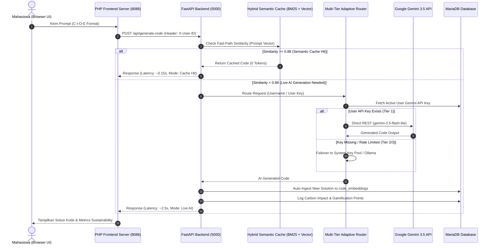

# S-SPARC AI (Smart Software Engineering & Pedagogical Adaptive Retrieval Assistant)

> **Platform Intelligence Buatan Adaptif & Pedagogis Terintegrasi untuk Laboratorium Pemrograman dan Pendidikan Software Engineering di Perguruan Tinggi Indonesia.**

[](https://python.org)
[](https://fastapi.tiangolo.com)
[](https://php.net)
[](https://mariadb.org)
[](https://ai.google.dev)
[](#sustainability)

---

## 📌 Ringkasan Eksekutif (Executive Summary)

**S-SPARC AI** (*Smart Software Engineering & Pedagogical Adaptive Retrieval Assistant*) adalah sistem asisten pembelajaran pemrograman berbasis AI yang dirancang khusus untuk lingkungan akademik Perguruan Tinggi di Indonesia. 

Berbeda dengan umum chatbot AI (*generic LLM wrappers*), S-SPARC AI mengombinasikan **Pedagogical Scaffolding (Protokol C-I-O-E)**, **Multi-Tier Adaptive Router**, **Hybrid Vector Semantic Caching (Sub-150ms Retrieval)**, dan **Green AI Environmental Footprint Tracking**. Sistem ini memungkinkan institusi pendidikan menyelenggarakan asistensi AI untuk ribuan mahasiswa dengan **biaya API $0 (Zero API Cost)** dan **performa latency tinggi (< 2.5 detik)**.

---

## 🌟 Pilar Arsitektur & Fitur Utama

```
+-----------------------------------------------------------------------------------+
|                                  S-SPARC AI PLATFORM                              |
+-----------------------------------------------------------------------------------+
| 1. C-I-O-E Protocol      | 2. Multi-Tier Router     | 3. Hybrid Semantic Cache    |
| - Context, Input,        | - Tier 1: User Key       | - BM25 Sparse Search        |
|   Output, Error Trace    | - Tier 2: System Pool    | - SentenceTransformers Dense|
| - Shannon Entropy Eval   | - Tier 3: Local Ollama   | - RRF (Sub-170ms / $0 Cost) |
+--------------------------+--------------------------+-----------------------------+
| 4. Carbon Tracking       | 5. E-STRANGE Gamification| 6. Windows Socket Resolver  |
| - Indonesia Grid CIF     | - Daily Quota (1500 RPD) | - IPv4 Socket Bypass        |
| - gCO2 & Tree Equivalent | - Cooldown Rate Limits   | - Fixed 78s -> 2.7s Latency |
+-----------------------------------------------------------------------------------+
```

### 1. Protokol Pedagogis C-I-O-E & Prompt Literacy Evaluator
S-SPARC melatih mahasiswa berpikir komputasional secara terstruktur dengan menerapkan **Protokol C-I-O-E**:
- **[C] Context**: Latar belakang tugas, domain masalah, dan batasan algoritma.
- **[I] Input**: Pre-kondisi data, struktur data input, dan contoh sampel data.
- **[O] Output**: Post-kondisi yang diharapkan, tipe data return, dan kompleksitas target.
- **[E] Error Trace / Kendala**: Pesan kesalahan compiler/interpreter, kode yang menghasilkan TLE/WA, dan percobaan solutif yang telah dilakukan.

Sistem secara otomatis mengevaluasi kualitas prompt mahasiswa menggunakan formulasi matematika **Shannon Entropy** ($H$) dan **Technical Token Density** ($D$), memberikan nilai mutu prompt (*Literacy Grade: A / B / C*) serta rekomendasi pedagogis real-time.

### 2. Multi-Tier Adaptive Router & High-Availability AI Engine
Untuk menjamin kontinuitas layanan tanpa tergantung pada satu API key tunggal, S-SPARC menerapkan 3 tingkat failover otomatis (*Adaptive Router*):
- **Tier 1 (User Personal Gemini Key)**: Setiap mahasiswa dapat mendaftarkan Google Gemini API Key milik pribadi (gratis dari Google AI Studio). Respon diproses langsung via Direct REST API dengan latensi **~1.5 - 2.5 detik**.
- **Tier 2 (System Key Pool Fallback)**: Jika user key tidak tersedia atau mengalami kegagalan, router mengalihkan request secara *round-robin* ke *System API Key Pool* yang terdaftar di lingkungan server.
- **Tier 3 (Local Zero-Cost Offline Fallback - Ollama)**: Jika seluruh akses internet/cloud Gemini mengalami pembatasan kuota (HTTP 429), sistem melakukan failover otomatis ke model lokal **Ollama Qwen2.5-Coder 14B**, menjamin platform tetap beroperasi 100% secara offline.

### 3. Hybrid Vector Semantic Caching (RRF Search - Sub-150ms)
S-SPARC dilengkapi mesin *Retrieval-Augmented Caching* pintar yang mengombinasikan:
- **Sparse Search (BM25)** untuk kecocokan kata kunci teknis dan nama fungsi.
- **Dense Vector Search (SentenceTransformers `all-MiniLM-L6-v2`)** untuk kecocokan makna dan konteks masalah.
- **Reciprocal Rank Fusion (RRF)** untuk menggabungkan hasil pencarian dengan presisi tinggi.

Ketika prompt mahasiswa memiliki kemiripan kosinus ($\ge 0.88$) dengan solusi terverifikasi dalam database `code_embeddings`, sistem akan menjawab secara **instan (0.11 - 0.17 detik)** tanpa mengonsumsi token API (0 Tokens / FREE Tier).

### 4. Windows Network IPv4 Socket Optimizer
Pengujian lingkungan laboratorium kampus bersistem operasi Windows sering kali mengalami *socket DNS stall* akibat pencarian alamat IPv6 pada domain `generativelanguage.googleapis.com` (yang menyebabkan delay hingga 78 detik per request). 

S-SPARC mengimplementasikan **Custom IPv4 Socket Resolver Patch** di tingkat socket Python (`_ipv4_getaddrinfo`), yang memangkas latensi eksekusi dari **78 detik menjadi 2.7 detik** secara konsisten.

### 5. Tracking Karbon & Keberlanjutan Kampus Hijau (Green AI)
S-SPARC mendukung inisiatif Kampus Hijau (*Green Campus*) dengan menghitung estimasi dampak lingkungan dari setiap eksekusi prompt secara ilmiah:
$$\text{Energy (kWh)} = \text{Tokens} \times \text{kWh\_per\_token} \times \text{PUE}$$
$$\text{Carbon (gCO2)} = \text{Energy (kWh)} \times \text{CIF\_IDN} \times 1000$$

*Catatan Parameter:*
- **CIF Indonesia (Carbon Intensity Factor)**: $0.78 \text{ kg CO}_2/\text{kWh}$ (Grid Listrik Indonesia).
- **PUE (Power Usage Effectiveness)**: $1.5$ (Standar Pusat Data Efisien).
- **Pohon Setara**: Dikonversi berdasarkan daya serap pohon tipikal ($21.77 \text{ kg CO}_2/\text{tahun}$).

### 6. Integrasi Gamifikasi Akademik & Quota Rate Limiting (E-STRANGE)
- **Daily Quota Badge**: Menampilkan sisa kuota harian secara transparan (1,500 Request/Hari & 15 Request/Menit untuk tier gratis Gemini).
- **Cooldown Rate Limits**: Mencegah pemanggilan berlebihan (*spamming*) dengan timer jeda 60 detik untuk Live AI dan 15 detik untuk Database Cache Hits.
- **Points Aggregator & Leaderboard**: Poin gamifikasi E-STRANGE dihitung otomatis dari kualitas prompt, orisinalitas kode, dan efisiensi algoritma.

---

## 🏗️ Teknologi Stack (Tech Stack Matrix)

| Komponen | Teknologi & Framework | Fungsi & Deskripsi |
| :--- | :--- | :--- |
| **Backend Core** | Python 3.12, FastAPI, Uvicorn | High-performance asynchronous REST API backend. |
| **Frontend Web** | PHP 8.x, Vanilla CSS, JS (ES6+) | Web interface responsive, Glassmorphism UI, Dark/Light Mode. |
| **Database** | MariaDB 10.11 / MySQL 8.0 | Menyimpan relasi user, histori chat, job queue, dan `code_embeddings`. |
| **Vector Search** | SentenceTransformers (`MiniLM-L6-v2`), BM25 | Hybrid sparse + dense vector retrieval engine. |
| **AI Providers** | Google Gemini REST API, LiteLLM, Ollama | Multi-provider cloud and local LLM runtime execution. |
| **UI Components** | SweetAlert2, Highcharts, Google Fonts (Outfit) | Notifikasi interaktif, chart sustainabilitas, dan tipografi modern. |

---

## 📐 Diagram Arsitektur & Lifecycle Request



---

## 🚀 Panduan Instalasi & Deployment Laboratorium Kampus

Berikut langkah-langkah instalasi S-SPARC AI pada peladen (*server*) atau komputer laboratorium universitas.

### 1. Prasyarat Sistem (Prerequisites)
- **Sistem Operasi**: Windows 10/11, Windows Server, atau Linux (Ubuntu 22.04 LTS).
- **Python**: Versi 3.10 atau 3.12 (disarankan).
- **PHP**: Versi 8.1 / 8.2 dengan ekstensi `pdo_mysql`, `curl`, `mbstring`.
- **Database**: MariaDB 10.6+ atau MySQL 8.0+.
- **Web Server**: Apache/Nginx (atau PHP Built-in Server untuk kebutuhan pengujian).

### 2. Kloning Repositori & Environment Setup
```bash
# Clone repositori
git clone https://github.com/06202003/s-sparc.git
cd s-sparc

# Buat environment Python virtual
python -m venv venv

# Aktivasi venv (Windows)
.\venv\Scripts\activate
# Aktivasi venv (Linux/macOS)
# source venv/bin/activate

# Install dependencies Python
pip install -r requirements.txt
```

### 3. Konfigurasi Environment (`.env`)
Salin berkas `.env.example` menjadi `.env` dan sesuaikan nilainya:
```ini
# Server Configuration
FLASK_PORT=5000
FLASK_HOST=127.0.0.1
FASTAPI_URL=http://127.0.0.1:5000

# Database Configuration
DB_HOST=127.0.0.1
DB_PORT=3306
DB_USER=root
DB_PASSWORD=passwordku
DB_NAME=db_semantic

# System Fallback Gemini Keys (Opsional)
GEMINI_API_KEY_1=AIzaSyYourPersonalGeminiApiKeyHere123
GEMINI_MODEL=gemini-3.5-flash-lite

# Ollama Local Fallback (Opsional)
OLLAMA_BASE_URL=http://localhost:11434
OLLAMA_MODEL=qwen2.5-coder:14b
```

### 4. Migrasi Database
Impor skema database dari direktori `db_migrations/` ke instance MariaDB/MySQL Anda:
```bash
mysql -u root -p db_semantic < db_migrations/complete_schema.sql
```

### 5. Menjalankan Server Services

**Langkah A: Jalankan FastAPI Backend Server (Port 5000)**
```bash
python run_fastapi.py
```

**Langkah B: Jalankan PHP Web Server (Port 8088)**
```bash
php -S 127.0.0.1:8088 -t estrange/v2/v2/ssparc
```

Akses browser Anda ke: `http://127.0.0.1:8088/chat.php`

---

## 📡 Dokumentasi Endpoint REST API Utama

### 1. `POST /api/generate-code`
Menerima prompt mahasiswa dan menghasilkan kode jawaban teroptimasi.

- **Headers**:
  - `Content-Type: application/json`
  - `X-User-ID: <UUID_USER_MAHASISWA>`
- **Request Body**:
```json
{
  "prompt": "[CONTEXT: Pengujian Array]\nSaya ingin mencari nilai maksimum...\n[INPUT]\nnums = [1, 5, 3]\n[OUTPUT]\nReturn 5\n[ERROR TRACE]\nNone",
  "course_id": "COURSE_SE_2026",
  "assessment_id": "ASSESS_01",
  "response_mode": "Standard",
  "language": "python"
}
```
- **Response Success (200 OK)**:
```json
{
  "mode": "success",
  "job_id": "9b1deb4d-3b7d-41b9-9102-123456789abc",
  "code": "```python\ndef find_max(nums):\n    return max(nums)\n```",
  "is_retrieval": false,
  "request_tokens_used": 1420,
  "cooldown_seconds": 60,
  "query_quota": {
    "has_key": true,
    "masked_key": "AQ.Ab8...HX6g",
    "daily_remaining": 1499,
    "tier_label": "Google Gemini Free Tier (1,500 RPD / 15 RPM)"
  },
  "prompt_analytics": {
    "prompt_quality_score": 1.0,
    "literacy_grade": "A (Prompt Architect)"
  }
}
```

---

### 2. `POST /api/user/api-key`
Mendaftarkan atau memperbarui Gemini API Key milik pribadi mahasiswa.

- **Request Body**:
```json
{
  "api_key": "AIzaSyYourPersonalGeminiApiKeyHere123",
  "terms_accepted": true
}
```
- **Response Success (200 OK)**:
```json
{
  "status": "success",
  "message": "API key berhasil disimpan dan Syarat & Ketentuan telah disetujui.",
  "masked_key": "AQ.Ab8...HX6g"
}
```

---

### 3. `GET /api/user/query-quota`
Mengambil informasi kuota harian, status API key, dan sisa batas request real-time.

- **Response Success (200 OK)**:
```json
{
  "has_key": true,
  "provider": "gemini",
  "masked_key": "AQ.Ab8...HX6g",
  "daily_limit": 1500,
  "daily_used": 4,
  "daily_remaining": 1496,
  "rate_limit_rpm": 15,
  "tier_label": "Google Gemini Free Tier (1,500 RPD / 15 RPM)"
}
```

---

## 📊 Integrasi Pembelajaran & Panduan Mahasiswa

1. **Pendaftaran API Key**:
   Saat pertama kali membuka menu **Chat Assistant**, mahasiswa mengklik tombol **Manage Google Gemini API Key**, memasukkan API key dari Google AI Studio, dan menyetujui Ketentuan Penggunaan.
2. **Pengisian Scaffolding**:
   Mahasiswa memilih *Quick Prompt Template* (C-I-O-E) untuk menyusun pertanyaan secara akademik dan terstruktur.
3. **Pemantauan Karbon & Kuota**:
   Badge kuota di bagian kanan bawah menampilkan sisa batas API dan kalkulasi penghematan karbon secara transparan.

---

## 👥 Tim Pengembang & Kontribusi Akademik

S-SPARC AI dikembangkan oleh tim peneliti dan praktisi Software Engineering di Indonesia untuk mendukung akselerasi transformasi digital pendidikan tinggi nasional.

- **Lead Architect & Developer**: Yehezkiel David Setiawan & Tim Riset S-SPARC
- **Lisensi**: Open-Source untuk Penggunaan Pendidikan & Akademik (MIT License).

---

<p align="center">
  <sub>Diproduksi dengan bangga untuk Kemajuan Pendidikan Software Engineering & Artificial Intelligence di Indonesia. 🇮🇩</sub>
</p>
