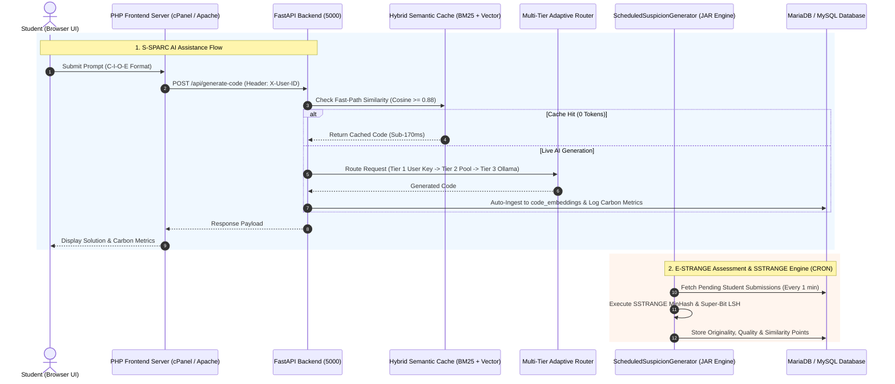

# E-STRANGE X S-SPARC AI Engine

> **An Integrated Platform for Educational Performance Support, Code Ethics & Quality Assessment, Scalable Similarity Detection (SSTRANGE), and Pedagogical AI Retrieval (S-SPARC).**

[](https://python.org)
[](https://fastapi.tiangolo.com)
[](https://php.net)
[](https://java.com)
[](https://mariadb.org)
[](https://ai.google.dev)
[](#sustainability)

---

## 📌 Executive Summary & System Definitions

This platform unites three complementary technologies designed to revolutionize programming education:

```
+---------------------------------------------------------------------------------------------------+
|                                 UNIFIED E-STRANGE & S-SPARC ECOSYSTEM                             |
+---------------------------------------------------------------------------------------------------+
|  1. E-STRANGE PLATFORM       |  2. SSTRANGE ENGINE          |  3. S-SPARC AI ASSISTANT            |
|  - Student Performance       |  - Locality Sensitive Hashing|  - C-I-O-E Protocol Scaffolding     |
|    Support                   |    (MinHash & Super-Bit)     |  - Multi-Tier Adaptive Router       |
|  - Code Ethics, Quality, &   |  - Multi-Language (Java, Py, |    (User Key -> System -> Ollama)   |
|    Efficiency Assessment     |    C#, Dart, Web Stack)      |  - Sub-150ms Hybrid Semantic Cache  |
|  - Academic Gamification     |  - Sensitive Similarity      |  - Real-Time Green Computing        |
|  - Formative Feedback        |  - IEEE Award-Winning Paper  |    Carbon Footprint Tracking        |
+---------------------------------------------------------------------------------------------------+
```

---

### ❓ 1. What is E-STRANGE?
**E-STRANGE** is an educational **performance support platform** engineered for students learning computer programming. Rather than merely grading final code submissions, E-STRANGE provides ongoing, formative support to help students master three essential dimensions of computer science education:
- **Code Ethics & Originality**: Helps students recognize proper code reuse vs. plagiarism.
- **Code Quality & Readability**: Offers structured recommendations to improve code structure, naming conventions, and clarity.
- **Computational Efficiency**: Evaluates algorithmic complexity (time and space complexity) and suggests optimization techniques.

E-STRANGE incorporates an **academic gamification engine** (leaderboards, originality badges, quality points, and token quotas) to keep students motivated throughout their learning journey.

---

### ❓ 2. What is SSTRANGE?
**SSTRANGE** (*Scalable Similarity TRacker in Academia with Natural lanGuage Explanation*) is the core backend algorithmic engine powering code similarity observation in E-STRANGE. It employs advanced **Locality Sensitive Hashing (LSH)** algorithms—specifically **MinHash** and **Super-Bit**—to detect structural and sensitive code similarities efficiently across large submission volumes.

#### Supported Languages & Stacks:
- **Java**, **Python**, **C#**, **Dart**, and **Web Stack** (HTML + JS + CSS + PHP).

#### Peer-Reviewed Publications & Scientific Recognition:
- 📄 **MDPI Education Sciences (2023)**: *SSTRANGE: Scalable Similarity TRacker in Academia with Natural Language Explanation*. ([MDPI Paper](https://www.mdpi.com/2227-7102/13/1/54))
- 🏆 **IEEE ICALT (2023) — Best Discussion Paper Award**: *Scalable Code Similarity Detection for C# Submissions*. ([IEEE Xplore](https://ieeexplore.ieee.org/abstract/document/10260942))
- 📄 **IEEE EDUNINE (2024)**: *Sensitive Code Similarity Detection for Higher Education*. ([IEEE Xplore](https://ieeexplore.ieee.org/abstract/document/10500603/))

---

### ❓ 3. What is S-SPARC AI?
**S-SPARC AI** (*Smart Software Engineering & Pedagogical Adaptive Retrieval Assistant*) is an intelligent, high-speed AI tutoring and retrieval engine integrated directly into the E-STRANGE interface.

Unlike generic AI wrappers, S-SPARC AI enforces **Pedagogical Scaffolding (the C-I-O-E Protocol)**, encouraging students to articulate problem context before receiving guidance. It operates on a **Multi-Tier Adaptive Router** (User Personal Key $\rightarrow$ System Key Pool $\rightarrow$ Local Ollama Fallback), ensuring **Zero Institutional API Cost ($0)** and **high-availability offline resilience**. It also features **Sub-150ms Hybrid Semantic Vector Caching** and **Real-Time Carbon Footprint Tracking** calibrated for the Indonesian electrical grid.

---

### 🔗 4. How Do E-STRANGE & S-SPARC Work Together?
1. **E-STRANGE** acts as the primary web portal, managing user authentication, courses, gamification, and assessment submissions.
2. **SSTRANGE** runs in the background (via a scheduled Java runnable JAR) to analyze code submissions for originality, quality, and similarity.
3. **S-SPARC AI** embedded within E-STRANGE serves as the interactive real-time AI tutor. When students struggle with code or need guidance, S-SPARC AI delivers scaffolded feedback while recording token consumption, carbon impact, and gamification points back into E-STRANGE.

---

## 🌟 S-SPARC AI Architectural Pillars

### 1. Standardized C-I-O-E Pedagogical Protocol & Prompt Literacy Evaluator
S-SPARC trains students to develop structured computational thinking by enforcing the **C-I-O-E Protocol**:
- **[C] Context**: Task background, problem domain, and algorithmic constraints.
- **[I] Input**: Data pre-conditions, input data structures, and sample test cases.
- **[O] Output**: Expected post-conditions, return data types, and target time/space complexity.
- **[E] Error Trace / Constraints**: Compiler/interpreter error trace, failing test cases (WA/TLE), and self-debugging steps taken.

The system automatically assesses student prompt quality using mathematical **Shannon Entropy** ($H$) and **Technical Token Density** ($D$), assigning a real-time **Literacy Grade** (*Grade A / B / C*) alongside automated pedagogical guidance aligned with Bloom's Taxonomy.

### 2. Multi-Tier Adaptive Router & High-Availability Engine
To guarantee zero service disruption regardless of network conditions or individual quota limits, S-SPARC employs a 3-tier failover routing engine:
- **Tier 1 (User Personal Gemini Key)**: Students can register their personal Google Gemini API Key (available for free via Google AI Studio). Inference requests are executed directly via REST with latencies of **~1.5 - 2.5 seconds**.
- **Tier 2 (System Key Pool Fallback)**: If a user key is unconfigured or rate-limited, the router seamlessly falls back to a load-balanced *System API Key Pool* managed on the server.
- **Tier 3 (Local Zero-Cost Offline Fallback - Ollama)**: Should cloud network connectivity fail completely or hit rate limits (HTTP 429), the platform automatically redirects inference to a local **Ollama Qwen2.5-Coder 14B** instance, ensuring 100% offline reliability.

### 3. Hybrid Vector Semantic Caching (BM25 + SentenceTransformers RRF)
S-SPARC features a high-performance *Retrieval-Augmented Caching Engine* that combines:
- **Sparse Search (BM25)** for exact keyword, syntax, and function signature matching.
- **Dense Vector Search (SentenceTransformers `all-MiniLM-L6-v2`)** for semantic context and problem intent matching.
- **Reciprocal Rank Fusion (RRF)** to fuse sparse and dense rankings into a unified high-precision score.

When a student prompt exhibits high cosine similarity ($\ge 0.88$) with a verified solution in the `code_embeddings` database, S-SPARC responds **instantly (0.11 - 0.17 seconds)** without consuming API tokens (0 Tokens / FREE Tier).

### 4. Windows Network IPv4 Socket Optimizer
When deployed in university computer laboratories operating on Windows environments, standard Python `requests` calls to `generativelanguage.googleapis.com` often experience severe socket stalls due to IPv6 DNS resolution attempts (causing delays up to 78 seconds per request).

S-SPARC incorporates a custom **IPv4 Socket Resolver Patch** at the socket layer (`_ipv4_getaddrinfo`), which slashes execution latency from **78 seconds down to 2.7 seconds** consistently.

### 5. Green Computing & Environmental Footprint Tracking
S-SPARC advances institutional *Green Campus* initiatives by calculating the environmental footprint of every AI prompt in real time:
$$\text{Energy (kWh)} = \text{Tokens} \times \text{kWh\_per\_token} \times \text{PUE}$$
$$\text{Carbon (gCO2)} = \text{Energy (kWh)} \times \text{CIF\_IDN} \times 1000$$

*Parameters:*
- **CIF Indonesia (Carbon Intensity Factor)**: $0.78 \text{ kg CO}_2/\text{kWh}$ (Indonesian Electrical Grid Baseline).
- **PUE (Power Usage Effectiveness)**: $1.5$ (Efficient Data Center Benchmark).
- **Tree Absorption Equivalent**: Calculated based on standard annual absorption rates ($21.77 \text{ kg CO}_2/\text{year}$).

---

## 🏗️ Tech Stack Matrix

| Component | Framework / Technology | Purpose & Description |
| :--- | :--- | :--- |
| **Backend Core** | Python 3.12, FastAPI, Uvicorn | Asynchronous, high-throughput REST API backend engine. |
| **Frontend Web** | PHP 8.2, Vanilla CSS, JavaScript (ES6+) | Glassmorphism responsive web UI, Dark/Light Mode. |
| **Database** | MariaDB 10.11 / MySQL 8.0 | Stores user credentials, chat histories, job queues, and `code_embeddings`. |
| **Vector Search** | SentenceTransformers (`MiniLM-L6-v2`), BM25 | Hybrid sparse + dense vector retrieval search engine. |
| **AI Providers** | Google Gemini REST API, LiteLLM, Ollama | Multi-provider cloud and local LLM execution runtime. |
| **CRON Engine** | Java 11+ Runnable JAR (`ScheduledSuspicionGenerator.jar`) | Background task processor for SSTRANGE similarity computation. |
| **UI Components** | SweetAlert2, Highcharts, Google Fonts (Outfit) | Interactive notifications, sustainability charts, and modern typography. |

---

## 📐 Unified Request & Processing Lifecycle



---

## ⚙️ Unified Installation & Deployment Guideline

Follow these step-by-step instructions to deploy the complete E-STRANGE & S-SPARC platform.

### Prerequisites:
- **Operating System**: Windows Server / Linux (Ubuntu 22.04 LTS recommended).
- **Web Server & PHP**: Apache/Nginx with PHP 8.1+ (`pdo_mysql`, `curl`, `mbstring`).
- **Python**: Version 3.10 or 3.12.
- **Java Runtime**: JRE / JDK 11 or higher (for the CRON runnable JAR).
- **Database**: MariaDB 10.6+ or MySQL 8.0+.

---

### Step 1: E-STRANGE Supporting Directory & Java Engine Setup
1. Copy the supporting directory to your server (typically placed in the server root, e.g., `/var/www/supporting_dir` or `C:\supporting_dir`).
2. In the Java code project file `ScheduledSuspicionGenerator.java`:
   - Set `prefixPath` to the exact server path of the supporting directory (including directory name).
3. Compile the Java project and export it as a **runnable JAR file** with `ScheduledSuspicionGenerator.java` set as its launch configuration / main class.
4. Move the resulting JAR file into the supporting directory.
5. In the supporting directory, edit `serverinfo.txt` with your MySQL credentials:
   - Set `server_base_path` to the absolute path of the `public_html` directory where the PHP project is located.

---

### Step 2: Database Migration
Import the MySQL database schema (`db_semantic` / `estrange_v7`) into your MySQL/MariaDB server:
```bash
mysql -u root -p db_semantic < db_migrations/complete_schema.sql
```

---

### Step 3: PHP Frontend Deployment (`public_html`)
1. Copy the PHP code project into your server's `public_html` directory (e.g., `/public_html/ssparc` or `/public_html/estrange`).
2. Configure `_config.php` with your database credentials:
   ```php
   $servername = "localhost";
   $username = "your_db_user";
   $password = "your_db_password";
   $dbname = "db_semantic";
   $baseDomainLink = "https://estrange.your-university.ac.id/";
   $registered_email_domain = "@maranatha.ac.id"; // Restrict registration to your institution
   ```
3. Configure `_phpmailerlib.php` with your institutional Google email credentials for student notifications (XOAUTH2 authentication enabled).

---

### Step 4: S-SPARC FastAPI Backend Setup
1. Clone or copy the S-SPARC Python backend to your server.
2. Create and activate a Python virtual environment:
   ```bash
   python -m venv venv
   source venv/bin/activate  # Linux
   # .\venv\Scripts\activate # Windows
   ```
3. Install Python dependencies:
   ```bash
   pip install -r requirements.txt
   ```
4. Copy `.env.example` to `.env` and set your credentials:
   ```ini
   FLASK_PORT=5000
   FASTAPI_URL=https://estrangeinternal.itmaranatha.org
   DB_HOST=127.0.0.1
   DB_USER=your_db_user
   DB_PASSWORD=your_db_password
   DB_NAME=db_semantic
   GEMINI_MODEL=gemini-3.5-flash-lite
   ```
5. Start the FastAPI backend server:
   ```bash
   python run_fastapi.py
   ```

---

### Step 5: CRON Job Setup (Java SSTRANGE Engine)
Add a system CRON job to execute the runnable JAR file once per minute:
```cron
* * * * * java -jar /var/www/supporting_dir/ScheduledSuspicionGenerator.jar >> /var/www/supporting_dir/cron.log 2>&1
```

---

### Step 6: Initial System Login & Setup Verification
1. Access the web interface at your configured domain (`$baseDomainLink`).
2. Log in using the default administrative credentials:
   - **Username**: `adminacc`
   - **Password**: `adminacc`
3. ⚠️ **SECURITY WARNING**: Change the default administrator password and registered email address immediately after your first login.

---

## 📡 REST API Reference (S-SPARC Engine)

### 1. `POST /api/generate-code`
Processes student prompts and returns AI-generated solution code alongside prompt literacy analytics.

- **Request Headers**:
  - `Content-Type: application/json`
  - `X-User-ID: <STUDENT_UUID>`
- **Request Body**:
```json
{
  "prompt": "[CONTEXT: Array Processing]\nFinding maximum element...\n[INPUT]\nnums = [1, 5, 3]\n[OUTPUT]\nReturn 5\n[ERROR TRACE]\nNone",
  "course_id": "COURSE_SE_2026",
  "assessment_id": "ASSESS_01"
}
```

### 2. `POST /api/user/api-key`
Registers a student's personal Google Gemini API Key.

- **Request Body**:
```json
{
  "api_key": "AIzaSyYourPersonalGeminiApiKeyHere123",
  "terms_accepted": true
}
```

---

## 📚 Academic Publications & Citations

If you use E-STRANGE, SSTRANGE, or S-SPARC in academic research or institutional deployments, please cite the following papers:

```bibtex
@article{karnalim2023sstrange,
  title={SSTRANGE: Scalable Similarity TRacker in Academia with Natural Language Explanation},
  author={Karnalim, Oscar and others},
  journal={Education Sciences},
  volume={13},
  number={1},
  pages={54},
  year={2023},
  publisher={MDPI}
}

@inproceedings{karnalim2023csharp,
  title={Scalable Code Similarity Detection for C\# Submissions},
  author={Karnalim, Oscar and others},
  booktitle={2023 IEEE International Conference on Advanced Learning Technologies (ICALT)},
  year={2023},
  organization={IEEE},
  note={Best Discussion Paper Award}
}

@inproceedings{karnalim2024sensitive,
  title={Sensitive Code Similarity Detection for Higher Education},
  author={Karnalim, Oscar and others},
  booktitle={2024 IEEE World Engineering Education Conference (EDUNINE)},
  year={2024},
  organization={IEEE}
}
```

---

<p align="center">
  <sub>Developed & Maintained for Educational Software Engineering & Artificial Intelligence Advancement. 🇮🇩</sub>
</p>
