# S-SPARC AI™: Specific Smart Prompting Assistant for perfoRmanCe
## *A Pedagogical AI Framework for Metacognitive Scaffolding, Productive Friction, Multi-Tier Reliability, and Green Computing in Higher Education*

[](#)
[](#)
[](#awards-and-honors)
[](#awards-and-honors)
[](https://python.org)
[](https://fastapi.tiangolo.com)
[](#green-computing)
[](#un-sustainable-development-goals-sdgs)
[](https://raw.githack.com/06202003/s-sparc/main/docs/index.html)
[](docs/S_SPARC_COMPREHENSIVE_WHITEPAPER.md)

---

> ### Official Academic Whitepaper and Documentation Hub
> - 🌐 **Live Interactive Web Viewer (Direct Browser Open)**: [**Launch S-SPARC Interactive Whitepaper Web App**](https://raw.githack.com/06202003/s-sparc/main/docs/index.html)  
> - 🚀 **GitHub Pages Mirror**: [**https://06202003.github.io/s-sparc/**](https://06202003.github.io/s-sparc/) *(Requires GitHub Pages enabled on `main` branch in repo settings)*
> - 📄 **Comprehensive Academic Whitepaper (Markdown)**: [`docs/S_SPARC_COMPREHENSIVE_WHITEPAPER.md`](docs/S_SPARC_COMPREHENSIVE_WHITEPAPER.md) (14 complete sections with full mathematical derivations and empirical statistics)
> - 📊 **Official Pitch Deck (PDF)**: [`docs/S-SPARC Pitch Deck.pdf`](docs/S-SPARC%20Pitch%20Deck.pdf)
> - 🏛️ **Academic Home**: **Maranatha Christian University (Universitas Kristen Maranatha)**, Bandung, Indonesia

---

## Executive Summary

Generative artificial intelligence has introduced a critical challenge into higher education: **the speed of content generation has outpaced the depth of critical comprehension**. When students and researchers rely on conventional AI chatbots through unstructured queries, two major systemic problems emerge:

1. **Cognitive Atrophy and Epistemic Erosion**: Users become passive consumers of AI-generated answers, degrading fundamental analytical habits of problem framing, contextual critique, and algorithmic reasoning.
2. **Hidden Ecological Footprint**: Repeated and unreflective cloud queries consume electricity, generate carbon emissions, and consume freshwater for datacenter cooling.

**S-SPARC AI™ (Specific Smart Prompting Assistant for perfoRmanCe / Sustainable Smart Personal Assistant for Responsible Consumption)** transforms AI from a passive answer generator into a **metacognitive dialectical partner**. Developed by the ITMCU research team at Maranatha Christian University and recognized at the **UNU Global Youth AI Future Innovation Competition 2026** (UNU Macau), S-SPARC enforces structured inquiries (**C-I-O-E Protocol**), intentional **Reflexive Pauses (Productive Friction)**, **3-Tier Progressive Hints**, instant zero-token semantic caching (<45ms), and real-time environmental accounting.

```
=============================================================================================
  "True technological empowerment does not replace human intellect; it scaffolds human
   critical reasoning to achieve sustainable, responsible, and autonomous mastery."
=============================================================================================
```

---

## Master 5-Step User Journey

S-SPARC simplifies the entire interaction flow into five clear, linear pedagogical steps:

```mermaid
flowchart LR
    classDef step1 fill:#0d2d4c,stroke:#388bfd,stroke-width:2px,color:#ffffff;
    classDef step2 fill:#3d2c00,stroke:#d29922,stroke-width:2px,color:#ffffff;
    classDef step3 fill:#0e3a1e,stroke:#3fb950,stroke-width:2px,color:#ffffff;
    classDef step4 fill:#431e03,stroke:#f0883e,stroke-width:2px,color:#ffffff;
    classDef step5 fill:#063a36,stroke:#39c5bb,stroke-width:2px,color:#ffffff;

    S1["<b>STEP 1: Formulate Inquiry</b><br/>Fill 4 guided fields<br/>(Context, Input, Output, Error Trace)"]:::step1
    S2["<b>STEP 2: Smart Quality Check</b><br/>Evaluates prompt clarity<br/>& Shannon entropy"]:::step2
    S3["<b>STEP 3: Dialectical Answer</b><br/>Delivers critical synthesis<br/>+ Green Eco-Receipt"]:::step3
    S4["<b>STEP 4: 60s Reflexive Pause</b><br/>Dedicated time to read,<br/>cross-check & take notes"]:::step4
    S5["<b>STEP 5: Genuine Mastery</b><br/>Builds independent insight<br/>& critical understanding"]:::step5

    S1 --> S2 --> S3 --> S4 --> S5
```



### Step-by-Step Breakdown:
1. **Step 1: Thoughtful Formulation (C-I-O-E)**: Users structure their questions across four specific dimensions: Context, Input Data, Expected Output, and Error Trace.
2. **Step 2: Instant Quality Review**: Real-time evaluation of prompt clarity and completeness, providing automated guidance before submission.
3. **Step 3: Dialectical Response & Eco-Receipt**: Delivery of structured reasoning alongside transparent telemetry showing energy (Wh), carbon emissions ($g\text{ }CO_2e$), and cooling water (mL).
4. **Step 4: 60-Second Reflexive Breathing Room**: An intentional brief pause that prevents rapid copy-paste spamming and encourages reflective reading.
5. **Step 5: Conceptual Mastery**: The student independently constructs the working implementation, retaining core algorithmic principles.

---

## Core Technical Architecture & Pillars

```
+---------------------------------------------------------------------------------------------------+
|                                     S-SPARC AI ENTERPRISE ECOSYSTEM                               |
+---------------------------------------------------------------------------------------------------+
|  1. C-I-O-E PROTOCOL         |  2. MULTI-TIER ROUTER        |  3. HYBRID SEMANTIC CACHE            |
|  - Context, Input, Output,   |  - Tier 1: User Key (BYOK)   |  - BM25 Sparse Search                |
|    Error Trace Scaffolding   |  - Tier 2: System Key Pool   |  - SentenceTransformers Dense        |
|  - Shannon Entropy Eval      |  - Tier 3: Local Ollama      |  - Reciprocal Rank Fusion (RRF)      |
|  - Bloom's Taxonomy Alignment|  - Zero Institutional Cost   |  - Sub-45ms / 0 Token Overhead       |
+---------------------------------------------------------------------------------------------------+
|  4. PRODUCTIVE FRICTION      |  5. GREEN COMPUTING          |  6. METRIC-DRIVEN GAMIFICATION       |
|  - 60s Reflexive Pause       |  - Carbon & Water Telemetry  |  - EcoPoints & Prompt Badging        |
|  - 3-Tier Progressive Hints  |  - Localized Grid CIF (IDN)  |  - Cognitive Autonomy Progress       |
+---------------------------------------------------------------------------------------------------+
```

### 1. Standardized C-I-O-E Inquiring Protocol
The C-I-O-E Protocol requires students to articulate four essential problem bounds:
- **[C] Context**: Task background, problem domain, and theoretical scope.
- **[I] Input**: Data pre-conditions, variable types, and sample test cases.
- **[O] Output**: Expected post-conditions, return data types, and target time/space complexity.
- **[E] Error Trace**: Compiler/interpreter trace, failing assertions (WA/TLE), and self-debugging steps taken.

### 2. Multi-Tier High-Availability Routing Engine
To ensure uninterrupted service across varied network environments and budget constraints:
- **Tier 1: User Personal Key (BYOK)**: Students connect their personal Google Gemini API Key. Inference completes via REST with typical latency of **~1.2s - 1.8s** at **$0 institutional cost**.
- **Tier 2: System Key Pool Fallback**: If a user key is unconfigured or encounters quota limits, the router seamlessly falls back to a load-balanced institutional key pool.
- **Tier 3: Local Zero-Cost Offline Fallback (Ollama)**: If cloud connectivity fails or rate limits occur (HTTP 429), inference automatically redirects to a locally hosted **Ollama Qwen2.5-Coder 14B** instance (**~5.5s - 8.2s** latency, 100% offline).

### 3. Hybrid Semantic Memory (<45ms, 0 Token Cost)
S-SPARC features a hybrid retrieval cache fusing:
- **Sparse Search (BM25)** for exact keyword and function signature matching.
- **Dense Vector Search (SentenceTransformers `all-MiniLM-L6-v2`)** for semantic context matching.
- **Reciprocal Rank Fusion (RRF)** to combine rankings into a high-precision score.

When an inquiry exhibits high cosine similarity ($\ge 0.88$) with a verified solution in the database, S-SPARC serves the answer **instantly (<45ms)** with **zero cloud token consumption**.

---

## Green Computing & Environmental Accounting

Every inference request logs precise ecological metrics displayed on student receipts:

$$\text{Energy (kWh)} = \text{Tokens} \times \text{kWh/token} \times \text{PUE}$$

$$\text{Carbon (g } CO_2e) = \text{Energy (kWh)} \times \text{CIF} \times 1000$$

$$\text{Water (mL)} = \text{Energy (kWh)} \times \text{WUE} \times 1000$$

| Parameter | Baseline Value | Standard Reference |
| :--- | :--- | :--- |
| **Indonesian Grid Emission Factor (CIF)** | $0.384 - 0.780\text{ kg } CO_2/\text{kWh}$ | Ministry of Energy and Mineral Resources (ESDM) / Jamali Grid |
| **Power Usage Effectiveness (PUE)** | $1.50$ | Efficient Cloud Hyperscale Benchmark |
| **Water Usage Effectiveness (WUE)** | $1.80\text{ L/kWh}$ | Hyperscale Datacenter Evaporative Cooling Benchmark |
| **Cloud LLM Energy per 1k Tokens** | $0.003\text{ kWh}$ | Standard Generative Transformer Baseline |
| **Semantic Cache Energy per Lookup** | $0.00002\text{ kWh}$ | Local In-Memory Vector Search ($99.3\%$ savings) |

---

## Empirical Validation & Quasi-Experimental Results (TRL 6)

S-SPARC has undergone rigorous field evaluation across active undergraduate cohorts at Maranatha Christian University, positioned at **Technology Readiness Level (TRL) 6**:

| Metric / Evaluation Dimension | Value | Academic Validation Context |
| :--- | :--- | :--- |
| **Midterm Exam Performance** | **+33.7%** | $d = 1.54$, $p < .001$ (Large effect size vs. control cohort) |
| **Final Exam Performance** | **+12.8%** | $d = 0.71$, $p < .01$ (Statistically significant improvement) |
| **Overall Course Grade** | **+14.0%** | $d = 0.81$, $p < .01$ (Comprehensive academic gains) |
| **Inference Token Demand Reduction** | **83.94%** | $1,781,845$ of $2,122,873$ tokens bypassed via semantic memory |
| **Debugging Cycle Compression** | **7.4 $\to$ 1.8 turns** | Metacognitive friction eliminated mindless error-pasting |
| **Direct Retrieval Accuracy (MRR)** | **1.000** | Precision@1 = $100\%$, Recall = $96.0\%$, F1 = $97.96\%$ |
| **Student Satisfaction Score** | **4.07 / 5.00** | $N = 67$ survey respondents reporting high learning autonomy |

---

## UN Sustainable Development Goals (SDGs)

S-SPARC is engineered to advance key United Nations Sustainable Development Goals:
- **SDG 4 (Quality Education)**: Democratizes access to individualized, high-quality programming tutoring while preventing algorithmic cognitive dependence.
- **SDG 9 (Industry, Innovation & Infrastructure) & SDG 10 (Reduced Inequalities)**: Enables bandwidth-constrained institutions in the Global South to access advanced AI tutoring at zero institutional subscription cost via local caching and offline fallbacks.
- **SDG 12 (Responsible Consumption) & SDG 13 (Climate Action)**: Teaches environmental literacy through real-time carbon accounting and achieves over $80\%$ reduction in cloud datacenter energy consumption.
- **SDG 17 (Partnerships for the Goals)**: Built on open-science standards, enabling inter-university exchange of validated pedagogical vectors.

---

## Tech Stack & System Requirements

| Layer | Technology | Specification |
| :--- | :--- | :--- |
| **AI Backend Core** | Python 3.12 | FastAPI Async, Uvicorn, LiteLLM |
| **Vector Engine** | SentenceTransformers | `all-MiniLM-L6-v2`, BM25, Reciprocal Rank Fusion |
| **Database** | MariaDB 10.11 / MySQL 8.0 | Vector and relational schema storage |
| **Offline LLM Runtime** | Ollama | Qwen2.5-Coder 14B (Local on-premise execution) |
| **Frontend Integration** | PHP 8.2 / HTML5 / CSS3 | Glassmorphism responsive UI, KaTeX math, Mermaid diagrams |

---

## Installation & Deployment Guide

### 1. Prerequisites
- **Operating System**: Linux (Ubuntu 22.04 LTS / Debian 12) or Windows Server
- **Python**: Version 3.10 or 3.12
- **Database**: MariaDB 10.6+ or MySQL 8.0+

### 2. Quickstart
```bash
# Clone the repository
git clone https://github.com/06202003/s-sparc.git
cd s-sparc

# Create and activate virtual environment
python -m venv venv

# Windows
.\venv\Scripts\activate
# Linux/macOS
# source venv/bin/activate

# Install dependencies
pip install -r requirements.txt
```

### 3. Environment Configuration (`.env`)
```ini
FLASK_PORT=5000
FASTAPI_URL=http://127.0.0.1:8000
DB_HOST=127.0.0.1
DB_USER=your_db_user
DB_PASSWORD=your_db_password
DB_NAME=db_semantic
GEMINI_MODEL=gemini-3.5-flash-lite
```

### 4. Running the Service
```bash
python run_fastapi.py
```

---

## Awards and Honors

1. **UNU Global Youth AI Future Innovation Competition 2026**
   - **Organizer**: United Nations University (UNU Macau)
   - **Track**: AI for Education / SDG 4
   - **Recognition**: Global Finalist and Innovator
2. **AIREA Merit Award**
   - **Organizer**: The Education University of Hong Kong (EdUHK)
   - **Competition**: 2nd International Competition of AI in Education (AIREA 2026)
   - **Scope**: Selected among 212 project submissions across 13 countries
3. **Most Favorite Poster Award**
   - **Organizer**: Impact Edu International Conference

---

## Research Team & Institutional Attribution

### Academic Home
**Maranatha Christian University (Universitas Kristen Maranatha)**  
Faculty of Information Technology  
Bandung, West Java, Indonesia  

### Research and Engineering Team (ITMCU)
- **Yehezkiel David Setiawan**: Principal Investigator, Systems Architect, Lead Researcher
- **Oscar Karnalim, S.T., M.T., Ph.D., SMIEEE**: Faculty Advisor, Principal Research Supervisor
- **Johanes Mario**: AI Systems and Data Infrastructure Engineer
- **Archangella Sheilla**: Pedagogical Design and Educational Metrics Researcher
- **Dominic Xaviera**: Backend Integration and System Verification Specialist
- **Joshua Christopher**: Frontend UX and Telemetry Visualization Engineer

---

## Scientific Citations

```bibtex
@article{karnalim2023sstrange,
  title={SSTRANGE: Scalable Similarity TRacker in Academia with Natural Language Explanation},
  author={Karnalim, Oscar and others},
  journal={Education Sciences},
  volume={13},
  number={1},
  pages={54},
  year={2023},
  publisher={MDPI}
}

@inproceedings{karnalim2023csharp,
  title={Scalable Code Similarity Detection for C\# Submissions},
  author={Karnalim, Oscar and others},
  booktitle={2023 IEEE International Conference on Advanced Learning Technologies (ICALT)},
  year={2023},
  organization={IEEE},
  note={Best Discussion Paper Award}
}

@inproceedings{karnalim2024sensitive,
  title={Sensitive Code Similarity Detection for Higher Education},
  author={Karnalim, Oscar and others},
  booktitle={2024 IEEE World Engineering Education Conference (EDUNINE)},
  year={2024},
  organization={IEEE}
}
```

---

<p align="center">
  <b>S-SPARC AI™ Enterprise Ecosystem</b><br>
  Faculty of Information Technology • Maranatha Christian University, Bandung, Indonesia<br>
  <sub>Recognized at the UNU Global Youth AI Future Innovation Competition 2026 (UNU Macau)</sub>
</p>
