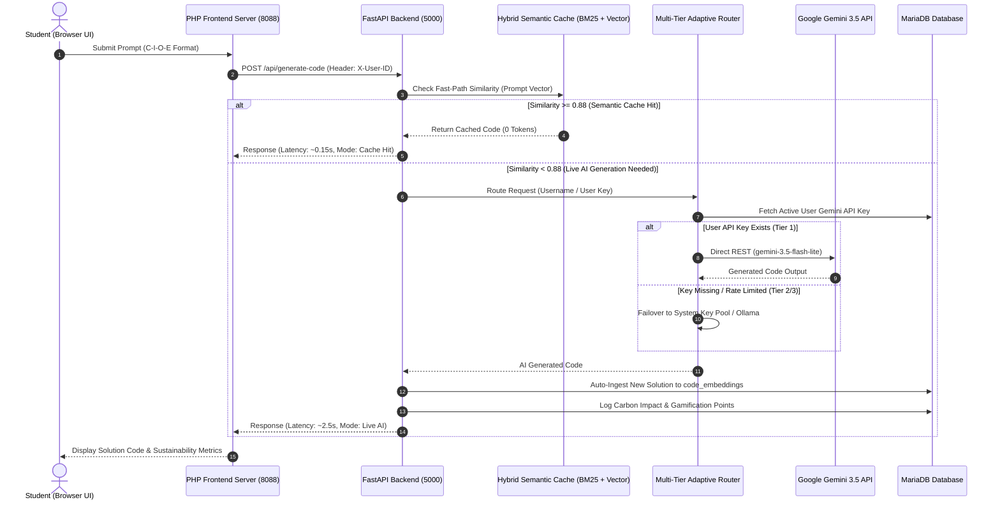

# E-STRANGE X S-SPARC AI: Smart Software Engineering & Pedagogical Adaptive Retrieval Assistant

> **An Adaptive, Pedagogically Scaffolded AI Learning Engine & High-Performance Retrieval Platform Designed for Software Engineering Education in Higher Education.**

[](https://python.org)
[](https://fastapi.tiangolo.com)
[](https://php.net)
[](https://mariadb.org)
[](https://ai.google.dev)
[](#sustainability)

---

## 📌 Executive Summary

**S-SPARC AI** (*Smart Software Engineering & Pedagogical Adaptive Retrieval Assistant*) is an advanced AI-powered educational platform specifically built to enhance programming and software engineering instruction in university computer laboratories.

Unlike generic AI coding chatbots (*unstructured LLM wrappers*), S-SPARC AI integrates **Pedagogical Scaffolding (the C-I-O-E Protocol)**, a **Multi-Tier Adaptive Router**, **Hybrid Vector Semantic Caching (Sub-150ms Retrieval)**, and **Green Computing Sustainability Tracking**. The system enables educational institutions to deliver scalable, high-speed AI assistance for thousands of students with **Zero Institutional API Cost ($0)** and **ultra-fast response latencies (< 2.5 seconds)**.

---

## 🌟 Core Architectural Pillars

```
+-----------------------------------------------------------------------------------+
|                                  S-SPARC AI PLATFORM                              |
+-----------------------------------------------------------------------------------+
| 1. C-I-O-E Protocol      | 2. Multi-Tier Router     | 3. Hybrid Semantic Cache    |
| - Context, Input,        | - Tier 1: User Key       | - BM25 Sparse Search        |
|   Output, Error Trace    | - Tier 2: System Pool    | - SentenceTransformers Dense|
| - Shannon Entropy Eval   | - Tier 3: Local Ollama   | - RRF (Sub-170ms / $0 Cost) |
+--------------------------+--------------------------+-----------------------------+
| 4. Green Computing       | 5. E-STRANGE Gamification| 6. Windows Socket Resolver  |
| - Indonesia Grid CIF     | - Daily Quotas (1500 RPD)| - IPv4 Socket Bypass        |
| - gCO2 & Tree Equivalent | - Cooldown Rate Limits   | - Fixed 78s -> 2.7s Latency |
+-----------------------------------------------------------------------------------+
```

### 1. Standardized C-I-O-E Pedagogical Protocol & Prompt Literacy Evaluator
S-SPARC trains students to develop structured computational thinking by enforcing the **C-I-O-E Protocol**:
- **[C] Context**: Task background, problem domain, and algorithmic constraints.
- **[I] Input**: Data pre-conditions, input data structures, and sample test cases.
- **[O] Output**: Expected post-conditions, return data types, and target time/space complexity.
- **[E] Error Trace / Constraints**: Compiler/interpreter error trace, failing test cases (WA/TLE), and self-debugging steps taken.

The system automatically assesses student prompt quality using mathematical **Shannon Entropy** ($H$) and **Technical Token Density** ($D$), assigning a real-time **Literacy Grade** (*Grade A / B / C*) alongside automated pedagogical guidance aligned with Bloom's Taxonomy.

### 2. Multi-Tier Adaptive Router & High-Availability Engine
To guarantee zero service disruption regardless of network conditions or individual quota limits, S-SPARC employs a 3-tier failover routing engine:
- **Tier 1 (User Personal Gemini Key)**: Students can register their personal Google Gemini API Key (available for free via Google AI Studio). Inference requests are executed directly via REST with latencies of **~1.5 - 2.5 seconds**.
- **Tier 2 (System Key Pool Fallback)**: If a user key is unconfigured or rate-limited, the router seamlessly falls back to a load-balanced *System API Key Pool* managed on the server.
- **Tier 3 (Local Zero-Cost Offline Fallback - Ollama)**: Should cloud network connectivity fail completely or hit rate limits (HTTP 429), the platform automatically redirects inference to a local **Ollama Qwen2.5-Coder 14B** instance, ensuring 100% offline reliability.

### 3. Hybrid Vector Semantic Caching (BM25 + SentenceTransformers RRF)
S-SPARC features a high-performance *Retrieval-Augmented Caching Engine* that combines:
- **Sparse Search (BM25)** for exact keyword, syntax, and function signature matching.
- **Dense Vector Search (SentenceTransformers `all-MiniLM-L6-v2`)** for semantic context and problem intent matching.
- **Reciprocal Rank Fusion (RRF)** to fuse sparse and dense rankings into a unified high-precision score.

When a student prompt exhibits high cosine similarity ($\ge 0.88$) with a verified solution in the `code_embeddings` database, S-SPARC responds **instantly (0.11 - 0.17 seconds)** without consuming API tokens (0 Tokens / FREE Tier).

### 4. Windows Network IPv4 Socket Optimizer
When deployed in university computer laboratories operating on Windows environments, standard Python `requests` calls to `generativelanguage.googleapis.com` often experience severe socket stalls due to IPv6 DNS resolution attempts (causing delays up to 78 seconds per request).

S-SPARC incorporates a custom **IPv4 Socket Resolver Patch** at the socket layer (`_ipv4_getaddrinfo`), which slashes execution latency from **78 seconds down to 2.7 seconds** consistently.

### 5. Green Computing & Environmental Footprint Tracking
S-SPARC advances institutional *Green Campus* initiatives by calculating the environmental footprint of every AI prompt in real time:
$$\text{Energy (kWh)} = \text{Tokens} \times \text{kWh\_per\_token} \times \text{PUE}$$
$$\text{Carbon (gCO2)} = \text{Energy (kWh)} \times \text{CIF\_IDN} \times 1000$$

*Parameters:*
- **CIF Indonesia (Carbon Intensity Factor)**: $0.78 \text{ kg CO}_2/\text{kWh}$ (Indonesian Electrical Grid Baseline).
- **PUE (Power Usage Effectiveness)**: $1.5$ (Efficient Data Center Benchmark).
- **Tree Absorption Equivalent**: Calculated based on standard annual absorption rates ($21.77 \text{ kg CO}_2/\text{year}$).

### 6. E-STRANGE Academic Gamification & Quota Limits
- **Daily Quota Badges**: Displays student daily allowance transparently (1,500 Requests/Day & 15 Requests/Minute for Gemini Free Tier).
- **Cooldown Rate Limiting**: Prevents automated spamming via enforced timers (60s for Live AI generation / 15s for Database Cache Hits).
- **Points Aggregator & Leaderboards**: E-STRANGE gamification scores are updated automatically based on prompt quality, code originality, and algorithmic efficiency.

---

## 🏗️ Tech Stack Matrix

| Component | Framework / Technology | Purpose & Description |
| :--- | :--- | :--- |
| **Backend Core** | Python 3.12, FastAPI, Uvicorn | Asynchronous, high-throughput REST API backend engine. |
| **Frontend Web** | PHP 8.2, Vanilla CSS, JavaScript (ES6+) | Glassmorphism responsive web UI, Dark/Light Mode. |
| **Database** | MariaDB 10.11 / MySQL 8.0 | Stores user credentials, chat histories, job queues, and `code_embeddings`. |
| **Vector Search** | SentenceTransformers (`MiniLM-L6-v2`), BM25 | Hybrid sparse + dense vector retrieval search engine. |
| **AI Providers** | Google Gemini REST API, LiteLLM, Ollama | Multi-provider cloud and local LLM execution runtime. |
| **UI Components** | SweetAlert2, Highcharts, Google Fonts (Outfit) | Interactive notifications, sustainability charts, and modern typography. |

---

## 📐 System Architecture & Request Lifecycle



---

## 🚀 Installation & Campus Lab Deployment Guide

Follow these steps to deploy S-SPARC AI on a campus laboratory server or workstation.

### 1. System Requirements
- **Operating System**: Windows 10/11, Windows Server, or Linux (Ubuntu 22.04 LTS recommended).
- **Python**: Version 3.10 or 3.12.
- **PHP**: Version 8.1 or 8.2 with `pdo_mysql`, `curl`, `mbstring` extensions enabled.
- **Database**: MariaDB 10.6+ or MySQL 8.0+.
- **Web Server**: Apache/Nginx (or PHP Built-in Server for testing).

### 2. Repository Cloning & Environment Setup
```bash
# Clone the repository
git clone https://github.com/06202003/s-sparc.git
cd s-sparc

# Create virtual environment
python -m venv venv

# Activate venv (Windows)
.\venv\Scripts\activate
# Activate venv (Linux/macOS)
# source venv/bin/activate

# Install Python dependencies
pip install -r requirements.txt
```

### 3. Environment Configuration (`.env`)
Copy `.env.example` to `.env` and configure your parameters:
```ini
# Server Configuration
FLASK_PORT=5000
FLASK_HOST=127.0.0.1
FASTAPI_URL=http://127.0.0.1:5000

# Database Configuration
DB_HOST=127.0.0.1
DB_PORT=3306
DB_USER=root
DB_PASSWORD=your_password
DB_NAME=db_semantic

# System Fallback Gemini Keys (Optional)
GEMINI_API_KEY_1=AIzaSyYourPersonalGeminiApiKeyHere123
GEMINI_MODEL=gemini-3.5-flash-lite

# Ollama Local Fallback (Optional)
OLLAMA_BASE_URL=http://localhost:11434
OLLAMA_MODEL=qwen2.5-coder:14b
```

### 4. Database Migration
Import the initial database schema into your MariaDB/MySQL instance:
```bash
mysql -u root -p db_semantic < db_migrations/complete_schema.sql
```

### 5. Launching Server Services

**Step A: Start FastAPI Backend Server (Port 5000)**
```bash
python run_fastapi.py
```

**Step B: Start PHP Web Server (Port 8088)**
```bash
php -S 127.0.0.1:8088 -t estrange/v2/v2/ssparc
```

Navigate your browser to: `http://127.0.0.1:8088/chat.php`

---

## 📡 REST API Endpoint Reference

### 1. `POST /api/generate-code`
Processes student prompts and returns optimized solution code alongside literacy analytics.

- **Headers**:
  - `Content-Type: application/json`
  - `X-User-ID: <STUDENT_USER_UUID>`
- **Request Body**:
```json
{
  "prompt": "[CONTEXT: Array Processing]\nI need to find the maximum value...\n[INPUT]\nnums = [1, 5, 3]\n[OUTPUT]\nReturn 5\n[ERROR TRACE]\nNone",
  "course_id": "COURSE_SE_2026",
  "assessment_id": "ASSESS_01",
  "response_mode": "Standard",
  "language": "python"
}
```
- **Response (200 OK)**:
```json
{
  "mode": "success",
  "job_id": "9b1deb4d-3b7d-41b9-9102-123456789abc",
  "code": "```python\ndef find_max(nums):\n    return max(nums)\n```",
  "is_retrieval": false,
  "request_tokens_used": 1420,
  "cooldown_seconds": 60,
  "query_quota": {
    "has_key": true,
    "masked_key": "AQ.Ab8...HX6g",
    "daily_remaining": 1499,
    "tier_label": "Google Gemini Free Tier (1,500 RPD / 15 RPM)"
  },
  "prompt_analytics": {
    "prompt_quality_score": 1.0,
    "literacy_grade": "A (Prompt Architect)"
  }
}
```

---

### 2. `POST /api/user/api-key`
Registers or updates a student's personal Gemini API Key.

- **Request Body**:
```json
{
  "api_key": "AIzaSyYourPersonalGeminiApiKeyHere123",
  "terms_accepted": true
}
```
- **Response (200 OK)**:
```json
{
  "status": "success",
  "message": "API key successfully registered and Terms accepted.",
  "masked_key": "AQ.Ab8...HX6g"
}
```

---

### 3. `GET /api/user/query-quota`
Retrieves real-time quota metrics, API key registration status, and daily request balances.

- **Response (200 OK)**:
```json
{
  "has_key": true,
  "provider": "gemini",
  "masked_key": "AQ.Ab8...HX6g",
  "daily_limit": 1500,
  "daily_used": 4,
  "daily_remaining": 1496,
  "rate_limit_rpm": 15,
  "tier_label": "Google Gemini Free Tier (1,500 RPD / 15 RPM)"
}
```

---

## 👥 Authors, Research & License

S-SPARC AI is developed by software engineering researchers and practitioners to advance AI-driven computer science education.

- **Lead Architect & Developer**: Yehezkiel David Setiawan & The S-SPARC Research Team
- **License**: Released under the **MIT License** for open educational and academic use.

---

<p align="center">
  <sub>Designed & Developed for Software Engineering & Artificial Intelligence Education. 🇮🇩</sub>
</p>
