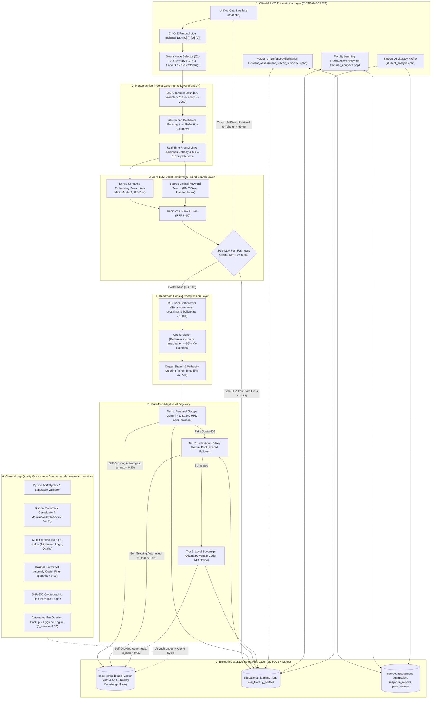
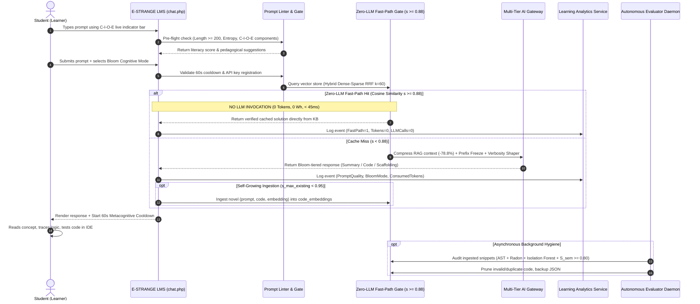

# S-SPARC — Unified Educational & Technical Architecture Blueprint
**System Designation:** S-SPARC: Specific Smart Prompting Assistant for peRformanCe  
**Target Competition:** UNU Macau & UNU Global AI Network — AI for SDGs 2026 (Track 1: AI for Education)  
**Document Designation:** `SSPARC_EDUCATION_ARCHITECTURE.md`  

---

## 1. High-Level Architectural Topology

---

## 2. The Complete Student Learning & Data Flow

---

## 3. The 4 Unified System Flows

1. **Student Metacognitive Learning Flow:**
   - Problem Encounter $\rightarrow$ C-I-O-E Formulation $\rightarrow$ 60s Reflection Cooldown $\rightarrow$ Bloom Cognitive Scaffolding $\rightarrow$ Code Tracing & Testing $\rightarrow$ Independent Mastery.
2. **Zero-LLM Direct Retrieval & Inference Flow:**
   - Query Ingestion $\rightarrow$ Hybrid RRF Retrieval $\rightarrow$ **Zero-LLM Fast-Path Gate ($s \ge 0.88$, direct KB response without LLM call)** $\rightarrow$ [If Cache Miss] AST CodeCompressor $\rightarrow$ CacheAligner $\rightarrow$ Multi-Tier Gateway (Gemini BYOK / Ollama Offline).
3. **Self-Growing Closed-Loop Knowledge Governance Flow:**
   - Novel Pair Auto-Ingestion ($s_{\text{max\_existing}} < 0.95$) $\rightarrow$ Python AST Syntax Verification $\rightarrow$ Radon CC/MI Metric Scoring $\rightarrow$ LLM Judge Evaluation ($S_{\text{sem}} \ge 0.80$) $\rightarrow$ Isolation Forest 5D Anomaly Filter $\rightarrow$ Pre-Deletion JSON Backup $\rightarrow$ Database Self-Healing.
4. **Learning Analytics & Sustainability Flow:**
   - Interaction Event Recording $\rightarrow$ Shannon Entropy Calculation $\rightarrow$ Cognitive Independence Indexing $\rightarrow$ Physical Footprint Estimation ($\text{Wh}$, $\text{CO}_2\text{e}$, $\text{H}_2\text{O}$) $\rightarrow$ Student Profile Badging & Faculty Dashboard Aggregation.

