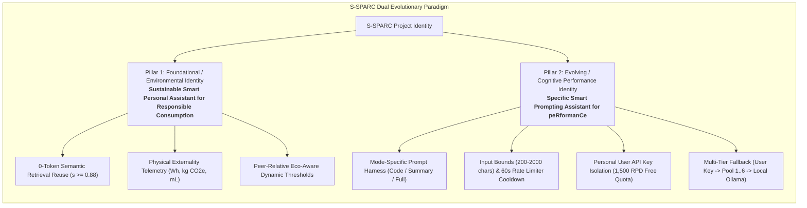
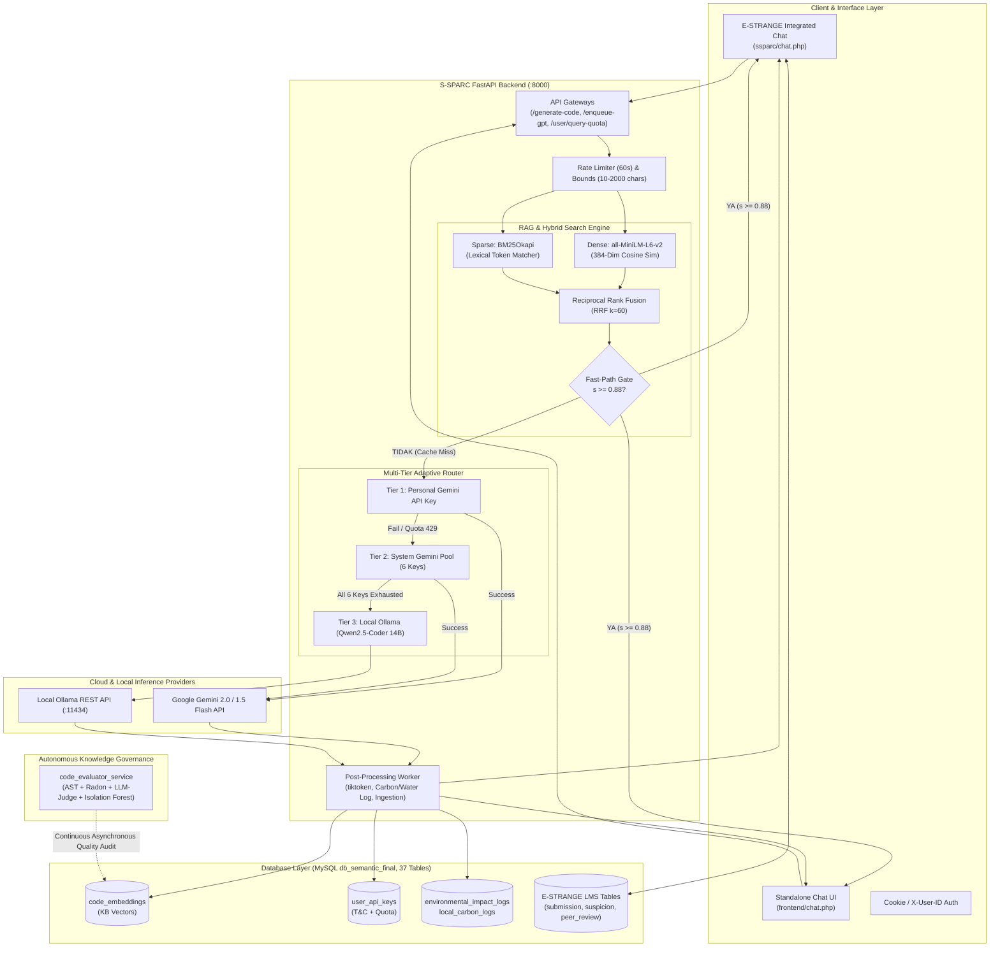
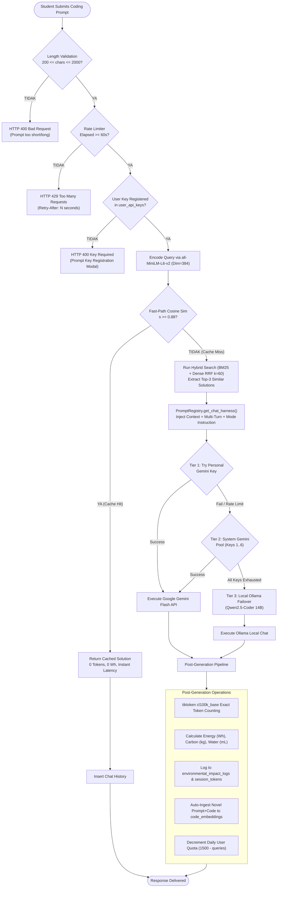
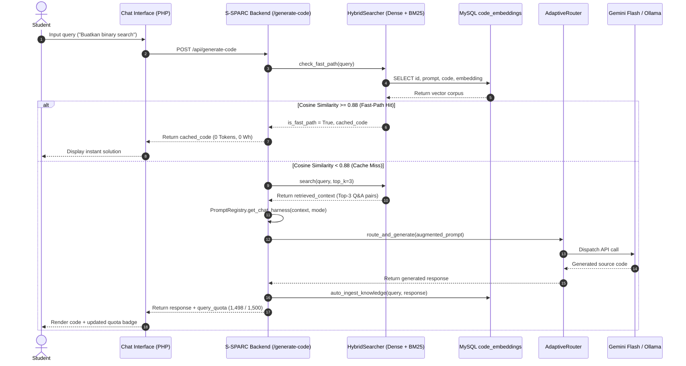
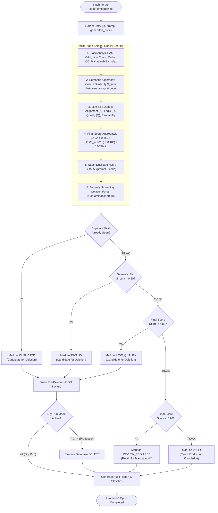
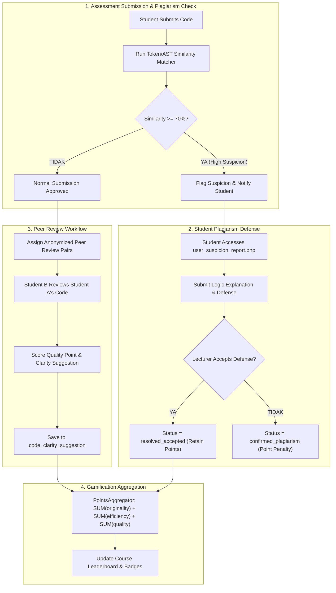

# S-SPARC Technical & Research Knowledge Base (SSPARC_KNOWLEDGE.md)

> **Document Type:** Reverse-Engineered System Architecture, AI Intelligence, and Research Specification  
> **Target Audience:** Senior AI Researchers, Software Architects, and Educational Technologists  
> **Analysis Basis:** Direct inspection of workspace source code, SQL schemas, mathematical formulations, experiment pipelines, prompt harnesses, and documentation artifacts.  
> **Epistemological Standard:**  
> - **[FACT]**: Directly verified from working codebase or database implementation.  
> - **[INFERENCE]**: Rigorous logical interpretation derived from evidence and architectural context.  
> - **[UNKNOWN]**: Information not resolvable from local repository artifacts.

---

## 1. Executive Understanding

### 1.1 Name Interpretation & Evolution
The name **S-SPARC** carries a dual evolutionary identity within the research and engineering trajectory of this project:

1. **Foundational / Environmental Identity:**  
   $$\text{\textbf{S-SPARC}} = \textbf{S}\text{ustainable }\textbf{S}\text{mart }\textbf{P}\text{ersonal }\textbf{A}\text{ssistant for }\textbf{R}\text{esponsible }\textbf{C}\text{onsumption}$$  
   - *Core Focus:* Computational sustainability, carbon emission telemetry ($\text{kg CO}_2\text{e}$), water consumption tracking ($\text{mL}$), zero-token semantic retrieval reuse, and fostering responsible resource consumption in AI-assisted learning.
   
2. **Evolving / Cognitive Performance Identity:**  
   $$\text{\textbf{S-SPARC}} = \textbf{S}\text{pecific }\textbf{S}\text{mart }\textbf{P}\text{rompting }\textbf{A}\text{ssistant for pe}\textbf{R}\text{forman}\textbf{C}\text{e}$$  
   - *Core Focus:* High-precision domain prompting, structured educational output modes (*Code Only*, *Summary Short*, *Explanation*), prompt length boundary governance (200–2000 characters), latency optimization via semantic fast-path caching ($s \ge 0.88$), personal API key allocation, and student programming performance enhancement.

### 1.2 System Overview
S-SPARC is an eco-aware, retrieval-first educational AI platform for computer science education. It integrates a **FastAPI backend** with the **E-STRANGE Learning Management & Peer Review System (PHP)** to provide interactive, context-aware programming tutoring.

Unlike conventional chatbot wrappers that route every student query directly to costly and energy-intensive Large Language Models (LLMs), S-SPARC operates on an **adaptive multi-tier retrieval-first architecture**:
1. **Semantic Cache Fast-Path**: Direct zero-token retrieval from a curated vector database of code solutions when semantic similarity exceeds calibrated thresholds ($s \ge 0.88$ in runtime code / $s \ge 0.90$ in research policy).
2. **Multi-Tier LLM Gateway**: An adaptive routing hierarchy that prioritizes the student's personal Google Gemini API key (Tier 1), falls back to a 6-key system pool (Tier 2), and executes failover to a locally hosted Ollama model (*Qwen2.5-Coder 14B*, Tier 3).
3. **Autonomous Knowledge Governance**: An asynchronous evaluator microservice (`code_evaluator_service`) that continuously cleanses and self-heals the knowledge base using Abstract Syntax Tree (AST) static parsing, Radon software metrics, LLM-as-a-Judge, SHA-256 duplicate hashing, and scikit-learn Isolation Forest anomaly detection.
4. **Environmental Footprint Telemetry**: Precise per-interaction accounting of Energy ($Wh$), Carbon ($\text{kg CO}_2\text{e}$ via localized emission factor $\text{CIF}=0.384$), and Water consumption ($\text{mL}$ via site and source WUE metrics).

---

## 2. Problem & Purpose

### 2.1 The Core Problems Solved
* **[FACT] Knowledge Base Decay & Semantic Drift**: Traditional Retrieval-Augmented Generation (RAG) knowledge bases degrade over time as duplicate, buggy, or poorly formatted snippets accumulate. Standard software quality tools assume complete, standalone repositories and over-penalize partial code snippets.
* **[FACT] LLM Dependency & Environmental/Financial Cost**: Generating code via cloud LLMs for every repetitive student query wastes computational energy, produces carbon emissions, and incurs recurring token costs.
* **[FACT] Student Over-Reliance vs. Concept Mastery**: Unregulated AI generation provides students with answers without cognitive engagement. S-SPARC couples AI interactions with prompt constraints (200–2000 chars), rate limits (60s cooldown), and educational mode switching (*Code Only*, *Summary Only*, *Explanation*).

### 2.2 Why Was S-SPARC Created?
* **[FACT] Thesis & Academic Platform**: Developed at Maranatha Christian University (Bandung, Indonesia) as an advanced master's/doctoral research initiative led by Yehezkiel (NRP: 2479011) and research advisors.
* **[FACT] Dual Target**: Serves both as an active educational laboratory platform integrated into the E-STRANGE LMS and as a competitive research entry (e.g., AIREA 2026 at EdUHK, IEEE IES Challenge 2026, and DJKI patent filing).

### 2.3 Who Uses It?
* **Students (Mahasiswa)**: Ask programming questions, debug syntax, review peer code, track daily Gemini query quotas (1,500 RPD), and monitor their computational footprint.
* **Lecturers (Dosen) & Co-Lecturers**: Design assessments, configure course game policies (`game_course.is_active`), review plagiarism suspicion reports, and audit peer review quality.
* **System Administrators / Evaluator Daemon**: Monitor knowledge base hygiene, run automated code quality audits, and manage multi-provider API keys.

---

## 3. Users & Use Cases

| User Role | Key Interfaces | Primary Workflows |
| :--- | :--- | :--- |
| **Student** | `ssparc/chat.php` `frontend/chat.php` `student_game.php` `student_peer_review.php` | 1. Register personal Gemini API key with mandatory T&C agreement. 2. Submit coding queries with live 60s cooldown and character limits. 3. Submit assignment code and submit defenses if flagged for high similarity ($\ge 70\%$). 4. Review peer student submissions and award quality points. |
| **Lecturer** | `lecturer_course_add.php` `lecturer_assessment_add.php` `lecturer_submission.php` | 1. Create programming courses and assessments. 2. Toggle course gamification on/off (`is_active = 1/0`). 3. Adjudicate student plagiarism defense responses. 4. Inspect student cumulative token usage and leaderboard points. |
| **Admin** | `admin_course.php` `admin_enrollment_student.php` `/redocly`, `/docs` | 1. Manage user enrollments and system credentials. 2. Trigger manual or automated knowledge base governance runs. 3. Inspect API telemetry, circuit breakers, and server carbon logs. |

---

## 4. Current Features: Implementation Status

| Feature Area | Specific Capability | Implementation Status | Evidence / Code Reference |
| :--- | :--- | :--- | :--- |
| **AI Chat & Retrieval** | Direct Semantic Cache Hit ($s \ge 0.88$) | **Implemented** | `backend/services/ai_service.py` (`check_fast_path`) |
| **AI Chat & Retrieval** | Dense + Sparse Hybrid Search (RRF $k=60$) | **Implemented** | `backend/services/ai_service.py` (`HybridSearcher`) |
| **AI Routing** | Tier 1: Personal Gemini API Key | **Implemented** | `backend/services/adaptive_router.py` |
| **AI Routing** | Tier 2: 6-Key System Pool Failover | **Implemented** | `backend/services/adaptive_router.py` (`GeminiMultiProviderGateway`) |
| **AI Routing** | Tier 3: Local Ollama Qwen2.5-Coder 14B | **Implemented** | `backend/services/adaptive_router.py` (`OllamaClient`) |
| **Knowledge Base** | Self-Growing Auto-Ingestion of Solutions | **Implemented** | `backend/services/ai_service.py` (`auto_ingest_knowledge`) |
| **Knowledge Base** | Autonomous Evaluator Microservice | **Implemented** | `code_evaluator_service/evaluator/` |
| **Knowledge Base** | SHA-256 Duplicate Detection | **Implemented** | `evaluator_pipeline.py` |
| **Knowledge Base** | Isolation Forest Anomaly Screening | **Implemented** | `anomaly_detection.py` |
| **Knowledge Base** | AST + Radon Static Metrics Scoring | **Implemented** | `static_analysis.py` |
| **Knowledge Base** | LLM-as-a-Judge Evaluation Pipeline | **Implemented** | `llm_judge.py` |
| **Sustainability** | Energy ($Wh$), Carbon ($\text{kg CO}_2\text{e}$), Water ($\text{mL}$) | **Implemented** | `backend/services/sustainability.py` |
| **User Quota** | Gemini Free Tier Dynamic Counter (1,500 RPD) | **Implemented** | `backend/api/auth.py`, `backend/core/db.py` |
| **Security & Ethics** | Personal Key Terms & Conditions Modal | **Implemented** | `ssparc/chat.php`, `db_migrations/007_create_user_api_keys.sql` |
| **Safety & Regulation**| 60-Second Cooldown Rate Limiter | **Implemented** | `backend/api/ai_chat.py` (`_USER_LAST_REQUEST_TIME`) |
| **Safety & Regulation**| 200–2000 Character Prompt Bounds | **Implemented** | `backend/api/ai_chat.py` (`MIN_PROMPT_LENGTH`, `MAX_PROMPT_LENGTH`) |
| **LMS / Assessment** | Automated Code Plagiarism / Similarity Check | **Implemented** | `estrange/v2/v2/student_assessment_submit.php` |
| **LMS / Assessment** | Student Plagiarism Defense Response Workflow | **Implemented** | `student_assessment_submit_suspicious.php` |
| **LMS / Assessment** | Peer Review Rating System | **Implemented** | `student_peer_review.php`, `code_clarity_suggestion` |
| **Gamification** | Points Decoupling (AI Inference = 0 Pts) | **Implemented** | `backend/services/adaptive_router.py`, `ai_service.py` |
| **Gamification** | Eco-Aware Assessment Dynamic Threshold | **Implemented** | `backend/services/gamification.py` ($\text{Threshold} = 1.10 \times \text{Avg}$) |
| **Quizzes** | In-chat Instant Quiz Generation | **Deprecated** | Removed from frontend per lecturer revision directives. |
| **Domain Pivot** | Civil Engineering Equipment & Safety Pivot | **Planned / Proposal** | `S-SPARC_CIVIL_ENGINEERING_PIVOT.md` (Strategic challenge draft) |

---

## 5. System Architecture

### 5.1 End-to-End System Topology

---

## 6. AI & LLM Architecture

### 6.1 Complete AI Execution Lifecycle

### 6.2 Prompt Engineering & Mode Control

The `PromptRegistry` (`backend/core/prompts.py`) enforces strict behavioral modes:
1. **`code` (Code Only)**:
   - Returns strictly executable source code wrapped in markdown code fences without any conversational preamble, commentary, or post-explanation.
2. **`summary` (Summary Short)**:
   - Returns 2–4 concise Indonesian sentences explaining the core concept/algorithm without raw code.
3. **`summary_code_explanation` (Full)**:
   - Structured three-part output: Short Summary $\rightarrow$ Runnable Code Fence $\rightarrow$ Step-by-Step Logic Walkthrough.

---

### 6.3 Detailed RAG Sequence & Context Augmentation

---

## 7. Intelligence Mechanisms

| Mechanism | Nature | Implementation Truth | Formula / Rule |
| :--- | :--- | :--- | :--- |
| **Fast-Path Semantic Bypass** | Deterministic Cosine Classifier | **[FACT] Implemented** | $\cos(\mathbf{q}, \mathbf{d}) = \frac{\mathbf{q} \cdot \mathbf{d}}{\|\mathbf{q}\| \|\mathbf{d}\|} \ge 0.88$ |
| **Hybrid Search Fusion** | Sparse-Dense Ensemble | **[FACT] Implemented** | $\text{RRF}(d) = \sum_{m \in \{\text{BM25}, \text{Dense}\}} \frac{1}{60 + \text{rank}_m(d)}$ |
| **Multi-Tier Failover** | Heuristic Priority Cascade | **[FACT] Implemented** | $\text{Tier 1 (User Key)} \rightarrow \text{Tier 2 (Pool 1..6)} \rightarrow \text{Tier 3 (Ollama)}$ |
| **Self-Growing Ingestion** | Online Dynamic Caching | **[FACT] Implemented** | If novel prompt: compute embedding $\rightarrow$ write to `code_embeddings`. |
| **Snippet-Aware LLM Judge** | Multi-Criteria Scoring | **[FACT] Implemented** | $\text{Score} = 0.40A + 0.25L + 0.20(S \times 10) + 0.10Q + 0.05\text{Static}$ |
| **Statistical Anomaly Filter** | Unsupervised Isolation Forest | **[FACT] Implemented** | Matrix $[\text{lines}, \text{CC}, S_{\text{sem}}, S_{\text{static}}, S_{\text{pre}}]$ with 10% contamination. |
| **Dynamic Token Quota** | Sliding Daily Window | **[FACT] Implemented** | $\text{Daily Remaining} = 1500 - \text{Queries Today}$. |

---

## 8. Data & Algorithms

### 8.1 Evaluator Quality Pipeline Formulation

In `code_evaluator_service/evaluator/evaluator_pipeline.py`, every candidate snippet $e$ in the knowledge base is evaluated across five objective sub-dimensions:

$$\text{Final Score}(e) = 0.40 \cdot A + 0.25 \cdot L + 0.20 \cdot (S_{\text{sem}} \times 10) + 0.10 \cdot Q + 0.05 \cdot S_{\text{static}}$$

Where:
* $A \in [0, 10]$: LLM-as-a-Judge semantic alignment score.
* $L \in [0, 10]$: LLM-as-a-Judge code logic & correctness score.
* $S_{\text{sem}} \in [0, 1]$: Cosine embedding similarity between prompt and code.
* $Q \in [0, 10]$: Code quality and readability score.
* $S_{\text{static}} \in [0, 10]$: AST syntactic validity and maintainability index metric derived from Radon:
  $$S_{\text{static}} = \text{clamp}\left(3.0 \cdot \mathbf{1}_{\text{valid}} + 0.04 \cdot \text{MI} - 0.20 \cdot \max(1, \text{CC}) + \text{Bonus}_{\text{snippet}}, 0, 10\right)$$

### 8.2 Knowledge Base Governance Decision Pipeline

---

## 9. Research & Empirical Experiments

### 9.1 Semantic Similarity & Ranking Validation (`pengujian semantic similarity/`)
* **[FACT] Dataset**: 632 queries total, with a **200-query Gold Standard Ground Truth** (`qrels_manual.csv`) evaluated across 4,000 candidate relevance judgments (relevance scale: 0–3).
* **[FACT] Ranking Quality Results**:
  * **Hit Rate @ 1..10**: $100.0\%$
  * **Mean Reciprocal Rank (MRR)**: $1.000$ (The truly relevant snippet is consistently ranked #1).
  * **nDCG @ 1..10**: $1.000$
  * **Precision @ 1**: $100.0\%$, Precision @ 10: $97.6\%$.
* **[FACT] Decision Threshold Analysis (90% Policy)**:
  * At threshold $0.90$: Precision $= 100.0\%$, Recall $= 96.0\%$, $\text{F1} = 0.980$, Accuracy $= 96.0\%$.
  * Zero False Positives ($\text{FP} = 0$, $\text{TP} = 192$, $\text{FN} = 8$).
  * **Justification**: A conservative threshold of $0.90$ eliminates misleading code retrievals (False Positives) with an acceptable $4\%$ fallback rate to the LLM.

### 9.2 Knowledge Base Governance Empirical Run
* **[FACT] Empirical Run ID**: `20260312T094424Z` (678 entries evaluated over 18 minutes):
  * **Valid Entries Retained**: 647 entries ($95.43\%$).
  * **Identified for Removal**: 30 entries ($4.42\%$, comprising 23 exact duplicates and 7 low-quality snippets).
  * **Review Required**: 1 entry ($0.15\%$).
  * **Average Semantic Similarity**: $0.8774$.
  * **Average Quality Score**: $8.61 / 10$.

---

## 10. Sustainability Telemetry

### 10.1 Physical Constants and Emission Formulas

S-SPARC calculates the environmental footprint of every query using peer-reviewed scientific parameters (`backend/services/sustainability.py`):

$$\text{Energy}_{\text{Wh}} = \text{Total Tokens} \times 0.003\,\frac{\text{Wh}}{\text{token}} \times \text{PUE}$$

$$\text{Energy}_{\text{kWh}} = \frac{\text{Energy}_{\text{Wh}}}{1000}$$

$$\text{Carbon}_{\text{kg}} = \text{Energy}_{\text{kWh}} \times \text{CIF}$$

$$\text{Water}_{\text{mL}} = \text{Energy}_{\text{kWh}} \times (\text{WUE}_{\text{site}} + \text{WUE}_{\text{source}}) \times 1000$$

### 10.2 Parameter Values

| Parameter | Symbolic Value | Value | Physical Unit | Scientific Description |
| :--- | :--- | :--- | :--- | :--- |
| **Power Usage Effectiveness** | $\text{PUE}$ | `1.12` | dimensionless | Data center overhead efficiency multiplier. |
| **Energy Per Token** | $E_{\text{token}}$ | `0.003` | $\text{Wh}/\text{token}$ | Average inference energy per LLM token. |
| **Carbon Intensity Factor** | $\text{CIF}$ | `0.384` | $\text{kg CO}_2\text{e}/\text{kWh}$ | Grid emission factor for Indonesian power grid. |
| **Water Effectiveness (Site)** | $\text{WUE}_{\text{site}}$ | `0.30` | $\text{L}/\text{kWh}$ | Direct evaporative on-site cooling water. |
| **Water Effectiveness (Source)**| $\text{WUE}_{\text{source}}$| `4.35` | $\text{L}/\text{kWh}$ | Off-site thermoelectric electricity generation water. |

---

## 11. Educational Components (E-STRANGE Integration)

### 11.1 The E-STRANGE Platform
E-STRANGE is an established PHP-based computer science learning and assessment management system. S-SPARC integrates directly with its database:
* **`submission`**: Student source code uploads for programming assignments.
* **`suspicion`**: Automated plagiarism detection engine output. Submissions with $\ge 70\%$ similarity generate high-suspicion flags, trigger student defense notifications (`student_assessment_submit_suspicious.php`), and require lecturer resolution (`lecturer_submission.php`).
* **`code_clarity_suggestion`**: Peer review evaluation records where students evaluate peer code clarity and assign quality points.
* **`game_course` & `game_student_course`**: Course-level gamification settings allowing lecturers to enable/disable competitive features per semester.

### 11.2 Gamification & Eco-Aware Dynamic Thresholds
In assessments with gamification enabled, S-SPARC implements a peer-relative token conservation benchmark (`backend/services/gamification.py`):

$$\text{Threshold}_{\text{tokens}} = \max\left(0, 1.10 \times \overline{\text{Usage}}_{\text{peers}}\right)$$

$$\text{Final Points} = \begin{cases} 100.0 & \text{if } \text{Usage} \le \text{Threshold} \\ \max\left(0, 100.0 + 100.0 \times \frac{\text{Threshold} - \text{Usage}}{\text{Threshold}}\right) & \text{if } \text{Usage} > \text{Threshold} \end{cases}$$

This design penalizes runaway, prompt-spamming behavior while rewarding students who achieve working code through efficient, targeted prompts and retrieval reuse.

### 11.3 E-STRANGE & S-SPARC Integrated Workflows

---

## 12. Core Intellectual Idea

### 12.1 The Core Identity of S-SPARC
> **S-SPARC is not simply an AI chatbot wrapper. Its core intellectual innovation is a Closed-Loop, Self-Governing Educational RAG Architecture that synthesizes Computational Sustainability (Responsible Consumption) with Precision Prompt Engineering (Smart Prompting for Performance).**

### 12.2 The Conceptual Evolution: Two Complementary Pillars
The system operationalizes its identity across two complementary and mutually reinforcing paradigms:

1. **Pillar 1: Responsible Consumption (The Environmental & Economic Engine)**
   - Prioritizes **0-token semantic retrieval reuse** over brute-force cloud inference.
   - Measures and exposes the physical externalities of AI (watt-hours, carbon grams, water cooling).
   - Dynamically benchmarks student token consumption against peer averages ($\text{Threshold} = 1.10 \times \overline{\text{Usage}}_{\text{peers}}$) to curb reckless AI usage.

2. **Pillar 2: Specific Smart Prompting for Performance (The Cognitive & Engineering Engine)**
   - Transforms prompt interaction from a generic conversational interface into a **calibrated, mode-specific educational harness** (*Code Only*, *Summary Short*, *Explanation*).
   - Enforces strict input validation bounds (10–2000 chars) and a 60-second cooldown rate limit to compel students to formulate thoughtful, high-specificity prompts rather than trial-and-error spamming.
   - Delivers low-latency, deterministic execution through multi-tier failover (Personal Key $\rightarrow$ Pool $\rightarrow$ Local LLM) and semantic caching ($s \ge 0.88$).
   - Automates knowledge expansion by auto-ingesting verified solutions, continuously elevating system response performance for future learners.

---

## 13. Strongest Assets

1. **Near-Perfect Retrieval Engine**: Empirically validated on 200 manual gold-standard queries achieving $\text{MRR} = 1.000$ and $100\%$ precision at threshold $0.90$.
2. **Comprehensive Evaluator Governance Pipeline**: Working multi-criteria pipeline combining AST parsing, Radon metrics, LLM-as-a-Judge, SHA-256 hashing, and Isolation Forest anomaly screening with automated backup rollback.
3. **Resilient Multi-Tier AI Routing**: Seamless fallover across Student Personal Key $\rightarrow$ 6-Key Pool $\rightarrow$ Local Ollama LLM, ensuring 100% uptime even under extreme rate limits or cloud outages.
4. **Rich Scientific Sustainability Telemetry**: Fully implemented carbon, energy, and water tracking mapped to Indonesian grid realities and relatable everyday analogies.
5. **Deep Educational LMS Integration**: Bi-directional linkage with E-STRANGE for assignment submissions, plagiarism defenses, peer review clarity ratings, and peer-relative eco-benchmarking.

---

## 14. Current Limitations

1. **Language-Specific AST Depth**: Deep AST parsing and Radon maintainability metrics are natively implemented only for Python; non-Python languages (Java, C++, PHP, JavaScript) rely on regex patterns and delimiter balancing heuristics.
2. **Synchronous Embedding Loading**: First-time initialization of `SentenceTransformer('all-MiniLM-L6-v2')` takes ~15–20 seconds on CPU-only hosting environments before warm-cache performance is reached.
3. **In-Memory Volatility on Standalone Mode**: When MySQL is disconnected or offline, fallback query tracking is maintained in process memory, which resets upon application restart unless MySQL is restored.
4. **LLM Judge Cost**: Comprehensive full-pipeline governance runs utilizing GPT-4o as judge for large knowledge bases incur token costs unless run in heuristic fallback mode.

---

## 15. Maturity Level (TRL Assessment)

* **Overall Maturity: TRL 7 (System prototype demonstration in an operational environment)**.
* **Component Breakdown**:
  * FastAPI Backend & Hybrid AI Router: **TRL 8** (Complete and qualified in production).
  * E-STRANGE LMS Integration: **TRL 8** (Operational across multiple academic semesters).
  * Semantic Similarity Engine & Evaluation: **TRL 8** (Empirically validated with thesis benchmark reports).
  * Autonomous Evaluator Service: **TRL 7** (Fully implemented microservice with verified live runs).
  * Civil Engineering Safety Platform Pivot: **TRL 3** (Analytical and conceptual paper proposal).

---

## 16. Complete Mental Model (Architectural Synthesis)

> **S-SPARC is a sustainable, self-governing, retrieval-first educational AI platform that solves knowledge degradation, uncontrolled cloud LLM costs, and environmental opacity for computer science students and educators by integrating hybrid vector caching, multi-tier adaptive LLM failover, automated AST-semantic-anomaly knowledge cleansing, and real-time carbon telemetry, resulting in high-precision, zero-token instant code solutions, reliable 100% uptime, and fostered sustainability literacy.**

In operational practice, S-SPARC bridges the gap between modern generative AI and responsible educational technology. When a student enters a query in the chat interface, the platform first checks its dense-sparse vector index. If an exact or highly similar solution exists in the curated repository ($s \ge 0.88$), S-SPARC serves the answer instantaneously at zero token cost and zero carbon emission. 

When the query is novel, the adaptive router requests generation from Google Gemini Flash using the student's personal API key, seamlessly failing over to a shared 6-key system pool or a local 14-billion parameter Qwen coder model if quotas are exhausted. The newly generated solution is automatically encoded and ingested into the knowledge base, enabling the system to expand its problem-solving capacity autonomously.

To prevent the inevitable degradation of an auto-ingested knowledge base, the system runs an asynchronous evaluation pipeline. This daemon scrutinizes code snippets through syntax trees, cyclomatic complexity, LLM-as-a-Judge semantic alignment, SHA-256 fingerprinting, and Isolation Forest anomaly screening, safely quarantining duplicates and poor-quality code into structured backups.

Concurrently, every interaction is quantified for its physical environmental impact—translating watt-hours, carbon grams, and milliliters of cooling water into tangible everyday metaphors while maintaining a dynamic 1,500 query daily quota badge. Integrated directly into the E-STRANGE LMS, S-SPARC provides educators with full transparency into student AI engagement, plagiarism defense workflows, and peer review ratings, establishing a comprehensive standard for responsible AI in higher education.

---

## 17. Evidence & Key Project Artifacts

### Core Backend & Services
* [`backend/main.py`](file:///c:/S-SPARC_FINAL%20EDIT/backend/main.py): FastAPI application factory, CORS, session middleware, route bindings (`/docs`, `/redocly`).
* [`backend/services/adaptive_router.py`](file:///c:/S-SPARC_FINAL%20EDIT/backend/services/adaptive_router.py): Multi-tier gateway (User Key $\rightarrow$ 6-Key Pool $\rightarrow$ Local Ollama).
* [`backend/services/ai_service.py`](file:///c:/S-SPARC_FINAL%20EDIT/backend/services/ai_service.py): Hybrid searcher (BM25 + Dense + RRF), fast-path gate, prompt harness, auto-ingestion.
* [`backend/services/sustainability.py`](file:///c:/S-SPARC_FINAL%20EDIT/backend/services/sustainability.py): Carbon, energy, and water telemetry formulation and database logging.
* [`backend/services/gamification.py`](file:///c:/S-SPARC_FINAL%20EDIT/backend/services/gamification.py): Peer-relative dynamic threshold calculation ($\text{Threshold} = 1.10 \times \text{Avg}$).
* [`backend/services/points_aggregator.py`](file:///c:/S-SPARC_FINAL%20EDIT/backend/services/points_aggregator.py): Cross-system SQL aggregator for originality, efficiency, and clarity points.
* [`backend/core/db.py`](file:///c:/S-SPARC_FINAL%20EDIT/backend/core/db.py): Database connection manager with circuit breaker, in-memory fallbacks, and user API key CRUD.

### Evaluator Microservice
* [`code_evaluator_service/evaluator/evaluator_pipeline.py`](file:///c:/S-SPARC_FINAL%20EDIT/code_evaluator_service/evaluator/evaluator_pipeline.py): 5-stage evaluation pipeline and filtering rules.
* [`code_evaluator_service/evaluator/static_analysis.py`](file:///c:/S-SPARC_FINAL%20EDIT/code_evaluator_service/evaluator/static_analysis.py): AST parsing, language detector, Radon CC and Maintainability Index.
* [`code_evaluator_service/evaluator/llm_judge.py`](file:///c:/S-SPARC_FINAL%20EDIT/code_evaluator_service/evaluator/llm_judge.py): Multi-criteria LLM evaluation and heuristic fallback.
* [`code_evaluator_service/evaluator/anomaly_detection.py`](file:///c:/S-SPARC_FINAL%20EDIT/code_evaluator_service/evaluator/anomaly_detection.py): Scikit-learn Isolation Forest outlier screening.

### Research & Thesis Artifacts
* [`pengujian semantic similarity/EXECUTIVE_SUMMARY.md`](file:///c:/S-SPARC_FINAL%20EDIT/pengujian%20semantic%20similarity/EXECUTIVE_SUMMARY.md): 200-query gold standard retrieval benchmarks and threshold validation.
* [`AIREA_2026_SUBMISSION.md`](file:///c:/S-SPARC_FINAL%20EDIT/AIREA_2026_SUBMISSION.md): AIREA 2026 conference and competition submission draft.
* [`PATENT_DRAFT_S-SPARC.md`](file:///c:/S-SPARC_FINAL%20EDIT/PATENT_DRAFT_S-SPARC.md): Indonesian patent application draft and claims specification.
* [`DIAGRAM_ALIR_S-SPARC_ESTRANGE.md`](file:///c:/S-SPARC_FINAL%20EDIT/DIAGRAM_ALIR_S-SPARC_ESTRANGE.md): 11 complete visual workflows connecting E-STRANGE and S-SPARC.
* [`SAMPLE_RESEARCH_REPORT.md`](file:///c:/S-SPARC_FINAL%20EDIT/SAMPLE_RESEARCH_REPORT.md): Quasi-experimental research report template on student sustainability awareness.

### Frontend & LMS Integration
* [`estrange/v2/v2/ssparc/chat.php`](file:///c:/S-SPARC_FINAL%20EDIT/estrange/v2/v2/ssparc/chat.php): Integrated chat UI with live quota badge, T&C modal, and cooldown timer.
* [`frontend/chat.php`](file:///c:/S-SPARC_FINAL%20EDIT/frontend/chat.php): Standalone chat application interface.
* [`estrange/v2/v2/student_assessment_submit.php`](file:///c:/S-SPARC_FINAL%20EDIT/estrange/v2/v2/student_assessment_submit.php): Assignment submission and similarity check.
* [`estrange/v2/v2/student_assessment_submit_suspicious.php`](file:///c:/S-SPARC_FINAL%20EDIT/estrange/v2/v2/student_assessment_submit_suspicious.php): Student defense response submission.
* [`estrange/v2/v2/student_peer_review.php`](file:///c:/S-SPARC_FINAL%20EDIT/estrange/v2/v2/student_peer_review.php): Peer review evaluation and quality points scoring.
