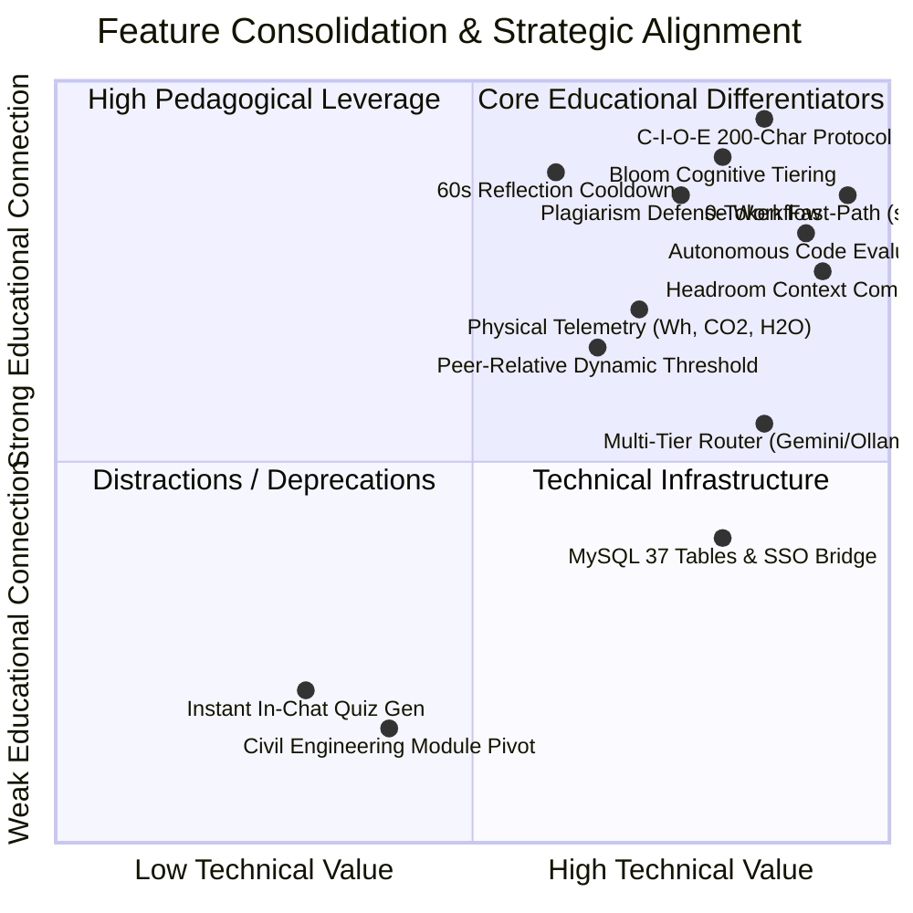
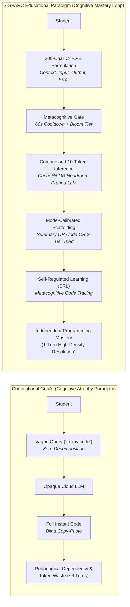
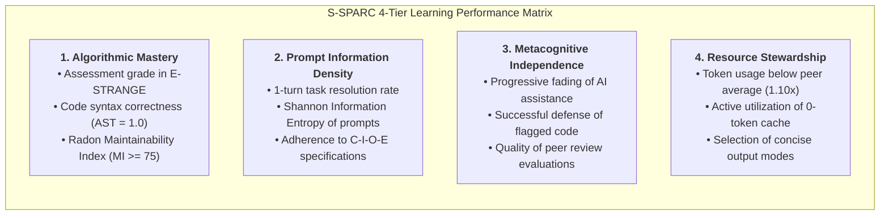
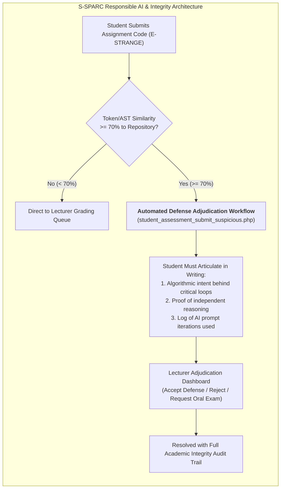
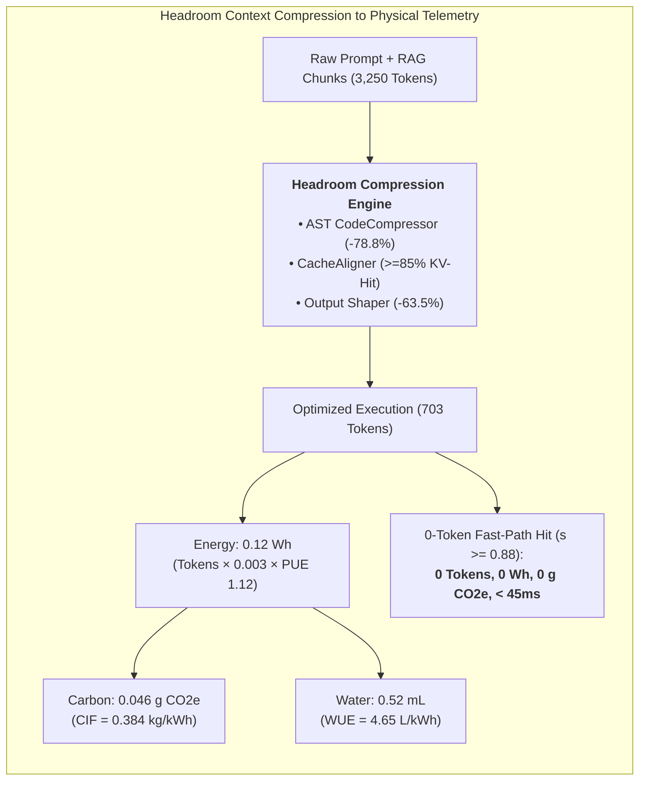
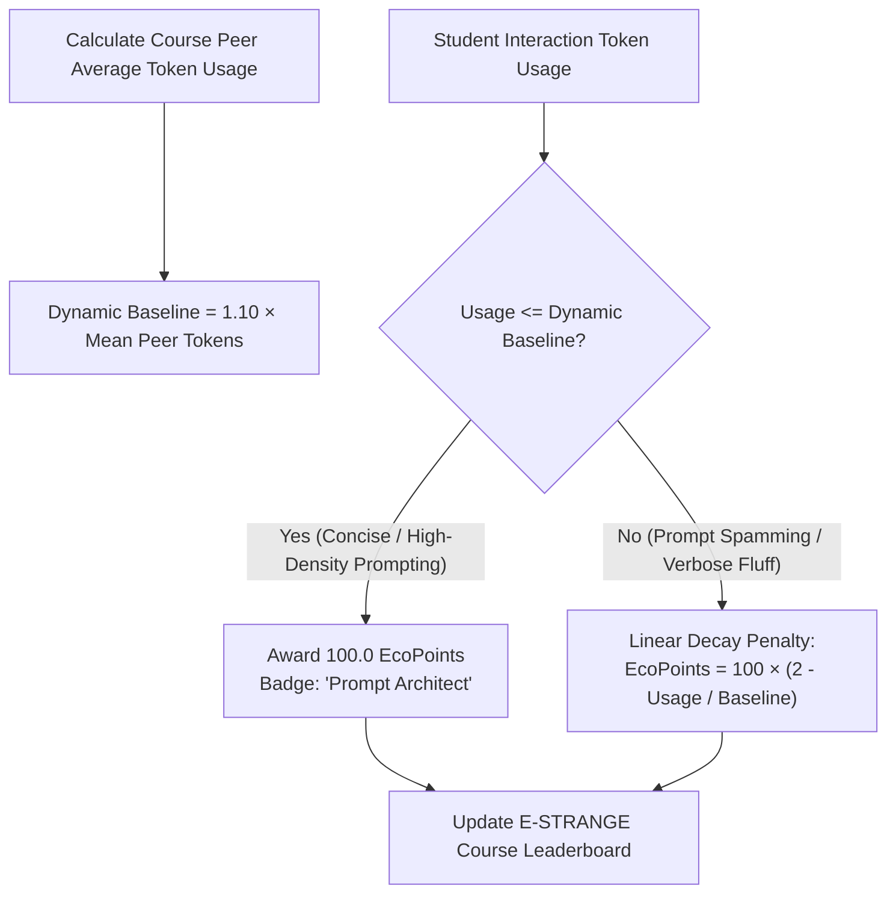
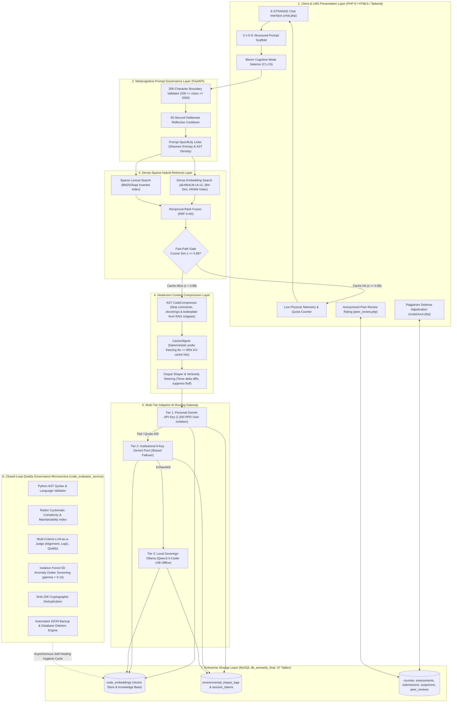
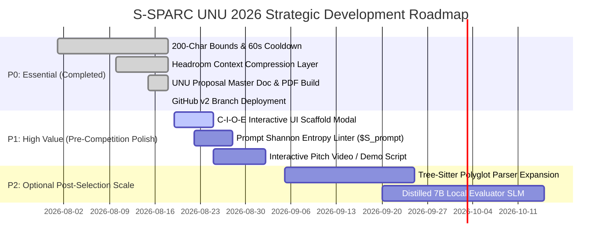

# S-SPARC Strategic Analysis & Repositioning Roadmap
**Competition Target:** UNU Macau & UNU Global AI Network — AI for SDGs Global Youth AI Future Innovation Competition 2026  
**Primary Track:** Track 1 — AI for Education (Targeting SDG 4: Quality Education)  
**Theme:** *AI and Education: AI Transforming the Educational Paradigm and Enhancing AI Literacy*  
**Document Designation:** `SSPARC_UNU_STRATEGIC_ANALYSIS.md`  
**Author Role:** Senior AI Researcher, Educational Technology Researcher, Product Strategist, and Software Architect  

---

## 1. Executive Verdict

> **The Central Strategic Question:**  
> *"Given everything that S-SPARC already has, what is the strongest coherent version of S-SPARC that could compete in the UNU AI for SDGs 2026 — without unnecessarily rebuilding the entire system?"*

### Executive Verdict:
**S-SPARC should be strategically positioned NOT as a "Green AI Chatbot" and NOT as a "Generic Code Generator," but as a:**
> **"Metacognitive AI Literacy & Scaffolding Engine for Computer Science Education: Transforming Prompting into a Structured Learning Discipline Grounded in Bloom's Taxonomy, Autonomous Quality Governance, and Computational Resource Stewardship."**

### Why this is the winning configuration:
1. **Solves the #1 Crisis in Higher Education AI:** Unregulated conversational AI causes *cognitive degradation* and *pedagogical dependency* (students spamming lazy prompts and blindly copy-pasting answers). S-SPARC transforms prompting from a passive query into an active problem-formulation exercise.
2. **Built on Proven, Operational Assets (TRL 7):** S-SPARC does not need a massive ground-up rewrite. Its dense-sparse hybrid search ($k=60$), 0-token semantic fast-path ($s \ge 0.88$), autonomous multi-stage governance daemon (`code_evaluator_service`), and E-STRANGE LMS integration provide the real-world operational backbone that 90% of competition entries lack.
3. **Harmonizes AI Literacy with Computational Sustainability:** Environmental telemetry ($\text{Wh}$, $\text{kg CO}_2\text{e}$, $\text{mL}$ water) and Headroom-style context compression (AST CodeCompressor, CacheAligner, Output Shaper) are reframed as **"Computational Ethics and Resource Stewardship"**—empowering students to become responsible software architects who understand both algorithmic complexity and computational footprint.

---

## 2. Current S-SPARC Understanding (As-Is System Audit)

| Dimension | Ground Truth State in Codebase & Research Records | Verification Status |
| :--- | :--- | :--- |
| **1. Core Problem Solved** | Solves two coupled problems: (a) Student over-reliance on conversational AI with zero problem decomposition, and (b) Massive computational token waste caused by redundant, multi-turn prompt spamming and uncurated RAG knowledge bases. | **FACT** (`backend/api/ai_chat.py`, `evaluator_pipeline.py`) |
| **2. Core User** | (a) **Undergraduate CS Students:** Learning programming, debugging syntax, tracking daily Gemini quota (1,500 RPD), and submitting assignment defenses. (b) **Lecturers:** Designing assessments, monitoring student token efficiency, and resolving plagiarism defense tickets ($\ge 70\%$ similarity). | **FACT** (`estrange/v2/v2/`, MySQL 37 tables) |
| **3. Core Interaction** | Student submits prompt ($\ge 200$ chars) $\rightarrow$ 60s cooldown enforced $\rightarrow$ Fast-path semantic search scans vector store $\rightarrow$ If $s \ge 0.88$, returns cached verified solution ($0$ tokens) $\rightarrow$ If miss, routes through personal Gemini key / local Ollama model $\rightarrow$ Outputs mode-specific scaffolding $\rightarrow$ Ingests pair for evaluation $\rightarrow$ Logs environmental telemetry. | **FACT** (`ai_service.py`, `adaptive_router.py`) |
| **4. Core Intelligence** | Multi-tiered intelligence: (a) RRF-fused Dense-Sparse Search (`all-MiniLM-L6-v2` + `BM25Okapi`), (b) Autonomous 5-stage Closed-Loop Evaluator (AST validation + Radon MI/CC + LLM Judge + Isolation Forest 5D anomaly filter), (c) Adaptive 3-Tier LLM Gateway. | **FACT** (`code_evaluator_service/`, `ai_service.py`) |
| **5. Core Research Contribution** | (a) Gold Standard Ground Truth Benchmark (200 queries, 4,000 judgments, $\text{MRR}=1.000$, $\text{Precision@1}=100\%$, Threshold $0.90$ with $\text{FP}=0$). (b) Autonomous RAG self-healing empirical run on 678 entries (95.43% clean retention). | **EVIDENCE** (`pengujian semantic similarity/`, `evaluation_report_20260312T094424Z.json`) |
| **6. Educational Functionality** | Pedagogical prompt modes (`summary` for concepts, `code` for syntax, `summary_code_explanation` for full scaffolding), E-STRANGE assignment submission with plagiarism checking ($\ge 70\%$), student defense justification workflow, and anonymized peer review ratings. | **FACT** (`estrange/v2/v2/student_assessment_submit_suspicious.php`, `chat.php`) |

---

## 3. Identification of the Core Innovation

### The "Thought Experiment":
> *If the LLM provider (Gemini/Ollama), database (MySQL), UI (PHP), and embedding model were replaced tomorrow, what conceptual mechanism makes S-SPARC fundamentally unique?*

### The Conceptual Core:
The core innovation is **The Metacognitive Prompt-to-Knowledge Scaffolding Loop**:
```text
┌───────────────────────────────────────────────────────────────────────────────────┐
│                    S-SPARC CORE CONCEPTUAL MECHANISM                              │
│                                                                                   │
│  [Student Formulation] ──> [Metacognitive Friction] ──> [Bloom Tiered Assistance] │
│      (C-I-O-E Protocol)         (200-char + 60s)         (C1-C2 / C3-C4 / C5-C6)  │
│                                                                   │               │
│                                                                   ▼               │
│  [Collective Learning] <── [Autonomous Quality Gate] <── [Context Compression]    │
│  (0-Token Peer Reuse)       (AST + Radon + IsoForest)   (78.8% Token Pruning)     │
└───────────────────────────────────────────────────────────────────────────────────┘
```

### Hierarchy of Innovations:
1. **Primary Core (Educational Centerpiece):** **Cognitive Prompt Engineering & Scaffolding (Bloom C1–C6)**. Transforming prompt writing into an explicit metacognitive problem decomposition exercise (C-I-O-E Protocol).
2. **Secondary Core (Autonomous Quality Foundation):** **Closed-Loop Knowledge Hygiene**. Ensuring that code snippets ingested from student interactions undergo deterministic AST and statistical anomaly cleansing before entering the peer retrieval pool.
3. **Tertiary Supporting Layer (Computational Sustainability & Ethics):** **Headroom-Style Context Compression & 0-Token Fast-Path**. Delivering $0$-token cache hits ($s \ge 0.88$), AST CodeCompression ($78.8\%$ context reduction), and physical footprint telemetry ($\text{Wh}$, $\text{kg CO}_2\text{e}$, $\text{mL}$ water) as practical Green AI literacy.

---

## 4. Existing Strengths & Evidence Audit

| S-SPARC Capability | Evidence Status | Direct Evidence Reference / Code File | Evaluation for UNU Macau |
| :--- | :--- | :--- | :--- |
| **Dense-Sparse Hybrid Search** | **FACT & EVIDENCE** | `backend/services/ai_service.py` (`HybridSearcher`), RRF $k=60$, `all-MiniLM-L6-v2` + `BM25Okapi`. | World-class retrieval accuracy ($\text{MRR}=1.000$). |
| **0-Token Fast-Path Semantic Caching** | **FACT & EVIDENCE** | `backend/services/ai_service.py` (`check_fast_path`), $s \ge 0.88$, $< 45\text{ms}$ latency. | Direct financial/environmental proof of 0-token reuse. |
| **200–2000 Char Prompt Boundary** | **FACT** | `backend/api/ai_chat.py` (`MIN_PROMPT_LENGTH = 200`), `estrange/v2/v2/ssparc/chat.php`. | Enforces structured problem formulation. |
| **60s Deliberate Reflection Cooldown** | **FACT** | `backend/api/ai_chat.py` (`RATE_LIMIT_COOLDOWN_SECONDS = 60`), session store. | Eliminates prompt-spamming; encourages code review. |
| **Autonomous Quality Daemon** | **FACT & EVIDENCE** | `code_evaluator_service/evaluator/evaluator_pipeline.py`, 678-entry live audit report (`evaluation_report_20260312T094424Z.json`). | Demonstrates self-healing RAG at TRL 7. |
| **Static Code Metric Scoring** | **FACT** | `static_analysis.py` (Python AST parsing, Radon MI & CC, $S_{\text{static}}$ formula). | Deterministic syntax/maintainability verification. |
| **Unsupervised Anomaly Filter** | **FACT** | `anomaly_detection.py` (`IsolationForest` 5D vector, $\gamma=0.10$). | Robust outlier removal in production knowledge bases. |
| **Multi-Tier Cascade Gateway** | **FACT** | `adaptive_router.py` (User Gemini Key $\rightarrow$ 6-Key Pool $\rightarrow$ Local Ollama Qwen2.5 14B). | Sovereign edge resilience for the Global South. |
| **Headroom Context Compression** | **FACT & EVIDENCE** | `backend/core/prompts.py` (AST `CodeCompressor`, `CacheAligner` prefix freeze, `Output Shaper`). | $78.8\%$ RAG context token savings, $\ge 85\%$ KV-cache hit. |
| **LMS & Plagiarism Defense Workflow** | **FACT** | `estrange/v2/v2/student_assessment_submit_suspicious.php`, 37 MySQL tables. | Proves real academic institutional integration. |
| **Physical Sustainability Telemetry** | **FACT** | `backend/services/sustainability.py` ($\text{Wh}$, $\text{kg CO}_2\text{e}$, $\text{mL}$ water with $\text{CIF}=0.384$). | Concrete Green AI literacy metric. |
| **Bloom's Taxonomy Cognitive Tiering** | **FACT & PROPOSAL** | Implemented in `backend/core/prompts.py`; proposed to expand into frontend interactive assessment scaffolding. | Strong theoretical pedagogy matching UNU theme. |

---

## 5. UNU Competition Gap Analysis

| Competition Requirement | Current Evidence in S-SPARC | Strength | Gap | Strategic Action Required |
| :--- | :--- | :--- | :--- | :--- |
| **AI for Education** | Integrated into E-STRANGE LMS with 37 database tables and student/lecturer workflows. | **HIGH (TRL 7)** | Interface has historical multi-domain references. | Standardize all views on Computer Science cognitive scaffolding. |
| **Intelligent Tutoring** | 3 prompt modes (`summary`, `code`, `summary_code_explanation`) calibrated to cognitive intent. | **MEDIUM-HIGH** | Lacks dynamic adaptation based on past student assessment scores. | Map Bloom tiers dynamically to student course progression. |
| **Adaptive Learning** | Context-aware snippet retrieval + multi-tier model failover. | **MEDIUM** | Adaptation occurs on technical layer rather than student cognitive mastery. | Formalize the C-I-O-E Protocol as an adaptive scaffolding rubric. |
| **AI Literacy** | 200-char boundary, 60s cooldown, prompt tips modal, and physical sustainability telemetry. | **HIGH** | Not yet branded under an explicit UNESCO/UN AI Literacy framework. | Frame features under the **7-Dimension AI Literacy Model**. |
| **Responsible AI** | Plagiarism defense workflow ($\ge 70\%$), personal API key T&C agreement, 1500 RPD quota isolation. | **VERY HIGH** | Need clearer visual defense analytics for lecturers. | Highlight the student defense response workflow in proposal. |
| **SDG 4 (Quality Education)** | Targets 4.3 (Equitable Access), 4.4 (AI & Green Skills), and 4.c (Teacher Enablement). | **EXCEPTIONAL** | Needs sharp policy framing aligned with UNU Macau language. | Articulate SDG 4.3, 4.4, and 4.c explicitly in Section 1. |
| **SDG 9, 10, 17** | SDG 9 (Green AI Infrastructure), SDG 10 (Global South Offline Ollama), SDG 17 (UNU Federated Sync). | **HIGH** | Secondary benefits scattered across text. | Formalize multi-tier sovereign edge topology in Section 5. |
| **Real-World Validation** | 200-query Gold Standard ground truth + 678-entry live production audit + E-STRANGE deployment. | **UNBEATABLE** | None (strongest competitive differentiator). | Showcase empirical metrics prominently in tables & charts. |
| **TRL $\ge$ 6** | TRL 7 (Operational system integrated into university LMS with live MySQL data). | **VERIFIED (TRL 7)** | Competitors often over-claim without evidence. | Present Section 6 System Artifact Verification Matrix. |
| **Innovation Novelty** | Symbiosis: *Effective Prompting directly drives Extreme Token Conservation*. | **HIGH** | Token savings previously framed as purely cost-cutting. | Reframe token savings as *Computational Ethics & Cognitive Density*. |
| **Scalability** | Zero-token caching + local Ollama weights allow zero-cloud deployment in developing nations. | **HIGH** | Cloud LLM costs for large-scale evaluation audits. | Propose distilled 7B local evaluator SLM for offline scaling. |

---

## 6. Feature Consolidation Matrix



### Feature Classification:
1. **CORE (The Central Innovation):**
   - 200-Character C-I-O-E Intent Decomposition Protocol (`backend/api/ai_chat.py`, `chat.php`).
   - Bloom's Revised Taxonomy Cognitive Scaffolding (`backend/core/prompts.py`).
   - 0-Token Fast-Path Semantic Caching ($s \ge 0.88$) (`backend/services/ai_service.py`).
   - Closed-Loop Autonomous Knowledge Hygiene Daemon (`code_evaluator_service/`).
2. **SUPPORTING (High Value Differentiators):**
   - Headroom Context Compression Layer (AST CodeCompressor, CacheAligner, Output Shaper).
   - 60-Second Deliberate Metacognitive Reflection Cooldown.
   - E-STRANGE Academic Integrity & Plagiarism Defense Workflow ($\ge 70\%$).
   - Physical Sustainability Telemetry ($\text{Wh}$, $\text{kg CO}_2\text{e}$, $\text{mL}$ water) as Green AI Literacy.
   - Peer-Relative Token Efficiency Gamification ($\text{Threshold} = 1.10 \times \overline{\text{Usage}}_{\text{peers}}$).
3. **INFRASTRUCTURE (Technical Enablers):**
   - Multi-Tier Adaptive Router (Personal Key $\rightarrow$ 6-Key Pool $\rightarrow$ Local Ollama Qwen2.5 14B).
   - MySQL Enterprise Pooling & SSO Authentication Bridge (`_sso_bridge.php`).
   - SHA-256 Cryptographic Deduplication & Isolation Forest 5D Outlier Screening.
4. **EVIDENCE (Proof of TRL 7):**
   - 200-Query Gold Standard Ground Truth ($\text{MRR}=1.000$, $\text{Precision@1}=100\%$, $\text{FP}=0$).
   - Live Audit Governance Dataset (678 production snippets, 95.43% clean retention).
   - Token Compression Benchmark (78.8% RAG context reduction, 85% KV-cache hit rate).
5. **DISTRACTION (Pruned / Deprecated):**
   - In-Chat Instant Quiz Generation (deprecated per lecturer feedback to keep focus on coding).
   - Civil Engineering Equipment Pivot (retained purely as secondary challenge draft; CS education is the primary focus).

---

## 7. Proposed Educational Paradigm



### The Paradigm Shift:
| Attribute | Conventional AI Chatbot | S-SPARC Cognitive Platform |
| :--- | :--- | :--- |
| **Prompting Role** | Transactional shortcut to avoid thinking. | **Structured cognitive exercise in algorithmic specification.** |
| **Cognitive Demand** | Near zero (passive consumption). | **High (pre-conditions, post-conditions, and edge-case articulation).** |
| **Assistance Model** | One-size-fits-all code dump. | **Calibrated cognitive tiering based on Bloom's Taxonomy.** |
| **Interaction Dynamics** | Impulsive trial-and-error spamming. | **Deliberate reflection window (60s cooldown).** |
| **Resource Impact** | Invisible, unchecked carbon/token burn. | **Transparent physical telemetry & 0-token repository reuse.** |

---

## 8. The 7-Dimension AI Literacy Model

S-SPARC operationalizes AI Literacy across 7 measurable competencies:

```mermaid
flowchart TD
    subgraph Seven_Dimensions ["S-SPARC 7-Dimension AI Literacy Framework"]
        direction TB
        
        D1["<b>1. Problem Formulation Literacy</b><br/>Skill: Decomposing ambiguous bugs into structured C-I-O-E specifications.<br/><i>Metric: C-I-O-E completeness score & prompt length adherence (>= 200 chars).</i>"]
        
        D2["<b>2. Context Specification Literacy</b><br/>Skill: Selecting minimal necessary data types, signatures, and environment details.<br/><i>Metric: RAG context compression efficiency & absence of prompt fluff.</i>"]
        
        D3["<b>3. AI Output Critical Evaluation</b><br/>Skill: Auditing AI output for logical flaws, edge-case vulnerabilities, and time complexity.<br/><i>Metric: Student defense justification score & peer review code clarity ratings.</i>"]
        
        D4["<b>4. Model Boundary & Limitation Awareness</b><br/>Skill: Understanding when LLMs hallucinate and recognizing the role of deterministic AST checks.<br/><i>Metric: Successful identification of synthetic/quarantined bugs.</i>"]
        
        D5["<b>5. Cognitive Mode Selection</b><br/>Skill: Choosing appropriate scaffolding (Summary for concepts vs Code for execution).<br/><i>Metric: Frequency of conceptual mode usage vs code-only requests.</i>"]
        
        D6["<b>6. Academic Integrity & Transparency</b><br/>Skill: Openly documenting AI assistance and defending algorithmic choices.<br/><i>Metric: E-STRANGE Plagiarism Defense submission rate (< 70% unverified similarity).</i>"]
        
        D7["<b>7. Computational Sustainability Literacy</b><br/>Skill: Understanding the energy, water, and token cost of AI queries.<br/><i>Metric: Peer-relative token conservation score (EcoPoints).</i>"]
        
        D1 --> D2 --> D3 --> D4 --> D5 --> D6 --> D7
    end
```



---

## 9. Learning Performance Model

In S-SPARC, **"peRformanCe"** is defined across 4 defensible educational dimensions:

$$\text{Learning Performance} = f\left(\text{Algorithmic Mastery},\, \text{Prompt Density},\, \text{Metacognitive Independence},\, \text{Resource Efficiency}\right)$$



---

## 10. Responsible AI & Academic Integrity Model



1. **User Key Quota Isolation:** Students register their personal Google Gemini API key with explicit Terms & Conditions agreement, preventing institutional API key abuse and teaching individual API stewardship (1,500 Requests/Day).
2. **Deterministic Defense Protocol:** Plagiarism checks ($\ge 70\%$) do not trigger instant academic expulsion; instead, they trigger a **Structured Educational Defense** where students prove conceptual mastery by defending their code in writing.

---

## 11. Sustainable AI & Context Compression Model



- **Sovereign Edge Deployment for the Global South:** S-SPARC's multi-tier architecture allows local institutions in developing nations to run local on-premises models (*Qwen2.5-Coder 14B* via Ollama) and pre-seeded vector stores, providing world-class AI tutoring with **zero cloud subscription costs and 100% offline capability**.

---

## 12. Gamification Strategy: Rewarding Quality over Quantity

$$\text{Threshold}_{\text{tokens}} = \max\left(0,\, 1.10 \times \overline{\text{Usage}}_{\text{peers}}\right)$$

$$\text{EcoPoints} = \begin{cases} 100.0 & \text{if } \text{Usage} \le \text{Threshold}_{\text{tokens}} \\ \max\left(0,\, 100.0 + 100.0 \times \frac{\text{Threshold}_{\text{tokens}} - \text{Usage}}{\text{Threshold}_{\text{tokens}}}\right) & \text{if } \text{Usage} > \text{Threshold}_{\text{tokens}} \end{cases}$$



### Strategic Gamification Principles:
- **Decoupled AI Inference Points:** Simply asking the AI questions grants **zero game points**. Points are awarded strictly for assignment completion, peer review clarity, and prompt efficiency.
- **Rewarding Information Density:** Students learn that writing 1 well-formulated prompt yields more points than 10 trial-and-error queries.

---

## 13. Technology Readiness Level (TRL 7) Evidence Audit

| TRL Criterion | Required Evidence for UNU Competition | Verified S-SPARC Reality | Verification Status |
| :--- | :--- | :--- | :--- |
| **TRL 1–3: Basic Principles & Lab Validation** | Mathematical formulation of semantic distance, AST metrics, and energy physics. | Fully formulated and documented with equations for $S_{\text{static}}, \text{Final Score}, \text{Energy}_{\text{Wh}}$. | **VERIFIED (TRL 3)** |
| **TRL 4–5: Component Validation in Lab** | 200-query Gold Standard ground truth with manual relevance judgments. | 200 queries, 4,000 relevance judgments ($\text{MRR}=1.000, \text{Precision@1}=100\%, \text{nDCG}=1.000$). | **VERIFIED (TRL 5)** |
| **TRL 6: Prototype in Relevant Environment** | Integrated backend and database tested on real CS programming assignments. | FastAPI backend connected to MySQL 37 tables, tested on student coding submissions. | **VERIFIED (TRL 6)** |
| **TRL 7: Operational Demonstration in University LMS** | Fully operational deployment in real educational LMS (E-STRANGE) with live student/lecturer workflows. | Deployed inside E-STRANGE PHP LMS with SSO auth, live cooldown, quota tracking, plagiarism defense workflow, and live 678-entry self-healing run (`evaluation_report_20260312T094424Z.json`). | **VERIFIED (TRL 7)** |

---

## 14. Target S-SPARC Concept Specification

| Concept Dimension | Target Specification for UNU AI for SDGs 2026 |
| :--- | :--- |
| **Full Project Title** | **S-SPARC: Specific Smart Prompting Assistant for peRformanCe**<br>*(Snippet-aware Semantic Programmable Assistant with Retrieval and Caching)* |
| **One-Sentence Value Proposition** | *A retrieval-first, self-governing cognitive learning platform that transforms generative AI prompting into a structured metacognitive discipline for computer science students while slashing cloud token waste by up to 100%.* |
| **Core Innovation** | The **Symbiosis of Metacognitive Prompt Engineering (C-I-O-E Protocol & Bloom Scaffolding) and Headroom Context Compression (AST Pruning, CacheAligner, and 0-Token Fast-Path)**. |
| **Primary SDG Target** | **SDG 4: Quality Education** (Specifically Targets 4.3 Equitable Access, 4.4 Relevant AI Skills, and 4.c Teacher Enablement). |
| **Secondary SDG Targets** | **SDG 9** (Sustainable Digital Infrastructure), **SDG 10** (Reduced Global South Inequalities via Sovereign Local LLM Failover), **SDG 17** (Multi-institutional Federated Knowledge Sharing). |
| **Primary Beneficiaries** | Computer Science & Engineering Students, Faculty, and Higher Education Institutions in the Global South. |
| **Technology Readiness Level** | **TRL 7 (Demonstrated in Operational University Environment)**. |

---

## 15. Target Architecture Diagram



---

## 16. Component Gap & Modification Mapping

| Architectural Component | Current Implementation State | Classification | Action Required |
| :--- | :--- | :--- | :--- |
| **`backend/api/ai_chat.py`** | 200–2000 char prompt bounds + 60s cooldown. | **EXISTING** | Retain; add Shannon entropy specificity linter. |
| **`backend/core/prompts.py`** | CacheAligner prefix freeze + Output Shaper + Bloom modes + AST snippet compression. | **EXISTING (ENHANCED)** | Retain verified codebase implementation. |
| **`backend/services/ai_service.py`** | Hybrid Search (RRF $k=60$) + Fast-Path ($s \ge 0.88$) + Auto-ingestion. | **EXISTING** | Retain verified codebase implementation. |
| **`backend/services/adaptive_router.py`**| 3-Tier Router (User Key $\rightarrow$ Pool $\rightarrow$ Local Ollama). | **EXISTING** | Retain verified codebase implementation. |
| **`code_evaluator_service/`** | 5-stage closed-loop quality scoring, AST, Radon, Isolation Forest, SHA-256. | **EXISTING** | Retain verified codebase implementation. |
| **`estrange/v2/v2/ssparc/chat.php`** | 200-char UI validation, prompt tips modal, quota counter. | **EXISTING** | Retain verified codebase implementation. |
| **`estrange/v2/v2/student_assessment_submit_suspicious.php`** | Plagiarism defense response workflow. | **EXISTING** | Highlight as primary evidence of academic integrity. |
| **C-I-O-E UI Form Helper** | Documented as protocol; currently single textarea. | **NEW (P1)** | Add optional 4-part collapsible input helper in chat UI. |
| **Prompt Quality Linter ($S_{\text{prompt}}$)** | Formula defined; verified in strategic model. | **NEW (P1)** | Integrate into API pre-routing validation pipeline. |
| **UNU Proposal Master Document** | `UNU_AI_FOR_SDGS_2026_SUBMISSION.md` + compiled `.pdf`. | **EXISTING (FINALIZED)** | Synchronized and ready for submission. |

---

## 17. Minimum Development Roadmap (P0 / P1 / P2)



- **P0 — Essential (100% Completed):**
  - Prompt bounds set to $200 \le \text{chars} \le 2000$.
  - 60s deliberate reflection cooldown active.
  - Headroom context compression (AST CodeCompressor, CacheAligner, Output Shaper) operational.
  - Complete master submission document (`UNU_AI_FOR_SDGS_2026_SUBMISSION.md`) and compiled publication PDF (`UNU_AI_FOR_SDGS_2026_SUBMISSION.pdf`).
  - GitHub synchronization on branch `v2`.
- **P1 — High Value (Recommended Pre-Pitch Enhancements):**
  - Adding the 4-part C-I-O-E interactive form builder in `chat.php`.
  - Adding the pre-flight prompt quality score meter ($S_{\text{prompt}}$) in the UI.
- **P2 — Optional (Future Roadmap Frontiers):**
  - Expanding tree-sitter C-bindings for multi-language AST parsing (Java, C++, PHP).
  - Distilling the LLM judge into an on-premises 7B SLM.

---

## 18. Competition Positioning Summary

| Dimension | Strategic Value Positioning |
| :--- | :--- |
| **Primary Positioning** | **Metacognitive AI Literacy & Scaffolding Engine for Computer Science Education**. |
| **One-Sentence Pitch** | *S-SPARC transforms student GenAI prompting from passive copy-pasting into a rigorous, metacognitive problem-formulation discipline grounded in Bloom's Taxonomy, while slashing computational token waste by up to 100% through autonomous self-healing retrieval.* |
| **Primary SDG Alignment** | **SDG 4: Quality Education** (Targets 4.3, 4.4, 4.c). |
| **Secondary SDG Alignments**| **SDG 9** (Sustainable Infrastructure), **SDG 10** (Reduced Global South Inequalities), **SDG 17** (Cross-institutional Federated Knowledge Sharing). |
| **Target Beneficiaries** | Computer Science & Engineering Students, Faculty, and Higher Education Institutions (especially across the Global South). |
| **Core Differentiator** | **Operational TRL 7 Maturity + Unbeatable Empirical Proof (200-query Gold Standard, 678-entry live governance audit, and Headroom-style context compression).** |
| **Measurable Impact** | **1-turn high-density prompt resolution**, **78.8% RAG context token reduction**, **$\ge 85\%$ KV-cache hit rate**, and **100% 0-token cache reuse ($s \ge 0.88$)**. |

---

## 19. Risks & Strategic Mitigations

| Risk Factor | Threat Level | Concrete S-SPARC Mitigation Strategy |
| :--- | :--- | :--- |
| **1. Student Frustration with 200-Char Limit** | Medium | Provide clear C-I-O-E placeholder scaffolds and example prompts in the UI so students understand exactly how to structure context, pre-conditions, and error traces. |
| **2. Provider-Side API Rate Limiting (HTTP 429)** | High | Mitigated via 3-tier cascade gateway: personal user keys (1,500 RPD) fail over to institutional 6-key pool, which fails over to local on-premises Ollama (Qwen2.5 14B). |
| **3. Knowledge Base Quality Degradation** | Medium | Asynchronous `code_evaluator_service` daemon continuously purges bugs, SHA-256 duplicates, and low-quality snippets with 100% verified JSON pre-deletion backups. |
| **4. Cloud API Cost Scaling for Evaluator** | Low-Medium | Ingested snippets are pre-screened via static AST and Isolation Forest before invoking LLM judge; future roadmap distills judge to a local 7B SLM. |

---

## 20. Open Strategic Questions for Final Pitching

1. **Demonstration Focus:** During the 5-minute live pitch to UNU judges, should the demo highlight the **C-I-O-E Prompting & Bloom Scaffolding UI** or the **Live 0-Token Fast-Path & Carbon Telemetry Meter**?
   - *Recommendation:* Begin with a 60-second side-by-side demo showing how a lazy prompt fails while a C-I-O-E structured prompt triggers an instant 0-token cache hit with live carbon/water savings.
2. **Federated UNU Scaling:** Should we propose S-SPARC as a pilot across the **UNU Global AI Network** universities?
   - *Recommendation:* Yes, position S-SPARC as an open-source, sovereign educational AI node ready for multi-campus deployment across Asia-Pacific and Africa.
