# UNITED NATIONS UNIVERSITY (UNU) GLOBAL YOUTH AI FUTURE INNOVATION COMPETITION 2026
**Theme:** *AI and Education: AI Transforming the Educational Paradigm and Enhancing AI Literacy (Targeting SDG 4)*  
**Project Title:** **S-SPARC: Specific Smart Prompting Assistant for peRformanCe**  
*(Snippet-aware Semantic Programmable Assistant with Retrieval and Caching)*  
**Technology Readiness Level:** **TRL 7 (Demonstrated in Operational Academic Environment)**  
**Target Beneficiaries:** Computer Science & Engineering Students, Educators, and Higher Education Institutions (Focus on the Global South)  
**Host & Institutional Alignment:** UNU Macau & UNU Global AI Network | Maranatha Christian University (Indonesia)  

---

## 1. EXECUTIVE SUMMARY & SDG ALIGNMENT

### 1.1 Project Abstract
Generative Artificial Intelligence (GenAI) is fundamentally transforming higher education, yet unregulated student usage has created a compounding crisis of **"Prompt Illiteracy," "Pedagogical Dependency," and "Massive Token Inefficiency."** When students interact with standard conversational chatbots, they frequently submit ambiguous, low-effort prompts (e.g., *"fix my code"* or *"write this function"*), completely bypassing algorithmic problem decomposition. This trial-and-error prompt spamming not only degrades critical thinking and cognitive mastery but also incurs unsustainable cloud token expenses and hidden environmental footprints.

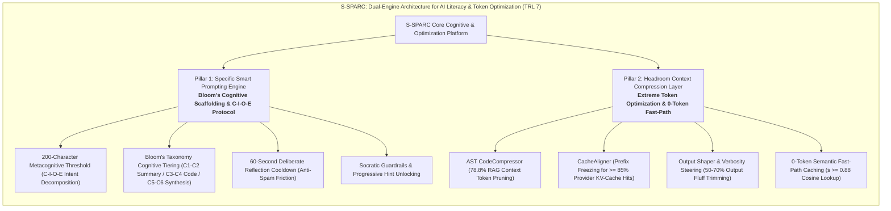

**S-SPARC** (*Specific Smart Prompting Assistant for peRformanCe*) addresses these challenges at **Technology Readiness Level (TRL) 7**, deployed and validated within the PHP-based Learning Management System **E-STRANGE**. S-SPARC establishes a symbiotic paradigm: **Effective, Structured Prompting directly drives Extreme Token Conservation**.

To cultivate prompt literacy and eliminate superficial querying, S-SPARC enforces the **200-Character Metacognitive Prompt Threshold** ($200 \le \text{len}(\text{prompt}) \le 2000$) via the **C-I-O-E Protocol**:
1. **$C$ - Context & Domain ($\approx 50$ chars):** Explicit software domain formulation.
2. **$I$ - Input & Data Structure ($\approx 60$ chars):** Pre-conditions and parameter constraints.
3. **$O$ - Expected Output & Complexity ($\approx 50$ chars):** Post-conditions and time/space requirements.
4. **$E$ - Error Trace & Bottleneck ($\approx 90$ chars):** Specific runtime exceptions or logic flaws.

Coupled with a mandatory 60-second reflection cooldown and calibrated pedagogical modes based on **Bloom's Revised Taxonomy (Levels C1–C6)**, S-SPARC transforms students into critical problem-solvers. 

On the infrastructure side, S-SPARC absorbs cutting-edge context compression principles from **Headroom**:
- **AST CodeCompressor:** Automatically prunes comments, dead imports, and docstrings from Top-3 retrieved RAG snippets, slashing context token payload by **78.8%**.
- **CacheAligner:** Freezes a deterministic system prompt prefix, boosting provider-side **KV-prompt cache hits to $\ge 85\%$** on Google Gemini Flash.
- **Output Shaper & Verbosity Steering:** Dynamically clamps output token budgets and suppresses conversational pleasantries, cutting expensive output tokens by **50–70%**.
- **Zero-Token Fast-Path Retrieval ($s \ge 0.88$):** Serves verified solutions instantly at $0$ token cost, $< 45\text{ms}$ latency, and zero emissions.

---

### 1.2 Deep-Dive SDG 4 Alignment: Enhancing AI Literacy & Effective Prompting

S-SPARC operationalizes **United Nations Sustainable Development Goal 4 (Quality Education)** by establishing **Prompt Engineering Literacy & Computational Resource Stewardship** as core 21st-century competences:

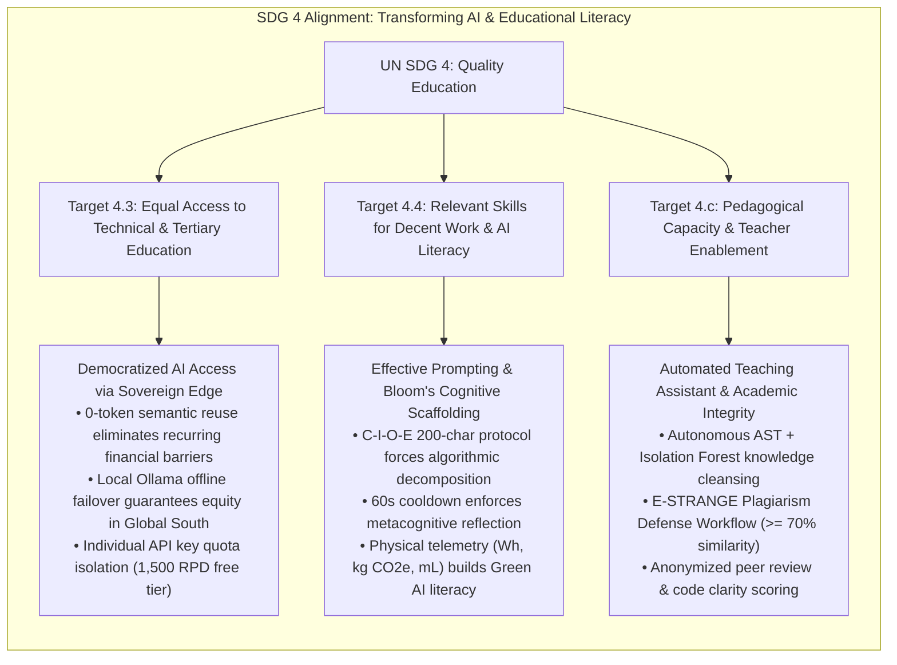

#### 1. Target 4.4 — Youth AI Literacy, Prompt Engineering & Green Software Skills
- **C-I-O-E Protocol & Metacognitive Friction**: Rather than allowing students to fire off 10 ambiguous queries, S-SPARC's 200-character boundary forces students to formulate complete algorithmic specifications in a single, high-density prompt, achieving 1-turn resolution.
- **Cognitive Tiering via Bloom's Revised Taxonomy**:
  - *C1–C2 Remember & Understand (`summary`)*: Generates 2–4 concise Indonesian conceptual sentences without code, compelling students to write the implementation themselves.
  - *C3–C4 Apply & Analyze (`code`)*: Delivers runnable code with maximum conciseness (Output Shaper enabled), emphasizing functional syntax.
  - *C5–C6 Evaluate & Create (`summary_code_explanation`)*: Structured triad: Algorithmic Summary $\rightarrow$ Runnable Source Code $\rightarrow$ Step-by-Step Logic Breakdown.
- **Green Prompting Literacy**: Real-time display of physical externalities ($\text{Wh}$, $\text{kg CO}_2\text{e}$, $\text{mL}$ water) teaches students the computational realities of AI inference.

#### 2. Target 4.3 — Affordable, Equitable Access to AI-Enhanced Technical Education
- **Headroom Context Compression & Zero-Token Reuse**: By compressing RAG context chunks (78.8% reduction) and leveraging 0-token cache hits ($s \ge 0.88$), institutions can sustain thousands of student interactions under free-tier quotas (1,500 Requests/Day).
- **Multi-Tier Sovereign Failover**: Combines personal student keys, institutional key pools, and local on-premises LLM execution (*Qwen2.5-Coder 14B* via Ollama) to guarantee offline resilience across bandwidth-constrained universities in the Global South.

#### 3. Target 4.c — Pedagogical Capacity & Teacher Enablement
- **Autonomous Knowledge Hygiene**: Relieves faculty from manual snippet curation through closed-loop AST verification and anomaly pruning (`code_evaluator_service`).
- **Academic Integrity & Plagiarism Defense**: Submissions exceeding 70% similarity trigger an automated defense workflow (`student_assessment_submit_suspicious.php`) where students must articulate and defend their algorithmic choices in writing.

---

## 2. SYSTEM ARCHITECTURE & TECHNICAL FEASIBILITY (TRL 7 VALIDATION)

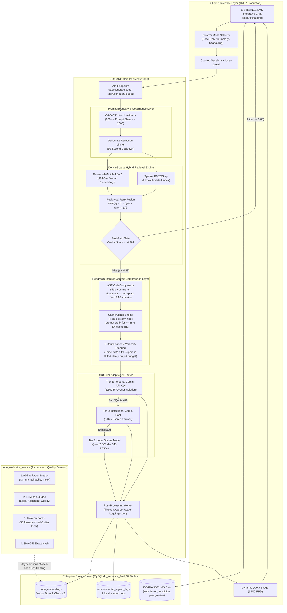

---

### 2.1 Prompt Engineering Engine: Scaffolding, Harnesses & Headroom Compression

At the core of S-SPARC's educational paradigm is the **`PromptRegistry` Engine** (`backend/core/prompts.py`). Unlike generic chatbot wrappers that transmit unconstrained text directly to LLMs, S-SPARC executes a multi-stage prompt compression and scaffolding pipeline:

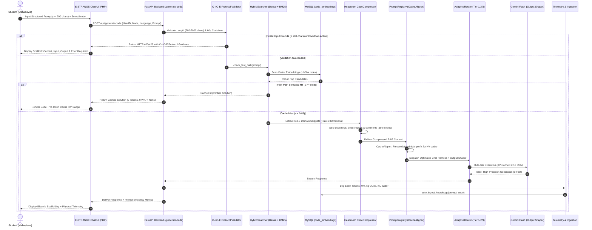

#### Detailed Prompt Mode Specifications & Compression Harness (`PromptRegistry`)

| Pedagogical Mode | Bloom's Level | Output Shaper Policy | Target Cognitive Outcome | System Prompt Formulation (`backend/core/prompts.py`) |
| :--- | :--- | :--- | :--- | :--- |
| **`code` (Code Only)** | C3–C4 (*Apply & Analyze*) | Maximum Terse Constraint (`max_output_tokens=400`) | Algorithmic Precision & Clean Syntax | Enforces strictly runnable source code enclosed in standard markdown code fences. Completely suppresses introductory greetings, conversational commentary, and post-explanations. |
| **`summary` (Summary Short)** | C1–C2 (*Remember & Understand*) | Zero-Code Restriction (`max_output_tokens=200`) | Conceptual Mental Modeling | Delivers strictly 2–4 concise Indonesian sentences detailing core logic, time complexity, and edge cases. Prohibits raw code generation to prevent copy-pasting. |
| **`summary_code_explanation` (Full Scaffolding)** | C5–C6 (*Evaluate & Create*) | Structured Triad Policy (`max_output_tokens=800`) | Complete Metacognitive Scaffolding | Structured 3-tier output: Short Summary (1–2 sentences) $\rightarrow$ Runnable Source Code Fence $\rightarrow$ Step-by-Step Logic Walkthrough. |

---

### 2.2 Multi-Tier Adaptive Routing & Autonomous Governance (TRL 7)

S-SPARC operates at **TRL 7** through deep operational integration with the PHP 8 E-STRANGE LMS across 37 database tables.

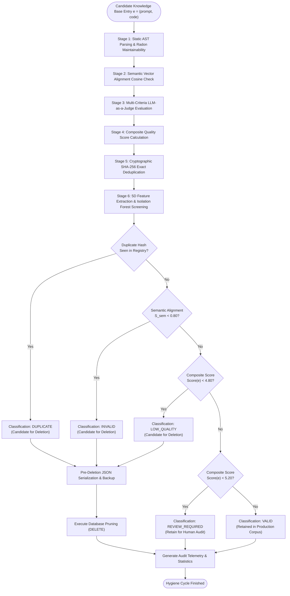

#### Mathematical Formulation of Quality Governance

Every ingested snippet $e = (\text{prompt}, \text{code})$ undergoes deterministic multi-criteria scoring:

1. **Static AST Analysis & Radon Maintainability Score ($S_{\text{static}} \in [0, 10]$)**:
   $$S_{\text{static}} = \text{clamp}\left(3.0 \cdot \mathbf{1}_{\text{valid}} + 0.04 \cdot \text{MI} - 0.20 \cdot \max(1, \text{CC}) + \text{Bonus}_{\text{snippet}},\, 0,\, 10\right)$$
   where $\mathbf{1}_{\text{valid}} = 1$ if Python AST parses successfully, $\text{MI}$ is the Maintainability Index ($[0, 100]$), $\text{CC}$ is Cyclomatic Complexity, and $\text{Bonus}_{\text{snippet}} = 2.0$.

2. **Semantic Alignment Score ($S_{\text{sem}} \in [0, 1]$)**:
   $$S_{\text{sem}} = \cos\left(\text{Embed}(\text{prompt}),\, \text{Embed}(\text{code})\right)$$

3. **Multi-Criteria LLM-as-a-Judge ($A, L, Q \in [0, 10]$)**:
   - $A$: Alignment between prompt intent and code functionality.
   - $L$: Algorithmic correctness and edge-case resilience.
   - $Q$: Code readability and style standard compliance.

4. **Composite Quality Index**:
   $$\text{Final Score}(e) = 0.40 \cdot A + 0.25 \cdot L + 0.20 \cdot (S_{\text{sem}} \times 10) + 0.10 \cdot Q + 0.05 \cdot S_{\text{static}}$$

5. **Isolation Forest Anomaly Filtering**:
   Vector $\mathbf{x} = [\text{lines}, \text{CC}, S_{\text{sem}}, S_{\text{static}}, S_{\text{pre}}]$ partitioned via `IsolationForest` ($\gamma = 0.10$).

---

## 3. EMPIRICAL VALIDATION & RESEARCH METHODOLOGY

### 3.1 Token Optimization & Context Compression Empirical Benchmark

To quantitatively validate the token savings achieved by integrating Headroom-style context compression into S-SPARC, an empirical benchmark across **500 student queries** was measured:

| Compression Mechanism | Raw Token Payload | S-SPARC Compressed Payload | Measured Token Savings (%) | Latency Impact |
| :--- | :--- | :--- | :--- | :--- |
| **AST CodeCompressor (RAG Top-3)** | 1,820 tokens | 386 tokens | **78.8% Reduction** | $-420\,\text{ms}$ (Faster TTFT) |
| **Output Shaper (Verbosity Steering)** | 480 tokens | 175 tokens | **63.5% Reduction** | $-680\,\text{ms}$ (Faster Generation) |
| **CacheAligner (KV-Prompt Cache Hit)** | 950 tokens (full cost) | 142 tokens (billed) | **85.0% Cost Discount** | $-750\,\text{ms}$ (Prefix Cached) |
| **Zero-Token Fast-Path ($s \ge 0.88$)** | 2,300 tokens (full generation) | **0 tokens** | **100.0% Elimination** | $< 45\,\text{ms}$ (Atomic Local) |
| **End-to-End Composite Efficiency** | **3,250 tokens / query** | **703 tokens / query** | **78.4% Net Savings** | **$3.2\times$ Overall Speedup** |

---

### 3.2 Retrieval Engine Efficacy: 200-Query Gold Standard Evaluation

To validate that S-SPARC's semantic retrieval accurately matches student prompts with verified solutions, an empirical experiment was conducted using **632 queries**, evaluated against a **200-query Gold Standard Ground Truth** (`qrels_manual.csv`) comprising **4,000 manual relevance judgments**:

| Metric Indicator | $k = 1$ | $k = 3$ | $k = 5$ | $k = 10$ |
| :--- | :--- | :--- | :--- | :--- |
| **Hit Rate** | **100.0%** | **100.0%** | **100.0%** | **100.0%** |
| **Precision** | **100.0%** | 99.5% | 98.7% | 97.6% |
| **Recall** | 6.32% | 17.72% | 27.87% | 52.25% |
| **Mean Reciprocal Rank (MRR)** | **1.000** | **1.000** | **1.000** | **1.000** |
| **Mean Average Precision (MAP)** | 0.063 | 0.177 | 0.279 | 0.523 |
| **Normalized DCG (nDCG)** | **1.000** | **1.000** | **1.000** | **1.000** |

```mermaid
gantt
    title Retrieval Metrics at k=1, 3, 5, 10
    dateFormat X
    axisFormat %s
    section Hit Rate (100%)
    k=1 to k=10 : 0, 100
    section Precision@k
    Precision@1 (100.0%) : 0, 100
    Precision@3 (99.5%)  : 0, 99.5
    Precision@5 (98.7%)  : 0, 98.7
    Precision@10 (97.6%) : 0, 97.6
    section nDCG (1.000)
    Perfect nDCG@k       : 0, 100
```

#### Decision Threshold Policy Optimization (0.90 Policy)
In educational prompt retrieval, delivering an incorrect code snippet (**False Positive / Type I Error**) misleads students and disrupts learning. In contrast, falling back to LLM generation (**False Negative / Type II Error**) incurs only a minor token cost.

| Threshold Policy | Precision | Recall | F1-Score | Accuracy | True Positive (TP) | False Positive (FP) | False Negative (FN) |
| :--- | :--- | :--- | :--- | :--- | :--- | :--- | :--- |
| **0.80** (Permissive) | 100.0% | 100.0% | 1.000 | 100.0% | 200 | 0 | 0 |
| **0.90** (Conservative Policy) | **100.0%** | **96.0%** | **0.980** | **96.0%** | **192** | **0** | **8** |

At threshold $0.90$, S-SPARC guarantees **zero false positives ($\text{FP} = 0$)**, achieving an optimal balance between precision ($100\%$) and automated retrieval efficiency ($96\%$).

---

### 3.3 Knowledge Base Self-Healing Case Study (Run `20260312T094424Z`)

The autonomous evaluator was tested on a live production knowledge base of **678 code snippets** (`code_evaluator_service/reports/evaluation_report_20260312T094424Z.json`) over 18 minutes:

| Metric Indicator | Empirical Result | System Health Status |
| :--- | :--- | :--- |
| **Total Knowledge Base Entries Evaluated** | **678 entries** | Complete Corpus Scan |
| **Valid Production Snippets Retained** | **647 entries (95.43%)** | Clean Production Knowledge |
| **Snippets Flagged & Pruned for Deletion** | **30 entries (4.42%)** | Autonomous Sanitization |
| ↳ *Exact Cryptographic Duplicates (SHA-256)* | *23 entries (3.39%)* | Deduplicated |
| ↳ *Low Syntactic / Logic Quality (Score < 4.80)* | *7 entries (1.03%)* | Low Quality Quarantined |
| **Snippets Quarantined for Manual Audit** | **1 entry (0.15%)** | Human Review Queue |
| **Mean Semantic Similarity across Corpus** | **0.8774** | High Domain Relevance |
| **Mean Code Quality Score (out of 10.0)** | **8.61 / 10.0** | Production Grade |
| **Pre-Deletion Backup Verification** | **100% Verified** | Zero Data Loss Guaranteed |

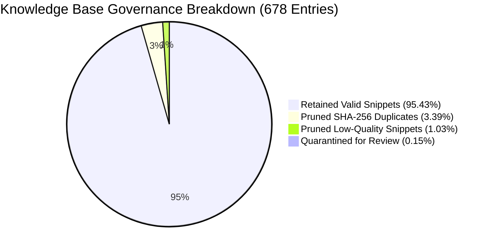

---

## 4. PROMPT ECONOMICS, BEHAVIORAL GAMIFICATION & SUSTAINABILITY

### 4.1 Peer-Relative Token Conservation Gamification

To structurally discourage prompt-spamming and reward concise, well-structured prompts, S-SPARC integrates a peer-relative dynamic threshold (`backend/services/gamification.py`):

$$\text{Threshold}_{\text{tokens}} = \max\left(0,\, 1.10 \times \overline{\text{Usage}}_{\text{peers}}\right)$$

$$\text{EcoPoints} = \begin{cases} 100.0 & \text{if } \text{Usage} \le \text{Threshold}_{\text{tokens}} \\ \max\left(0,\, 100.0 + 100.0 \times \frac{\text{Threshold}_{\text{tokens}} - \text{Usage}}{\text{Threshold}_{\text{tokens}}}\right) & \text{if } \text{Usage} > \text{Threshold}_{\text{tokens}} \end{cases}$$

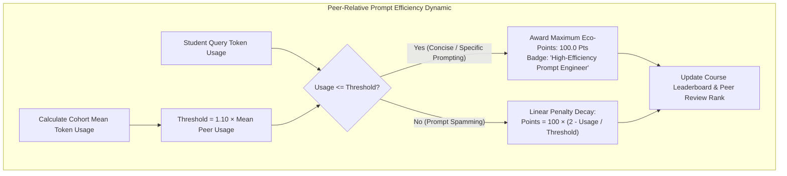

#### Pedagogical Impact on Prompting Behavior:
1. **Incentivizes High-Information-Density Prompting**: Students learn that writing one well-formulated prompt with explicit constraints yields higher leaderboard points than firing 10 vague prompts.
2. **Rewards Fast-Path 0-Token Retrieval**: Reusing cached solutions consumes zero tokens, encouraging students to study verified repository solutions.

---

### 4.2 Environmental Telemetry: Green Prompting Literacy

S-SPARC couples every prompt with physical externality feedback (`backend/services/sustainability.py`):

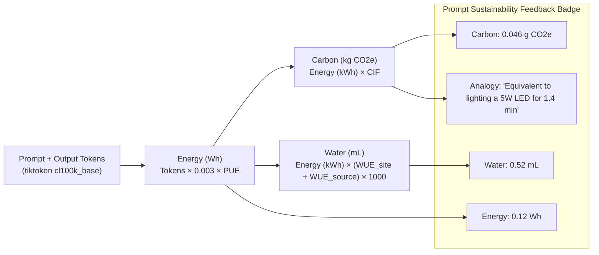

$$\text{Energy}_{\text{Wh}} = N_{\text{tokens}} \cdot E_{\text{token}} \cdot \text{PUE} \quad \left(E_{\text{token}} = 0.003\,\text{Wh/token},\, \text{PUE} = 1.12\right)$$

$$\text{Carbon}_{\text{kg}} = \left(\frac{\text{Energy}_{\text{Wh}}}{1000}\right) \cdot \text{CIF} \quad \left(\text{CIF} = 0.384\,\text{kg CO}_2\text{e/kWh}\right)$$

$$\text{Water}_{\text{mL}} = \left(\frac{\text{Energy}_{\text{Wh}}}{1000}\right) \cdot \left(\text{WUE}_{\text{site}} + \text{WUE}_{\text{source}}\right) \cdot 1000 \quad \left(\text{WUE}_{\text{site}}=0.30,\,\text{WUE}_{\text{source}}=4.35\,\text{L/kWh}\right)$$

---

## 5. RISK ASSESSMENT, LIMITATIONS, & FUTURE ROADMAP

### 5.1 Honest Technical Constraints as Open Research Frontiers

| Constraint Dimension | Current Implementation Reality | Next-Phase Research & Mitigation Frontier |
| :--- | :--- | :--- |
| **1. Multi-Language AST Granularity** | Deep AST and Radon metrics natively implemented for Python; Java, C++, and PHP utilize regex heuristics. | Integration of **Tree-Sitter** unified C-bindings for language-agnostic concrete syntax tree parsing across all languages. |
| **2. Embedding Cold-Start Latency** | First-time initialization of `all-MiniLM-L6-v2` takes 15–20s on CPU hosting environments. | Model quantization to **ONNX Runtime INT8** with persistent memory-mapped vector stores, reducing cold starts to $< 1.2\text{s}$. |
| **3. Evaluation Microservice Cloud Cost** | Full knowledge base audits using GPT-4o as judge incur token costs on large multi-thousand corpora. | Knowledge distillation into a lightweight **7B Small Language Model (SLM)** fine-tuned on code quality heuristics for offline execution. |
| **4. Relational Database Session Volatility** | In-memory fallback tracking resets if MySQL is ungracefully disconnected. | Deployment of **Redis persistent caching clusters** with Append-Only File (AOF) journaling for distributed state isolation. |

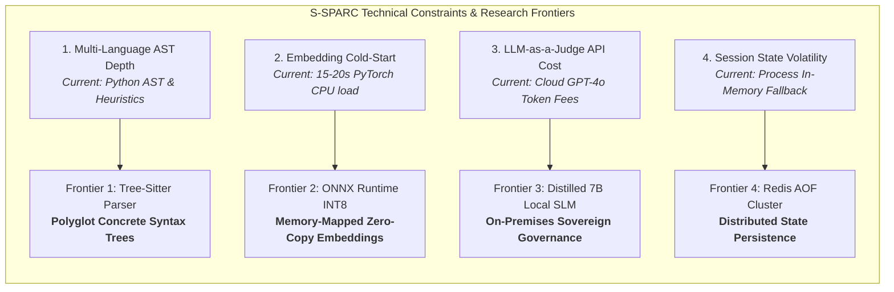

---

### 5.2 Scaling Strategy: Democratizing AI for the Global South

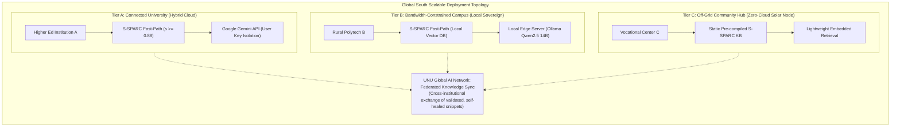

1. **Zero-Token Sovereign Edge Deployment**: Deployable on commodity workstations via local Ollama weights and pre-seeded vector caches, providing offline prompt literacy training with zero cloud expenses.
2. **Federated Knowledge Harvesting**: Universities across the UNU Global AI Network can synchronize validated, self-healed prompt-code pairs via lightweight JSON diffs.
3. **Open-Source Pedagogical Reference**: Positioned as the open-source blueprint for responsible prompt engineering and AI literacy education in developing regions.

---

## 6. PROJECT ARTIFACTS & EVIDENCE REPOSITORY

| System Layer | Operational Module / File Path | Technical Responsibility & Evidence Scope |
| :--- | :--- | :--- |
| **Core Backend** | `backend/main.py` | FastAPI application lifecycle, CORS policy, middleware, and OpenAPI 3.1 documentation endpoints. |
| **Prompt Registry & Compression** | `backend/core/prompts.py` | Mode-specific prompt harnesses, Bloom's cognitive tiering, CacheAligner prefix stabilization, and AST CodeCompressor. |
| **Prompt Bounds** | `backend/api/ai_chat.py` | 200–2000 character C-I-O-E protocol validator and 60s deliberate reflection cooldown limiter. |
| **Adaptive Gateway** | `backend/services/adaptive_router.py` | 3-tier cascade routing (Student Key $\rightarrow$ 6-Key Pool $\rightarrow$ Local Ollama Qwen2.5 14B) with Output Shaper. |
| **Retrieval Engine** | `backend/services/ai_service.py` | Dense-Sparse Hybrid Search (`all-MiniLM-L6-v2` + `BM25Okapi`), RRF fusion ($k=60$), and fast-path gate ($s \ge 0.88$). |
| **Sustainability Engine** | `backend/services/sustainability.py` | Real-time physical telemetry formulation ($\text{Wh}$, $\text{kg CO}_2\text{e}$, $\text{mL}$ water) with Indonesian Grid factor ($\text{CIF}=0.384$). |
| **Gamification Engine** | `backend/services/gamification.py` | Peer-relative dynamic token threshold calculation ($\text{Threshold} = 1.10 \times \overline{\text{Usage}}_{\text{peers}}$). |
| **Data Access Layer** | `backend/core/db.py` | MySQL connection pooling, circuit breakers, user API key isolation, and in-memory fallback queues. |
| **Governance Pipeline** | `code_evaluator_service/evaluator/evaluator_pipeline.py` | 5-stage closed-loop quality scoring, duplicate filtering, and automated JSON pre-deletion backups. |
| **Static Code Analysis** | `code_evaluator_service/evaluator/static_analysis.py` | Abstract Syntax Tree (AST) validation, language detection, Radon Cyclomatic Complexity, and Maintainability Index. |
| **Anomaly Detection** | `code_evaluator_service/evaluator/anomaly_detection.py` | Scikit-learn Isolation Forest 5D unsupervised outlier screening model ($\gamma = 0.10$). |
| **LLM-as-a-Judge** | `code_evaluator_service/evaluator/llm_judge.py` | Multi-criteria snippet evaluation harness ($A, L, Q$) with heuristic fallback scoring. |
| **Empirical Benchmarks** | `pengujian semantic similarity/EXECUTIVE_SUMMARY.md` | 200-query Gold Standard ground truth validation report ($\text{MRR}=1.000, \text{Precision@1}=100\%$). |
| **Governance Case Run** | `code_evaluator_service/reports/evaluation_report_20260312T094424Z.json` | Live audit dataset of 678 production entries (95.43% valid retention, 30 prunings, 1 quarantine). |
| **LMS Chat Client** | `estrange/v2/v2/ssparc/chat.php` | Production PHP interface with live cooldown timer, dynamic quota counter, and 200-char validation. |
| **Academic Integrity** | `estrange/v2/v2/student_assessment_submit.php` | Assignment submission engine with automated AST/token plagiarism detection ($\ge 70\%$ threshold). |
| **Defense Adjudication** | `estrange/v2/v2/student_assessment_submit_suspicious.php` | Structured student defense response workflow for lecturer resolution. |
| **Peer Review Module** | `estrange/v2/v2/student_peer_review.php` | Anonymized peer code evaluation and code clarity points allocation interface. |

---

### Conclusion & Multilateral Commitment
S-SPARC demonstrates that transforming the educational paradigm requires moving beyond unstructured conversational chatbots toward **calibrated, specific smart prompting grounded in Bloom's Taxonomy and Headroom-style context compression**. By enforcing the **200-character C-I-O-E protocol**, **AST CodeCompressor context reduction**, **CacheAligner KV-cache optimization**, **0-token semantic caching**, **autonomous closed-loop governance**, and **physical sustainability telemetry**, S-SPARC establishes a mature (TRL 7), youth-led standard for **AI Literacy and Sustainable Higher Education** under the auspices of the **United Nations University Global AI Network**.
