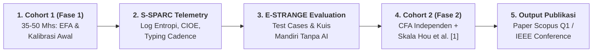

# 🎯 RESEARCH PITCH DECK: S-SPARC AI™ & OVER-RELIANCE DETECTOR
## *Measuring & Mitigating AI Over-Reliance in Programming Education*

> **📝 CATATAN REVISI METODOLOGI TINGKAT LANJUT (ARSENAL SIDANG & PEER-REVIEW Q1)**
> Versi ini mengintegrasikan 7 proteksi fundamental terhadap bias metodologi, psikometri, dan etika:
> 1. **Mitigasi Reaktivitas & Hawthorne Effect**: Desain transisi *Baseline Phase (Unconstrained)* menuju *Intervention Phase (Productive Friction)*.
> 2. **Uji Unidimensi Psikometri**: Menguji struktur laten 4 indikator via *Exploratory / Confirmatory Factor Analysis (EFA/CFA)* sebelum agregasi linear.
> 3. **Paradoks Inversi Entropi**: Memodelkan efek interaksi *Entropy $\times$ Prior Ability* guna membedakan keringkasan pakar (*expert conciseness*) dari kemalasan pemula.
> 4. **Validasi Classifier NLP untuk $R_{\text{concept}}$**: Sub-studi terpisah untuk pelaporan *Precision, Recall, F1-Score*, dan *Cohen's Kappa ($\kappa$)*.
> 5. **Anti P-Hacking & Metodologi Kuat**: Protokol analisis data dan variabel dikunci di awal sebelum ekstraksi data, dilengkapi 5-Fold Cross-Validation.
> 6. **Mitigasi Pygmalion Effect**: Masking skor ORI individual dari dosen selama fase kalibrasi untuk mencegah bias penilaian subjektif.
> 7. **Batasan Generalisasi Domain**: Mengakui batasan *deterministic unit testing* khusus ranah komputasi/CS.

---

### 📌 SLIDE 1: THE BIG PICTURE & HOOK
```
=============================================================================================
  "Generative AI generates code in seconds, but students lose the ability to think critically.
   How do we measure and fix AI dependence without banning it?"
=============================================================================================
```
* **Judul Riset**: *Quantifying AI Over-Reliance in Programming Education: A Telemetry-Driven Behavioral Metric with Productive Friction in S-SPARC*
* **Fokus**: *AI in Education (AIED)*, *Learning Analytics*, *Educational Data Mining*
* **Platform**: **S-SPARC AI™** terintegrasi dengan **E-STRANGE LMS**
* **Institusi**: Fakultas Teknologi Informasi, Universitas Kristen Maranatha (2026)

---

### 🚨 SLIDE 2: THE PROBLEM (Krisis Kognitif di Lab Pemrograman)
* **Kondisi Riil**: Mahasiswa terjebak dalam siklus pasif: *copy prompt -> paste ke AI -> copy code -> run* [3].
* **Fakta Empiris dari Literatur Peer-Reviewed**:
  * *Systematic review* membuktikan bahwa ketergantungan berlebih pada sistem dialog AI menurunkan kemampuan *critical thinking*, pengambilan keputusan, dan penalaran analitis mahasiswa [2].
  * Bantuan AI instan berkorelasi lemah dan tidak konsisten terhadap kemampuan mandiri tanpa AI [3], [14].
  * Ketergantungan tinggi pada LLM berkorelasi negatif dengan nilai akhir mata kuliah [4].
  * Analisis 2.376 interaksi mahasiswa dengan ChatGPT didominasi *surface-level regulation* tanpa refleksi kognitif mendalam [5].
* **Dampak Akademis**: **Cognitive Atrophy**: penurunan keterampilan *self-debugging* mandiri dan kegagalan saat evaluasi tanpa bantuan AI [2], [6].

---

### 🔍 SLIDE 3: THE RESEARCH GAP (Mengapa Riset Ini Penting Sekarang?)

| Pendekatan Riset Saat Ini (2022 - 2026) | Gap & Kelemahan | Pendekatan S-SPARC (Penelitian Kita) |
| :--- | :--- | :--- |
| **Kuesioner opini subjektif [2], [7]** | Skala Likert sering bias dan tidak mencerminkan perilaku asli | **Telemetri kuantitatif real-time**, dicatat otomatis per milidetik |
| **Deteksi biner plagiarisme** | AI detector sering *false positive* dan hanya berorientasi menghukum | **Cognitive profiling**: memetakan cara berpikir dan proses inkuiri mahasiswa [5] |
| **Taksonomi reliance kualitatif [15] / Eye-tracking [16]** | Menganalisis perilaku secara objektif tetapi bersifat *post-hoc* dan belum menghasilkan skor komposit tunggal untuk intervensi live | **Formula komposit ORI real-time** yang menggabungkan entropi, kelengkapan C-I-O-E, dan rasio konsep untuk langsung memicu *adaptive scaffolding* |
| **Tanpa intervensi sistem [5], [8]** | AI komersial membiarkan mahasiswa *prompt spamming* | **Productive Friction**: jeda refleksi 60 detik & petunjuk Socratic bertingkat [9], [10] |

---

### 💡 SLIDE 4: THE SOLUTION (Formulasi AI Over-Reliance Index / ORI)

S-SPARC merumuskan model matematis untuk mengukur ketergantungan kognitif secara komposit:

$$\mathbf{ORI = 1 - \left( w_1\, Q_{\text{prompt}} + w_2\, S_{\text{CIOE}} + w_3\, R_{\text{concept}} + w_4\, F_{\text{reflect}} \right)}$$

```
+---------------------------------------------------------------------------------------------------+
|  Q_prompt   : Shannon Entropy H(X) [11] + kepadatan token sintaksis pemrograman dalam prompt       |
|  S_CIOE     : Kelengkapan 4 batasan masalah (Context, Input, Output, Error Trace) [12]             |
|  R_concept  : Rasio bantuan konseptual/analogi vs permintaan blok kode instan (Bloom C2-C4)        |
|  F_reflect  : Kepatuhan jeda refleksi 60s + Keystroke Cadence (Anti-Paste Dwell Time) [9]          |
+---------------------------------------------------------------------------------------------------+
```

* Semua komponen dinormalisasi ke rentang **[0, 1]**; bobot **$w_1 + w_2 + w_3 + w_4 = 1$**.
* **Bobot awal (hipotesis awal)**: $w_1 = 0.30, w_2 = 0.25, w_3 = 0.20, w_4 = 0.25$.
* **Validasi Psikometrik Terbuka**: Pengujian struktur faktor tunggal (*Unidimensionality*) melalui EFA/CFA sebelum pembobotan linear difinalkan.
* **Mitigasi Meta-Gaming**: $F_{\text{reflect}}$ memverifikasi *typing cadence* guna mendeteksi *copy-paste* instan dari prompt generator eksternal.

---

### 🌟 SLIDE 5: PILAR KEBARUAN ILMIAH (*CORE NOVELTIES*)

1. **Novelty 1: Skor Komposit Real-Time untuk Pemicu Scaffolding Adaptif**  
   Berbeda dari studi reliance kualitatif [15] atau eye-tracking [16] yang dianalisis *post-hoc*, S-SPARC menghitung skor komposit secara *live* untuk langsung mengadaptasi level bantuan AI.
2. **Novelty 2: Information Theory (Shannon Entropy) untuk Evaluasi Kedalaman Prompt**  
   Mengadaptasi rumus entropi Shannon $H(X)$ [11] untuk mengukur bobot kekayaan informasi dalam prompt pemrograman [13], [17].
3. **Novelty 3: Pengujian Empiris Productive Friction & Anti Meta-Gaming**  
   Menguji efektivitas jeda paksa 60 detik [9], [10] yang diperkuat deteksi *keystroke dwell time* untuk memutus siklus *copy-paste* pasif.
4. **Novelty 4: Closed-Loop Integrasi AI + LMS Auto-Grader**  
   Menghubungkan skor ORI langsung dengan performa eksekusi kode (*unit test cases*) di E-STRANGE.

---

### 🗄️ SLIDE 6: DATA SUDAH SIAP (Zero Friction Data Collection)

* **Sistem Sudah Live & Siap Pakai**: Backend S-SPARC dan tabel logging database MySQL sudah aktif di E-STRANGE.
* **Data yang Otomatis Terekam per Mahasiswa**:
  * Teks prompt mentah + stempel waktu (*timestamp* ms) + *typing cadence*.
  * Skor Shannon Entropy $H(X)$ dan kepatuhan C-I-O-E.
  * Durasi waktu jeda sebelum *submit* kode.
  * Skor pengujian kode (*Passed Test Cases*, *Wrong Answer*, *Runtime*).
  * Estimasi konsumsi energi (Watt-hour) & jejak karbon ($g\, CO_2$).
* **Effort Dosen & Peneliti**: **NOL survei manual**; data tinggal diekspor ke CSV/Pandas setelah sesi praktikum kelas selesai.

---

### 🔒 SLIDE 7: ETIKA, PRIVASI DATA & PERLINDUNGAN MAHASISWA

* **Informed Consent & Opt-Out**: Mahasiswa diberi tahu secara transparan bahwa data agregat dianalisis untuk riset, dengan opsi *opt-out* yang tidak memengaruhi nilai akademik.
* **Anonymization Total**: Data diekspor dalam bentuk kode acak unik (*anonymized identifier*), bebas dari NIM dan nama mahasiswa.
* **Pencegahan Pygmalion Effect (Phase-Gated Dashboard)**: Skor ORI individual dan label persona *dimasking* (disembunyikan) dari dosen pengampu selama **Fase Riset/Pilot**, guna melindungi validitas internal dan mencegah bias penilaian subjektif. Dashboard evaluasi dosen *real-time* baru diaktifkan penuh setelah model tervalidasi di fase produk berikutnya.
* **Persetujuan Etik Institusi**: Pengajuan protokol izin penelitian resmi ke pimpinan fakultas/komite etik kampus.

---

### 🛡️ SLIDE 8: METODOLOGI KETAT (MENGATASI REAKTIVITAS & BIAS PSIKOMETRI)

```
+---------------------------------------------------------------------------------------------------+
|  1. MITIGASI REAKTIVITAS & MATURATION CONFOUND                                                    |
|     - Modul 1-2: Fase Baseline (interaksi AI natural tanpa jeda) untuk merekam trait asli.        |
|     - Modul 3-4: Fase Intervensi (Productive Friction 60s aktif) untuk mengukur delta adaptasi.   |
|     - Catatan Kritis: Pada desain 1 kelas, efek maturasi waktu diakui eksplisit sebagai batasan   |
|       (limitation); jika tersedia >= 2 seksi paralel, diterapkan counterbalancing (A-B vs B-A).   |
+---------------------------------------------------------------------------------------------------+
|  2. ROADMAP PSIKOMETRI 2-FASE (Mengatasi Batasan Sampel & Mencegah Overfitting)                   |
|     - FASE 1 (Semester Ini / Cohort 1): Instrument Development & Exploratory Factor Analysis (EFA)|
|       untuk mengeksplorasi struktur laten 4 indikator (Q, S, R, F) serta kalibrasi awal.          |
|     - FASE 2 (Semester Depan / Cohort 2): Confirmatory Factor Analysis (CFA) independen,          |
|       validasi konvergen dengan skala Hou et al. [1], dan uji interaksi power-demanding.          |
+---------------------------------------------------------------------------------------------------+
|  3. PARADOKS INVERSI ENTROPI (Interaction Modeling)                                              |
|     - Memodelkan interaksi 'Entropy x Baseline Ability' agar prompt ringkas mahasiswa pakar       |
|       (expert conciseness) tidak salah dinilai sebagai over-reliance pemula.                      |
+---------------------------------------------------------------------------------------------------+
|  4. SUB-STUDI VALIDASI CLASSIFIER NLP (R_concept)                                                 |
|     - Evaluasi klasifikasi niat prompt menggunakan >= 100 sampel prompt beranotasi ganda          |
|       (minimal 2 annotator independen) dengan target inter-rater agreement Cohen's Kappa κ >= 0.80|
+---------------------------------------------------------------------------------------------------+
```

---

### 🧪 SLIDE 9: STRATEGI VALIDASI RIGOROUS & ANTI-SIRKULARITAS



* **Separasi Sampel (EFA vs CFA)**: Struktur faktor dieksplorasi pada Cohort 1 (Fase 1) dan dikonfirmasi pada Cohort 2 independen (Fase 2) untuk mencegah *overfitting* psikometrik.
* **Anti-Sirkularitas**: Kalibrasi bobot regresi pada *training fold*, diuji independen pada *validation fold* (5-Fold Cross-Validation).
* **Multicollinearity Check**: Memeriksa *Variance Inflation Factor (VIF < 5)* antar variabel prediktor untuk menjamin kestabilan estimasi bobot.
* **Convergent Validity Baku**: Validasi silang skor ORI dengan instrumen baku *GenAI Reliance Scale* (Hou et al., *Computers & Education 2025* [1]).
* **Protokol Terkunci di Awal**: Mengunci rencana variabel dan analisis statistik sebelum ekstraksi data guna menjamin konsistensi metodologi.

---

### 🔬 SLIDE 10: 4 HIPOTESIS ANALISIS EKSPLORATORI LANJUTAN & KONTROL

> Berstatus *hypothesis-generating / exploratory*, dengan ambang batas signifikansi terkoreksi Bonferroni ($\alpha_{\text{adjusted}} = 0.05 / 4 = 0.0125$).

1. **Volume-Driven Cumulative Compute (Green AI)**:
   * *Hipotesis*: Mahasiswa over-reliant diprediksi menghasilkan akumulasi emisi komputasi kumulatif per tugas yang lebih tinggi akibat tingginya volume iterasi prompt berulang (bukan biaya per-kueri).
   * *Kontrol*: Memasukkan **tingkat kesulitan modul (Module Fixed-Effects)** dan memisahkan total volume kueri dari rasio *cache hit*.
2. **Code Distance Delta (AST Logika vs Rename Variabel)**:
   * *Hipotesis*: Mahasiswa otonom diprediksi memiliki jarak modifikasi logika (*AST Distance*) yang lebih besar terhadap saran AI dibanding mahasiswa pasif.
   * *Aturan Deterministik*: Membandingkan **kode saran AI terakhir dalam sesi tugas** terhadap submission final mahasiswa.
3. **Reflexive Pause vs First-Attempt Pass Rate**:
   * *Hipotesis*: Kepatuhan jeda refleksi berkorelasi positif dengan kelulusan pada percobaan pertama, independen dari kemampuan dasar.
   * *Kontrol & Batas Kausal*: Memasukkan **skor nilai awal/pre-test (Baseline Ability) sebagai KOVARIAT**; klaim dibatasi pada *korelasi terarah yang terkontrol*, bukan kausalitas deterministik.
4. **Query Novelty & Semantic Exploration**:
   * *Hipotesis*: Kemunculan *semantic cache miss* mencerminkan eksplorasi batasan masalah atau *edge cases* baru.
   * *Kontrol*: Mengontrol **usia kematangan cache (Cache Maturity)** dan kesulitan modul untuk menghindari bias *cold-start* di minggu-minggu awal.

---

### 🏆 SLIDE 11: TARGET LUARAN, SCOPE BOUNDARY & PUBLIKASI BERSAMA

1. **1 Artikel Ilmiah Konferensi Internasional Bereputasi / Jurnal Terindeks**:
   * *Target Konferensi*: **IEEE TALE** / **IEEE EDUCON** / **ACM SIGCSE**.
   * *Target Jurnal*: **Jurnal Terakreditasi SINTA 2** / **Scopus Q1/Q2 (IEEE TLT / Computers & Education: AI)**.
   * *Kepengarangan*: Kolaborasi Dosen Pembimbing (Corresponding Author) + Tim Peneliti Mahasiswa.
2. **Dashboard Evaluasi Dosen (Aktivasi Pasca-Validasi)**:
   * Fitur dashboard analitik live untuk dosen yang ditawarkan di roadmap produk akan diaktifkan penuh setelah model ORI tervalidasi secara psikometrik di Fase 2.
3. **Batasan Ruang Lingkup (Scope Boundary)**:
   * Metodologi ORI saat ini dirancang spesifik untuk penugasan dengan *deterministic unit testing* (Ilmu Komputer/Pemrograman). Ekspansi ke ilmu sosial/esai memerlukan instrumen evaluasi non-deterministik tersendiri.

---

### ⏱️ SLIDE 12: TIMELINE ROADMAP RISET 2-FASE

```
+---------------------------------------------------------------------------------------------------+
| FASE 1: INSTRUMENT DEVELOPMENT & EFA (Semester 1 - 8 Minggu)                                      |
| - Minggu 1-2 : Konfigurasi Instrumen, Izin Mahasiswa, & Baseline Phase (Modul 1-2)                |
| - Minggu 3-4 : Intervention Phase (Productive Friction Aktif, Modul 3-4)                          |
| - Minggu 5-6 : Ekstraksi Telemetri MySQL, Anotasi NLP (Kappa >= 0.80), & EFA Factor Structure    |
| - Minggu 7-8 : Manuscript Drafting (Work-in-Progress / IEEE Conference Submission)                |
+---------------------------------------------------------------------------------------------------+
| FASE 2: CONFIRMATORY VALIDATION & REPLICATION (Semester 2)                                        |
| - Replikasi di Cohort Independen (CFA, Hou et al. Scale Validation, Interaction Model Testing)    |
| - Submission ke Jurnal Utama Scopus Q1 (IEEE TLT / Computers & Education: AI) & Live Dashboard   |
+---------------------------------------------------------------------------------------------------+
```

---

### 🤝 SLIDE 13: WHAT WE NEED FROM DOSEN (CALL TO ACTION)

1. **Izin Implementasi di 1 Kelas Praktikum**: Menjalankan S-SPARC dalam alur praktikum semester aktif.
2. **Koordinasi Jadwal & Sesi Lab**: Memastikan kelancaran integrasi server telemetri di sesi kelas.
3. **Bimbingan & Review Metodologi Bersama**: Mengawal validasi statistik dan penulisan paper hingga *submission*.

---

### 📚 SLIDE 14: KEY REFERENCES (IEEE STYLE)

[1] Y. Hou, X. Zhu, P. Sudarshan, C. P. Lim, and Y. S. Ong, "Measuring undergraduate students' reliance on Generative AI during problem-solving: Scale development and validation," *Computers & Education*, vol. 234, Art. no. 105329, 2025.

[2] C. Zhai, S. Wibowo, and L. D. Li, "The effects of over-reliance on AI dialogue systems on students' cognitive abilities: A systematic review," *Smart Learning Environments*, vol. 11, no. 1, Art. no. 28, 2024.

[3] S. Li, J. Liu, and Q. Dong, "Generative artificial intelligence-supported programming education: Effects on learning performance, self-efficacy and processes," *Australasian Journal of Educational Technology*, vol. 41, no. 1, pp. 45-62, 2025.

[4] G. Jošt, V. Taneski, and S. Karakatič, "The impact of large language models on programming education and student learning outcomes," *Applied Sciences*, vol. 14, no. 10, Art. no. 4115, 2024.

[5] S. López-Pernas, K. Misiejuk, E. Oliveira, and M. Saqr, "The dynamics of the self-regulation process in student-AI interactions: The case of problem-solving in programming education," in *Proc. 25th Koli Calling Int. Conf. Comput. Educ. Res.*, 2025, pp. 1-12.

[6] D. Kohen-Vacs, M. Usher, and M. Jansen, "Integrating generative AI into programming education: Student perceptions and the challenge of correcting AI errors," *Int. J. Artif. Intell. Educ.*, vol. 35, no. 4, pp. 3166-3184, 2025.

[7] J. Prather et al., "The robots are here: Navigating the generative AI revolution in computing education," in *Proc. 2023 Work. Group Rep. Innov. Technol. Comput. Sci. Educ.*, 2023, pp. 108-159.

[8] A. Kharrufa, S. Alghamdi, A. Aziz, and C. Bull, "LLMs integration in software engineering team projects: Roles, impact, and a pedagogical design space," *ACM Trans. Comput. Educ.*, vol. 26, no. 1, pp. 1-27, 2024.

[9] P. Denny et al., "Prompt Problems: A new programming exercise for the generative AI era," in *Proc. 55th ACM Tech. Symp. Comput. Sci. Educ.*, 2024, pp. 296-302.

[10] C. Vieira, J. L. De La Hoz, A. J. Magana, and D. Restrepo, "Engineering students' experiences with ChatGPT to generate code," *Comput. Appl. Eng. Educ.*, vol. 33, no. 1, Art. no. e70090, 2025.

[11] C. E. Shannon, "A mathematical theory of communication," *Bell Syst. Tech. J.*, vol. 27, no. 3, pp. 379-423, 1948.

[12] P. Yang et al., "Large language models for software testing education: An experience report," in *Proc. 34th ACM Int. Conf. Found. Softw. Eng.*, 2026, pp. 1-12.

[13] X. Gong, W. Xu, and A.-L. Qiao, "Exploring undergraduates' computational thinking in progressive prompt-assisted programming learning," *Int. J. Educ. Technol. High. Educ.*, vol. 22, no. 1, Art. no. 14, 2025.

[14] G. Pitts, N. Rani, W. Mildort, and E.-M. Cook, "Students' reliance on AI in higher education: Identifying contributing factors," *arXiv preprint* arXiv:2506.13845, 2025.

[15] J. Zheng et al., "Do students rely on AI? Analysis of student-ChatGPT conversations from a field study," in *Proc. 8th AAAI/ACM Conf. AI, Ethics, and Society (AIES)*, 2025.

[16] G. Salib and Z. Sharafi, "AI or ally? Understanding student reliance on GitHub Copilot and human peers through eye tracking," *IEEE Trans. Softw. Eng.*, pp. 1-13, 2026, doi: 10.1109/TSE.2026.3705249.

[17] T.-Y. Yang et al., "Leveraging LLMs for automated extraction and structuring of educational concepts," *Mach. Learn. Knowl. Extr.*, vol. 7, no. 3, p. 103, 2025.

---

```
=============================================================================================
             "Datanya sudah ada, sistemnya sudah jalan, topiknya sedang tren global. 
                        Tinggal kita eksekusi jadi paper bersama!"
=============================================================================================
```
