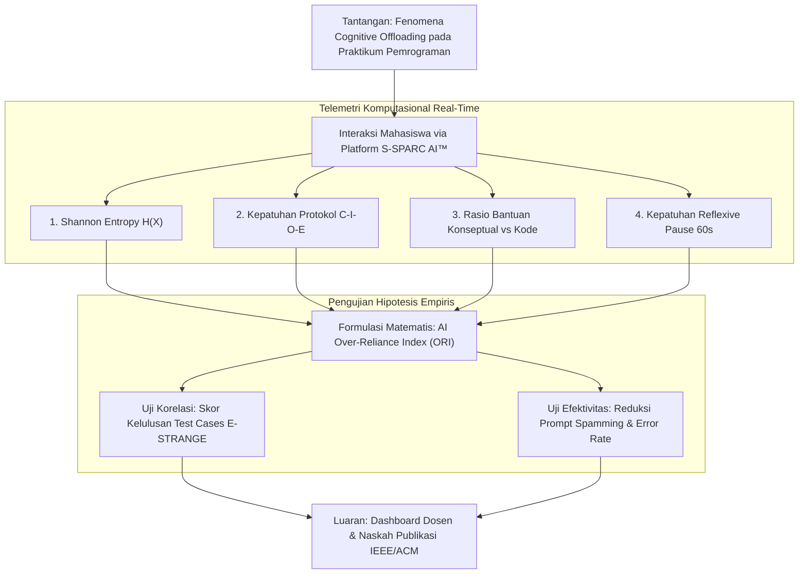

# PROPOSAL PENELITIAN AKADEMIK

---

## **HALAMAN JUDUL**

<br>

<div align="center">

# PENGUKURAN KUANTITATIF KETERGANTUNGAN MAHASISWA TERHADAP ARTIFICIAL INTELLIGENCE (*AI OVER-RELIANCE INDEX*) MENGGUNAKAN TELEMETRI INTERAKSI S-SPARC PADA PEMBELAJARAN PEMROGRAMAN BERBANTUAN E-STRANGE

<br>

**PROPOSAL PENELITIAN DOSEN / TUGAS AKHIR / SKRIPSI / HIBAH PENELITIAN**

<br>
<br>

**Disusun Oleh:**  
**Tim Peneliti S-SPARC & E-STRANGE**  
Fakultas Teknologi Informasi  
Universitas Kristen Maranatha  
Bandung, Indonesia  

<br>
<br>

**FAKULTAS TEKNOLOGI INFORMASI**  
**UNIVERSITAS KRISTEN MARANATHA**  
**BANDUNG**  
**2026**

</div>

---

## **LEMBAR PENGESAHAN PROPOSAL PENELITIAN**

1. **Judul Penelitian**: Pengukuran Kuantitatif Ketergantungan Mahasiswa Terhadap Artificial Intelligence (*AI Over-Reliance Index*) Menggunakan Telemetri Interaksi S-SPARC pada Pembelajaran Pemrograman Berbantuan E-STRANGE
2. **Bidang Fokus Penelitian**: *Artificial Intelligence in Education (AIED)*, *Educational Data Mining (EDM)*, *Learning Analytics & Software Engineering Pedagogy*
3. **Ketua Pengusul / Peneliti**:
   * Nama Lengkap / NIM / NIDN : [Nama Peneliti / Pengusul]
   * Program Studi : S-1 Teknik Informatika / Sistem Informasi
   * Fakultas : Teknologi Informasi
   * Perguruan Tinggi : Universitas Kristen Maranatha
4. **Dosen Pembimbing / Penanggung Jawab**:
   * Dosen Pembimbing I : [Nama Dosen Pembimbing I, Gelar] (NIDN: ....................)
   * Dosen Pembimbing II : [Nama Dosen Pembimbing II, Gelar] (NIDN: ....................)
5. **Lokasi Penelitian**: Laboratorium Komputer / Kelas Mata Kuliah Pemrograman, Universitas Kristen Maranatha
6. **Jangka Waktu Penelitian**: 8 Minggu (2 Bulan)
7. **Rencana Anggaran Biaya**: Rp 12.500.000,- (Diusulkan via Hibah Internal / Mandiri)

<br>

Bandung, 27 September 2026

**Menyetujui,**

| Dosen Pembimbing I | Pengusul / Peneliti Utama |
| :---: | :---: |
| <br><br><br>**(___________________________)**<br>NIDN: | <br><br><br>**(___________________________)**<br>NIM / NIK: |

<br>

**Mengetahui,**  
**Ketua Program Studi Teknik Informatika**  
Fakultas Teknologi Informasi Universitas Kristen Maranatha  

<br><br><br>
**(___________________________)**  
NIDN: 

---

## **KATA PENGANTAR**

Puji dan syukur ke hadirat Tuhan Yang Maha Esa atas segala rahmat dan petunjuk-Nya, sehingga proposal penelitian yang berjudul **"Pengukuran Kuantitatif Ketergantungan Mahasiswa Terhadap Artificial Intelligence (*AI Over-Reliance Index*) Menggunakan Telemetri Interaksi S-SPARC pada Pembelajaran Pemrograman Berbantuan E-STRANGE"** ini dapat diselesaikan dengan baik.

Proposal ini disusun sebagai rancangan penelitian empiris komprehensif guna menjawab tantangan pedagogis di era kecerdasan artifisial generatif, khususnya mengenai fenomena *cognitive offloading*, erosi kemandirian berpikir (*epistemic dependence*), dan atrofi logika pemrograman pada mahasiswa pendidikan tinggi. Penelitian ini memanfaatkan data telemetri nyata dari ekosistem *S-SPARC AI™* dan *E-STRANGE LMS* yang telah terimplementasi di Universitas Kristen Maranatha.

Penulis menyampaikan ucapan terima kasih yang tulus kepada:
1. Dekan dan segenap pimpinan Fakultas Teknologi Informasi Universitas Kristen Maranatha.
2. Ketua Program Studi Teknik Informatika atas arahan dan dukungan akademik.
3. Dosen Pembimbing atas bimbingan, masukan kritis, dan waktu yang diluangkan.
4. Rekan-rekan tim pengembang S-SPARC dan mahasiswa kelas praktikum yang berpartisipasi dalam penelitian ini.

Penulis menyadari bahwa rancangan penelitian ini masih terbuka untuk disempurnakan. Kritik dan saran yang konstruktif sangat diharapkan demi tercapainya luaran riset yang berdampak nyata bagi dunia pendidikan tinggi.

Bandung, 27 September 2026  
**Tim Peneliti**

---

## **DAFTAR ISI**

* [HALAMAN JUDUL](#halaman-judul)
* [LEMBAR PENGESAHAN](#lembar-pengesahan-proposal-penelitian)
* [KATA PENGANTAR](#kata-pengantar)
* [DAFTAR ISI](#daftar-isi)
* [DAFTAR TABEL](#daftar-tabel)
* [DAFTAR GAMBAR](#daftar-gambar)
* [BAB I: PENDAHULUAN](#bab-i-pendahuluan)
  * [1.1 Latar Belakang Masalah](#11-latar-belakang-masalah)
  * [1.2 Identifikasi dan Batasan Masalah](#12-identifikasi-dan-batasan-masalah)
  * [1.3 Rumusan Masalah](#13-rumusan-masalah)
  * [1.4 Tujuan Penelitian](#14-tujuan-penelitian)
  * [1.5 Manfaat Penelitian](#15-manfaat-penelitian)
* [BAB II: KAJIAN PUSTAKA DAN KERANGKA BERPIKIR](#bab-ii-kajian-pustaka-dan-kerangka-berpikir)
  * [2.1 Kajian Teori](#21-kajian-teori)
  * [2.2 Penelitian Relevan dan Pemetaan Kebaruan (*Novelty*)](#22-penelitian-relevan-dan-pemetaan-kebaruan-novelty)
  * [2.3 Kerangka Berpikir](#23-kerangka-berpikir)
  * [2.4 Hipotesis Penelitian](#24-hipotesis-penelitian)
* [BAB III: METODE PENELITIAN](#bab-iii-metode-penelitian)
  * [3.1 Desain dan Lokasi Penelitian](#31-desain-dan-lokasi-penelitian)
  * [3.2 Populasi, Sampel, dan Teknik Sampling](#32-populasi-sampel-dan-teknik-sampling)
  * [3.3 Definisi Operasional Variabel](#33-definisi-operasional-variabel)
  * [3.4 Teknik Pengumpulan Data dan Instrumentasi](#34-teknik-pengumpulan-data-dan-instrumentasi)
  * [3.5 Teknik Analisis Data](#35-teknik-analisis-data)
* [DAFTAR PUSTAKA](#daftar-pustaka)
* [LAMPIRAN](#lampiran)
  * [Lampiran 1: Rubrik Evaluasi Kualitas Prompt (C-I-O-E Protocol)](#lampiran-1-rubrik-evaluasi-kualitas-prompt-c-i-o-e-protocol)
  * [Lampiran 2: Jadwal Pelaksanaan Penelitian (Gantt Chart)](#lampiran-2-jadwal-pelaksanaan-penelitian-gantt-chart)
  * [Lampiran 3: Rencana Anggaran Biaya (RAB)](#lampiran-3-rencana-anggaran-biaya-rab)

---

## **DAFTAR TABEL**

* **Tabel 2.1**: Sintesis Bukti Empiris Ketergantungan AI dan Intervensi Pedagogis (Konsensus 2022 - 2026)
* **Tabel 2.2**: Matriks Intervensi Pedagogis Berbasis *Productive Friction* pada Pembelajaran Pemrograman
* **Tabel 2.3**: Matriks Pemetaan Riset Terdahulu (*State-of-the-Art*) dan Kebaruan (*Novelty*) S-SPARC
* **Tabel 3.1**: Definisi Operasional dan Skala Pengukuran Variabel Penelitian
* **Tabel 3.2**: Struktur Skema Database Telemetri S-SPARC & E-STRANGE
* **Tabel L.2**: *Gantt Chart* Rencana Pelaksanaan Penelitian 8 Minggu
* **Tabel L.3**: Rincian Anggaran Belanja Hibah Penelitian

---

## **DAFTAR GAMBAR**

* **Gambar 2.1**: Alur Kerangka Berpikir (*Conceptual Framework*) Pengaruh Telemetri S-SPARC terhadap Kemandirian Belajar
* **Gambar 3.1**: Arsitektur Pipeline Pengumpulan Data Telemetri Terotomatisasi E-STRANGE & S-SPARC

---

# **BAB I: PENDAHULUAN**

### 1.1 Latar Belakang Masalah
Integrasi *Generative Artificial Intelligence* (GenAI) seperti OpenAI ChatGPT, GitHub Copilot, dan Google Gemini dalam pendidikan ilmu komputer menunjukkan dinamika paradoksal. Rangkaian riset empiris mutakhir (2022 - 2026) mendokumentasikan konsensus ilmiah yang sangat kuat (sekitar 80%) mengenai adanya ketegangan mendasar: perkakas AI generatif memang mampu mendongkrak performa pembuatan kode jangka pendek, namun berisiko tinggi merusak keterampilan metakognitif dan kemandirian pemecahan masalah (*problem-solving skills*) yang menjadi inti dari pendidikan pemrograman [1]-[4].

Bukti empiris membuktikan bahwa bagaimana cara mahasiswa berinteraksi dengan AI jauh lebih menentukan hasil belajar dibandingkan sekadar frekuensi penggunaannya [2], [4]. Pada studi kuasi-eksperimen terhadap 151 mahasiswa ilmu komputer tahun pertama, bantuan AI menghasilkan peningkatan performa jangka pendek sebesar 20% hingga 40% [1]. Akan tetapi, capaian tersebut hanya berkorelasi sangat lemah dengan kemampuan pemecahan masalah secara mandiri tanpa bantuan AI ($r \approx 0.15, p > 0.05$), yang membuktikan minimnya transfer pembelajaran jangka panjang (*limited long-term learning transfer*) [1]. Analisis penambangan proses (*process mining*) mengungkap bahwa mahasiswa yang didukung GenAI terjebak dalam pola perilaku repetitif: siklus pasif *copy code -> debug and run* [2]. Ketergantungan berlebih dan *cognitive outsourcing* ini secara nyata menghambat akuisisi konsep inti pemrograman [2].

Eksperimen kontrol longitudinal selama 10 minggu oleh Jošt et al. [3] pada mahasiswa sarjana membuktikan adanya korelasi negatif yang signifikan antara tingginya ketergantungan pada LLM untuk pembuatan kode dan *debugging* dengan penurunan nilai akhir mata kuliah. Selanjutnya, analisis terhadap 2.376 interaksi ChatGPT dari 120 mahasiswa menemukan bahwa mahasiswa sangat jarang menerapkan regulasi metakognitif mendalam (seperti refleksi atau evaluasi kritis), melainkan didominasi oleh regulasi tingkat permukaan (*surface-level regulation*) [4]. Mahasiswa yang menghasilkan kode keliru cenderung mengandalkan luaran AI tanpa refleksi, sedangkan mahasiswa berprestasi tinggi meluangkan waktu untuk mematangkan pemahaman konteks masalah dan merevisi prompt secara terstruktur [4]. Banyak mahasiswa langsung menyalin seluruh deskripsi soal ke dalam AI pada awal pengerjaan tugas dan menempelkan hasilnya ke editor tanpa verifikasi logika [4], [5].

Selain itu, model AI kerap menghasilkan halusinasi masalah (*hallucinations*) pada kode mahasiswa, yang menyebabkan mahasiswa terdistraksi memikirkan bug palsu alih-alih fokus pada logika algoritma yang sebenarnya [6]. Tanpa intervensi pedagogis yang terstruktur, pemanfaatan AI hanya akan memperkuat model ketergantungan kognitif (*epistemic dependence*) [4], [7].

Kesenjangan riset utama (*research gap*) saat ini terletak pada:
1. Studi-studi terdahulu mayoritas menggunakan *qualitative coding*, kuesioner persepsi subjektif, dan analisis urutan perilaku *post-hoc*, sehingga bukti kuantitatif langsung yang menghubungkan metrik telemetri interaksi berbasis teori informasi (*Shannon Entropy*, diversitas leksikal, dan kepatuhan batasan masalah) dengan performa uji otomatis (*automated test cases*) masih sangat minim [1]-[4], [8].
2. Meskipun intervensi *Productive Friction* (seperti *Productive Failure*, *Prompt Problems*, dan variasi gaya penjelasan AI) mulai dikembangkan [8]-[11], belum ada penelitian yang menguji secara langsung pengaruh jeda reflektif wajib (*timed reflexive pause*) dan *multi-tier Socratic hint scaffolding* dalam mereduksi perilaku *copy-paste* pasif di lingkungan laboratorium pemrograman langsung.

Ekosistem **S-SPARC AI™** (*Specific Smart Prompting Assistant for perfoRmanCe* / *Sustainable Smart Personal Assistant for Responsible Consumption*) yang terintegrasi secara *native* dengan **E-STRANGE LMS** di Universitas Kristen Maranatha dirancang untuk menjawab kesenjangan tersebut. Melalui pencatatan telemetri formulasi inkuiri terstruktur (**Protokol C-I-O-E: Context, Input, Output, Error Trace**), indeks entropi informasi Shannon $H(X)$, jeda reflektif wajib 60 detik (*Productive Friction*), dan integrasi *auto-grader*, sistem ini memungkinkan pengukuran kuantitatif objektif terhadap **AI Over-Reliance Index (ORI)** secara longitudinal.

---

### 1.2 Identifikasi dan Batasan Masalah

#### Identifikasi Masalah:
1. Terjadinya fenomena *cognitive offloading* dan *epistemic dependence* yang menurunkan ketajaman penalaran komputasional mahasiswa akibat ketergantungan pada luaran kode instan LLM.
2. Belum tersedianya instrumen metrik komputasional objektif untuk mengukur derajat ketergantungan AI mahasiswa secara real-time selama sesi praktikum.
3. Ketiadaan mekanisme *productive friction* pada asisten AI konvensional yang membiarkan mahasiswa melakukan *prompt spamming* tanpa proses verifikasi mandiri.

#### Batasan Masalah:
1. Penelitian difokuskan pada **1 kelas cohort mahasiswa praktikum mata kuliah pemrograman** di Fakultas Teknologi Informasi Universitas Kristen Maranatha.
2. Interaksi mahasiswa dibatasi pada platform **E-STRANGE v3** yang telah terpasang modul dialog **S-SPARC AI™ v3.5**.
3. Bahasa pemrograman yang dievaluasi berfokus pada Python / C++ sesuai kurikulum laboratorium aktif.
4. Parameter telemetri yang dianalisis mencakup formulasi prompt, nilai *Shannon Entropy*, kepatuhan protokol C-I-O-E, waktu jeda refleksi (*timestamp delta*), dan skor kelulusan *test cases* kode pada *auto-grader*.

---

### 1.3 Rumusan Masalah
Berdasarkan latar belakang dan identifikasi masalah, rumusan masalah dalam penelitian ini adalah:
1. **RQ1**: Bagaimana merumuskan model matematis **AI Over-Reliance Index (ORI)** berbasis data telemetri interaksi (*Shannon Entropy* dan kepatuhan Protokol C-I-O-E)?
2. **RQ2**: Apakah terdapat hubungan atau korelasi yang signifikan antara *AI Over-Reliance Index* dengan performa pemrograman mahasiswa (skor kelulusan *test cases* dan durasi penyelesaian tugas)?
3. **RQ3**: Sejauh mana intervensi *Productive Friction* (penerapan *60-second Reflexive Pause*) efektif menekan kebiasaan *copy-paste* buta serta meningkatkan kemandirian *self-debugging* mahasiswa?

---

### 1.4 Tujuan Penelitian
1. **Tujuan Teoretis**:
   * Merumuskan dan memvalidasi model kuantitatif *AI Over-Reliance Index (ORI)* dan *Cognitive Independence Index (CII)* pada domain pendidikan ilmu komputer.
   * Memberikan bukti empiris berbasis data telemetri mengenai pengaruh *productive friction* terhadap retensi kognitif mahasiswa di era GenAI.
2. **Tujuan Praktis**:
   * Menyediakan modul visualisasi analitik (*Lecturer Analytics Dashboard*) pada E-STRANGE untuk memetakan dinamika kemandirian mahasiswa secara dini.
   * Menghasilkan 1 artikel ilmiah berkualitas tinggi untuk dipublikasikan pada konferensi atau jurnal internasional bereputasi (IEEE / ACM / Scopus).

---

### 1.5 Manfaat Penelitian
* **Bagi Mahasiswa**: Melatih kebiasaan metakognitif dan kemampuan *prompt engineering* ilmiah berstandar C-I-O-E guna membangun logika algoritma yang kokoh dan otonom.
* **Bagi Dosen & Institusi**: Menyediakan instrumen evaluasi formatif berbasis telemetri objektif untuk mendukung akreditasi akademik dan peningkatan mutu pembelajaran.
* **Bagi Komunitas Riset AIED**: Mengisi *research gap* global mengenai kuantifikasi empiris interaksi manusia-AI dengan metrik teori informasi Claude Shannon.

---

# **BAB II: KAJIAN PUSTAKA DAN KERANGKA BERPIKIR**

### 2.1 Kajian Teori

#### 2.1.1 Cognitive Offloading, Epistemic Agency, dan Self-Regulated Learning
*Cognitive load theory* [12] membedakan antara beban kognitif yang relevan dalam konstruksi skema pemahaman (*germane load*) dan beban yang tidak relevan (*extraneous load*). Penggunaan AI generatif tanpa scaffolding terarah memicu *cognitive offloading* total, di mana pembelajar mengalihkan seluruh proses berpikir tingkat tinggi ke mesin [1], [2]. 

Mahasiswa yang memiliki agensi epistemik (*epistemic agency*) tinggi tidak menerima luaran AI begitu saja, melainkan aktif melakukan kritik, memverifikasi kesesuaian batasan algoritma, dan mengadaptasi kode secara mandiri [2], [4]. Sebaliknya, mahasiswa dengan regulasi diri rendah (*low self-regulation*) cenderung mendominasi interaksi dengan instruksi langsung (*direct instructions*) dan spesifikasi luaran instan tanpa memperhatikan konteks [4]. Mahasiswa yang memanfaatkan ChatGPT secara kolaboratif atau untuk menyempurnakan kode buatan sendiri terbukti mengungguli mahasiswa yang hanya mengandalkan AI untuk men-generate kode dari nol [4].

#### 2.1.2 Productive Friction, Productive Failure, dan Scaffolding Intervensi
*Productive Friction* [7], [8] dan kerangka kerja *Productive Failure* [9] menegaskan bahwa proses belajar yang efektif membutuhkan tingkat kesulitan terencana (*desirable difficulties*). Ketika mahasiswa dihadapkan pada kode buatan AI yang mengandung bug tersembunyi dan diwajibkan melakukan *debugging*, mereka mengalami tantangan yang melatih penalaran kritis dan agensi pemecahan masalah [9].

Berbagai bentuk intervensi pedagogis telah dieksplorasi dalam literatur:
1. **Prompt Problems**: Latihan di mana mahasiswa menyusun prompt bahasa alami terstruktur yang harus menghasilkan kode yang lolos pengujian otomatis (*automated unit tests*), melatih keterampilan berpikir komputasional (*computational thinking*) [8].
2. **AI Explanation Style Selection**: Penyediaan penjelasan berbasis teks dan contoh (*exemplar-based*) yang terbukti menghasilkan akurasi *debugging* dan kepercayaan diri mahasiswa yang lebih tinggi dibandingkan sorotan visual (*saliency highlights*) [10].
3. **CS1-LLM Curriculum Integration**: Redesain kurikulum pemrograman dasar yang mengurangi penekanan sintaksis mentah dan berfokus pada dekomposisi masalah, pengujian, dan penjelasan terstruktur [13].
4. **Pair Programming with GenAI**: Kolaborasi terstruktur di mana mahasiswa bekerja bersama rekan sambil berinteraksi dengan AI terbukti menghasilkan nilai tugas tertinggi dibandingkan mahasiswa yang bekerja sendirian dengan AI (*solo-programming*) [14].

#### 2.1.3 Teori Informasi Claude Shannon ($H(X)$) dalam Analisis Prompt
Dalam teori komunikasi Shannon [15], entropi informasi $H(X)$ mengukur kekayaan distribusi leksikal dan ketidakpastian informasi:

$$H(X) = -\sum_{i=1}^{n} P(x_i) \log_2 P(x_i)$$

Mahasiswa yang memiliki pemahaman komputasional tingkat tinggi menyusun prompt dengan pola interaksi mendalam (seperti berdiskusi, merumuskan hipotesis, dan meringkas), yang tercermin dari tingginya nilai entropi Shannon serta kepadatan token teknis (nama variabel, tipe data, struktur kontrol, batasan kompleksitas $O(N)$, dan *error trace*) [4], [16]. Sebaliknya, mahasiswa dengan *computational thinking* rendah menunjukkan pola interaksi superfisial dengan entropi rendah [16]. Sensitivitas kompleksitas prompt membuktikan bahwa konfigurasi prompt dengan konteks kaya menghasilkan konsep pembelajaran yang jauh lebih bermakna secara edukatif [17].

#### 2.1.4 Protokol Inkuiri Terstruktur C-I-O-E
Protokol C-I-O-E mewajibkan mahasiswa mengartikulasikan 4 pilar batasan masalah:
* **[C] Context**: Ruang lingkup tugas, modul algoritma, dan batasan komputasi.
* **[I] Input**: Format data masukan, tipe variabel, dan contoh nilai batas (*edge cases*).
* **[O] Output**: Struktur luaran yang diharapkan, tipe data kembalian fungsi, dan kompleksitas waktu/memori.
* **[E] Error Trace**: Pesan kesalahan interpreter (*compiler traceback*) dan langkah isolasi yang telah dicoba secara mandiri.

Scaffolding prompt terstruktur ini terbukti secara empiris memperbaiki kemampuan mahasiswa dalam mengartikulasikan informasi relevan pada pengujian perangkat lunak dan mengatasi kendala *rigid one-shot prompting* [18].

---

### 2.2 Penelitian Relevan dan Pemetaan Kebaruan (*Novelty*)

**Tabel 2.1**: Sintesis Bukti Empiris Ketergantungan AI dan Intervensi Pedagogis (Konsensus 2022 - 2026)

| Studi & Peneliti | Sampel & Metodologi | Temuan Kunci | Statistik / Bukti Empiris |
| :--- | :--- | :--- | :--- |
| **Clareus Research [1]** | 151 mahasiswa CS tahun pertama, Kuasi-eksperimen | AI meningkatkan performa jangka pendek tetapi minim transfer belajar mandiri jangka panjang | Performa naik 20-40%, korelasi dengan unassisted solving sangat lemah ($r \approx 0.15, p > 0.05$) |
| **Jošt et al. [3]** | 32 mahasiswa sarjana, Eksperimen 10 minggu | Ketergantungan tinggi pada LLM untuk coding dan debugging berkorelasi dengan penurunan nilai akhir | Korelasi negatif signifikan antara ketergantungan LLM dan nilai akhir ($p < 0.05$) |
| **Li et al. [2]** | Kuasi-eksperimen GenAI vs Kontrol, *Process Mining* | *Cognitive outsourcing* menghambat perolehan konsep; muncul siklus pasif *copy -> debug* | Mahasiswa berprestasi tinggi menunjukkan agensi epistemik dengan mengkritisi luaran AI |
| **López-Pernas et al. [4]** | 120 mahasiswa, 2.376 interaksi ChatGPT | Interaksi didominasi regulasi permukaan; jarang melakukan refleksi metakognitif mendalam | Mahasiswa gagal cenderung menyalin seluruh deskripsi soal tanpa penyesuaian |
| **Vieira et al. [9]** | Mahasiswa teknik, *Productive Failure Framework* | Mahasiswa kesulitan mendeteksi bug pada kode AI; tercipta *desirable difficulties* | Mahasiswa merasa 'mengajari model', memicu keterlibatan pemikiran kritis |
| **Kohen-Vacs et al. [5]** | Mahasiswa lintas 2 semester, Tugas Debugging AI | Mahasiswa berkinerja lebih rendah pada tugas debugging buatan LLM dibanding buatan instruktur | Konten buatan AI menimbulkan beban kognitif yang lebih besar |
| **Lyu et al. [14], [19]** | Studi semester penuh, *CodeTutor & Pair Programming* | Kolaborasi manusia memitigasi over-reliance; kualitas prompt berkorelasi dengan akurasi luaran | Mahasiswa berpasangan dengan AI meraih skor tertinggi, solo-AI meraih nilai terendah |
| **Gong et al. [16]** | 44 mahasiswa sarjana, *Progressive Prompt Learning* | Bantuan prompt progresif meningkatkan pemikiran komputasional secara signifikan | Peningkatan serempak pada kreativitas, algoritma, dan pemikiran kritis ($p < 0.05$) |
| **Yang et al. [18]** | Mahasiswa *Software Testing*, Scaffolding Prompt | Scaffolding terstruktur memperbaiki artikulasi informasi konteks dan batasan | Mengatasi kendala *rigid one-shot prompting* dan ketiadaan batasan masalah |

<br>

**Tabel 2.2**: Matriks Intervensi Pedagogis Berbasis *Productive Friction* pada Pembelajaran Pemrograman

| Tipe Intervensi | Mekanisme Intervensi | Bukti Pedagogis yang Dihasilkan | Sumber Referensi |
| :--- | :--- | :--- | :--- |
| **Productive Failure** | Mahasiswa men-debug kode buatan AI yang disisipi error | Menciptakan *desirable difficulties*; meningkatkan keterlibatan kritis | Vieira et al. [9] |
| **Prompt Problems** | Mahasiswa menyusun prompt bahasa alami untuk menghasilkan kode yang lolos uji | Respon antusias mahasiswa; melatih kemampuan *computational thinking* | Denny et al. [8] |
| **Explanation Style Selection** | Pemilihan penjelasan berbasis contoh dan teks vs *saliency highlights* | Penjelasan contoh/teks menghasilkan akurasi *debugging* dan kepercayaan diri lebih tinggi | Dzvapatsva et al. [10] |
| **CS1-LLM Integration** | Kurikulum didesain ulang berfokus pada menjelaskan, menguji, dan dekomposisi | Mahasiswa menyambut positif pembelajaran berbantuan LLM yang terarah | Vadaparty et al. [13] |
| **S-SPARC Reflexive Pause (Usulan)** | Pemberlakuan jeda reflektif wajib 60 detik dan petunjuk Socratic 3-Tier | Menghentikan *prompt spamming* pasif dan memaksa verifikasi mandiri sebelum submit | Tim Peneliti S-SPARC (2026) |

<br>

**Tabel 2.3**: Matriks Perbandingan Riset Terdahulu (*State-of-the-Art*) dan Kebaruan S-SPARC

| Dimensi | Riset Eksisting (2022 - 2026) | Pendekatan S-SPARC dalam Penelitian Ini |
| :--- | :--- | :--- |
| **Metode Pengukuran** | Kualitatif manual, kuesioner persepsi, *post-hoc process mining* [1]-[4] | **Kuantitatif real-time berbasis Shannon Entropy $H(X)$ & Skor Rubrik C-I-O-E** |
| **Mekanisme Intervensi** | Pasif (tanpa pembatasan laju prompt) [4], [5] | **Productive Friction (60-second Reflexive Pause & 3-Tier Socratic Hints)** |
| **Integrasi Evaluasi** | Terpisah dari lingkungan penilaian tugas [3], [6] | **Terintegrasi langsung dengan E-STRANGE LMS Auto-Grader** |
| **Luaran Analitik** | Laporan manual setelah semester berakhir [3], [14] | **Dashboard telemetri langsung (*real-time cognitive profiling*)** |

---

### 2.3 Kerangka Berpikir



**Gambar 2.1**: Alur Kerangka Berpikir Pengukuran Kuantitatif Telemetri S-SPARC

---

### 2.4 Hipotesis Penelitian
* **$H_1$**: Terdapat korelasi negatif yang signifikan antara nilai *Shannon Entropy* serta kepatuhan Protokol C-I-O-E dengan *AI Over-Reliance Index* ($r < 0, p < 0.05$).
* **$H_2$**: Mahasiswa dengan *AI Over-Reliance Index* rendah (otonom) memperoleh rata-rata skor kelulusan *test cases* kode yang lebih tinggi secara signifikan dibandingkan mahasiswa dengan indeks ketergantungan tinggi ($t_{\text{hitung}} > t_{\text{tabel}}, p < 0.05$).
* **$H_3$**: Penerapan *Productive Friction* (Reflexive Pause 60 detik) secara signifikan menurunkan frekuensi pengajuan *prompt* berulang tanpa verifikasi mandiri (*prompt spamming*) ($p < 0.05$).

---

# **BAB III: METODE PENELITIAN**

### 3.1 Desain dan Lokasi Penelitian
* **Pendekatan**: Kuantitatif dengan rancangan **Quasi-Experimental Longitudinal Cohort Study**.
* **Lokasi**: Laboratorium Komputer Fakultas Teknologi Informasi, Universitas Kristen Maranatha, Bandung.
* **Waktu**: Semester Aktif Tahun Akademik 2025/2026 (selama 8 minggu / 4 modul penugasan praktikum).

---

### 3.2 Populasi, Sampel, dan Teknik Sampling
* **Populasi**: Mahasiswa aktif Fakultas Teknologi Informasi yang menempuh mata kuliah pemrograman praktikum.
* **Sampel**: 1 Kelas Cohort Praktikum Mata Kuliah Pemrograman (Algoritma dan Pemrograman / Struktur Data) dengan estimasi ukuran sampel $N = 35 - 50$ mahasiswa.
* **Teknik Sampling**: *Purposive Sampling*, dengan kriteria inklusi mahasiswa yang menyelesaikan minimal 80% modul penugasan pada E-STRANGE.

---

### 3.3 Definisi Operasional Variabel

**Tabel 3.1**: Definisi Operasional dan Skala Pengukuran Variabel Penelitian

| Kategori Variabel | Nama Variabel | Definisi Operasional | Indikator / Rumus | Skala |
| :--- | :--- | :--- | :--- | :--- |
| **Variabel Bebas ($X_1$)** | *Shannon Entropy* $H(X)$ | Kekayaan leksikal dan kerapatan informasi teks prompt | $-\sum P(x_i) \log_2 P(x_i)$, dinormalisasi ke rentang $0.0 - 1.0$ | Rasio |
| **Variabel Bebas ($X_2$)** | *C-I-O-E Adherence* | Kelengkapan formulasi masalah berdasarkan 4 pilar batasan | Skor $0.0 - 1.0$ ($0.25$ per pilar Context, Input, Output, Error) | Rasio |
| **Variabel Bebas ($X_3$)** | *Friction Compliance* | Kepatuhan mahasiswa memanfaatkan jeda 60 detik sebelum submit kode | Rasio waktu baca riil terhadap standar friksi ($\Delta T / T_{\text{pause}}$) | Rasio |
| **Variabel Terikat ($Y_1$)** | *AI Over-Reliance Index (ORI)* | Indeks komposit tingkat ketergantungan kognitif terhadap AI | $\text{ORI} = 1 - (0.40 Q + 0.35 S_{\text{CIOE}} + 0.25 R_{\text{concept}})$ | Rasio ($0.0 - 1.0$) |
| **Variabel Terikat ($Y_2$)** | *Programming Score* | Nilai performa kode berdasarkan kelulusan unit uji di E-STRANGE | Persentase kelulusan *test cases* ($0 - 100$) | Rasio |

---

### 3.4 Teknik Pengumpulan Data dan Instrumentasi

```
+---------------------------------------------------------------------------------------------------+
|                            PIPELINE PENGUMPULAN DATA TELEMETRI S-SPARC                            |
+---------------------------------------------------------------------------------------------------+
|  [Mahasiswa di E-STRANGE] ---> Formulasi Prompt C-I-O-E ---> Engine S-SPARC (FastAPI / PHP)       |
|                                                                     |                             |
|       +-------------------------------------------------------------+                             |
|       |                                                                                           |
|       v                                                             v                             |
|  [Tabel chat_history]                                         [Tabel educational_learning_logs]   |
|  - id, user_id, assessment_id                                 - prompt_quality_score (0.0 - 1.0)  |
|  - role ('user' / 'assistant')                                - shannon_entropy                   |
|  - content (Teks mentah)                                      - cioe_components_present (0 - 4)   |
|  - created_at (Timestamp ms)                                  - bloom_cognitive_mode              |
|                                                               - tokens_consumed, latency_ms       |
|                                                               - energy_wh, carbon_g_co2e          |
|                                                                     |                             |
|       +-------------------------------------------------------------+                             |
|       |                                                                                           |
|       v                                                                                           |
|  [Tabel student_submission (Auto-Grader E-STRANGE)]                                               |
|  - submission_id, user_id, assessment_id, score, verdict ('AC', 'WA', 'TLE'), submitted_at        |
+---------------------------------------------------------------------------------------------------+
```

#### 3.4.1 Instrumentasi Logging Otomatis
Data dikumpulkan secara pasif-transparan melalui basis data MySQL tanpa menginterupsi alur praktikum mahasiswa:
1. **Tabel `educational_learning_logs`**: Mencatat skor kualitas prompt, nilai entropi Shannon, kelengkapan C-I-O-E, mode Bloom, dan telemetri energi hijau.
2. **Tabel `chat_history`**: Menyimpan transkrip dialog lengkap, stempel waktu presisi milidetik, dan tingkat bantuan AI.
3. **Tabel `student_submission`**: Menyimpan hasil evaluasi kode program dari E-STRANGE (*Accepted, Wrong Answer, Time Limit Exceeded*).

#### 3.4.2 Validitas dan Reliabilitas Instrumen
* **Validitas Isi**: Formula rubrik C-I-O-E dan pembobotan parameter divalidasi oleh dosen pengampu dan pakar pendidikan ilmu komputer.
* **Reliabilitas Perangkat Lunak**: Modul parser entropi dan linter prompt diuji menggunakan unit testing otomatis (`pytest` dan PHPUnit) dengan tingkat *code coverage* $\ge 90\%$.

---

### 3.5 Teknik Analisis Data
1. **Statistik Deskriptif & Profiling Kognitif**:
   * Perhitungan mean, median, simpangan baku variabel telemetri.
   * Pemetaan 4 persona pembelajar (*The Socratic Architect, The Fast-Path Prodigy, The Resilient Debugger, The Passive Prompter*).
2. **Uji Prasyarat Analisis**:
   * **Uji Normalitas**: Menggunakan uji *Shapiro-Wilk* ($N \le 50$).
   * **Uji Homogenitas**: Menggunakan uji *Levene's Test*.
3. **Uji Hipotesis Statistik**:
   * **Uji Korelasi Pearson / Spearman**: Menguji korelasi entropi prompt dan skor C-I-O-E terhadap *AI Over-Reliance Index* ($H_1$).
   * **Independent Sample t-Test / Mann-Whitney U Test**: Menguji signifikansi perbedaan nilai praktikum antara kelompok mandiri vs kelompok *over-reliant* ($H_2$).
   * **Paired Sample t-Test / Wilcoxon Signed-Rank Test**: Menganalisis penurunan rasio *prompt spamming* setelah pemberlakuan *Reflexive Pause* ($H_3$).
4. **Analisis Regresi Linear Berganda**:
   * Mengukur besaran pengaruh simultan faktor telemetri terhadap nilai tugas akhir praktikum:
     $$Y = \beta_0 + \beta_1 X_1 + \beta_2 X_2 + \beta_3 X_3 + \epsilon$$

---

# **DAFTAR PUSTAKA**

[1] Clareus Research, "Coding with ChatGPT: Empirical evidence of cognitive offloading in computer science education," *Clareus Scientific Science and Engineering*, vol. 2, no. 62, pp. 1-14, 2025.

[2] S. Li, J. Liu, and Q. Dong, "Generative artificial intelligence-supported programming education: Effects on learning performance, self-efficacy and processes," *Australasian Journal of Educational Technology*, vol. 41, no. 1, pp. 45-62, 2025.

[3] G. Jošt, V. Taneski, and S. Karakatič, "The impact of large language models on programming education and student learning outcomes," *Applied Sciences*, vol. 14, no. 10, Art. no. 4115, May 2024.

[4] S. López-Pernas, K. Misiejuk, E. Oliveira, and M. Saqr, "The dynamics of the self-regulation process in student-AI interactions: The case of problem-solving in programming education," in *Proceedings of the 25th Koli Calling International Conference on Computing Education Research (Koli Calling '25)*, Koli, Finland, 2025, pp. 1-12.

[5] D. Kohen-Vacs, M. Usher, and M. Jansen, "Integrating generative AI into programming education: Student perceptions and the challenge of correcting AI errors," *International Journal of Artificial Intelligence in Education*, vol. 35, no. 4, pp. 3166-3184, 2025.

[6] J. Prather et al., "The robots are here: Navigating the generative AI revolution in computing education," in *Proceedings of the 2023 Working Group Reports on Innovation and Technology in Computer Science Education (ITiCSE-WGR '23)*, Turku, Finland, 2023, pp. 108-159.

[7] A. Kharrufa, S. Alghamdi, A. Aziz, and C. Bull, "LLMs integration in software engineering team projects: Roles, impact, and a pedagogical design space for AI tools in computing education," *ACM Transactions on Computing Education*, vol. 26, no. 1, pp. 1-27, 2024.

[8] P. Denny, J. Leinonen, J. Prather, A. Luxton-Reilly, T. Amarouche, B. A. Becker, and B. N. Reeves, "Prompt Problems: A new programming exercise for the generative AI era," in *Proceedings of the 55th ACM Technical Symposium on Computer Science Education (SIGCSE 2024)*, Portland, OR, USA, 2024, pp. 296-302.

[9] C. Vieira, J. L. De La Hoz, A. J. Magana, and D. Restrepo, "Engineering students' experiences with ChatGPT to generate code for disciplinary programming," *Computer Applications in Engineering Education*, vol. 33, no. 1, Art. no. e70090, 2025.

[10] G. P. Dzvapatsva, P. D. N. Ncube, E. Chinhamo, and C. Matobobo, "Impact of AI explanation styles on IT students' debugging accuracy, confidence, and reliance," in *Proceedings of the 2026 IEEE Global Engineering Education Conference (EDUCON)*, 2026, pp. 1-9.

[11] M. Krupp, M. Tretter, and U. Schmid, "Productive friction in human-AI interaction: Encouraging critical evaluation and reflection," in *Proceedings of the 2024 CHI Conference on Human Factors in Computing Systems (CHI '24)*, Honolulu, HI, USA, 2024, pp. 1-15.

[12] J. Sweller, "Cognitive load theory and educational technology," *Educational Technology Research and Development*, vol. 68, no. 1, pp. 1-16, Feb. 2020.

[13] A. Vadaparty, D. Zingaro, D. H. Smith, M. Padala, C. Alvarado, and L. Porter, "CS1-LLM: Integrating LLMs into CS1 instruction," in *Proceedings of the 2024 on Innovation and Technology in Computer Science Education V. 1 (ITiCSE 2024)*, Milan, Italy, 2024, pp. 210-216.

[14] W. Lyu, Y.-M. Wang, Y. Sun, and Y. Zhang, "Will your next pair programming partner be human? An empirical evaluation of generative AI as a collaborative teammate in a semester-long classroom setting," in *Proceedings of the Twelfth ACM Conference on Learning @ Scale (L@S '25)*, 2025, pp. 112-124.

[15] C. E. Shannon, "A mathematical theory of communication," *The Bell System Technical Journal*, vol. 27, no. 3, pp. 379-423, Jul. 1948.

[16] X. Gong, W. Xu, and A.-L. Qiao, "Exploring undergraduates' computational thinking and human-computer interaction patterns in generative progressive prompt-assisted programming learning," *International Journal of Educational Technology in Higher Education*, vol. 22, no. 1, Art. no. 14, 2025.

[17] T.-Y. Yang, B.-F. Ren, C.-H. Gu, T. He, B.-X. He, and S. Konomi, "Leveraging LLMs for automated extraction and structuring of educational concepts and relationships," *Machine Learning and Knowledge Extraction*, vol. 7, no. 3, p. 103, 2025.

[18] P. Yang, Y. Zhu, C. Chang, S.-C. Yu, Z. Chen, and Y. Tang, "Large language models for software testing education: An experience report," in *Proceedings of the 34th ACM International Conference on the Foundations of Software Engineering (FSE '26)*, 2026, pp. 1-12.

[19] W. Lyu, Y.-M. Wang, T. Chung, Y. Sun, and Y. Zhang, "Evaluating the effectiveness of LLMs in introductory computer science education: A semester-long field study," in *Proceedings of the Eleventh ACM Conference on Learning @ Scale (L@S '24)*, Atlanta, GA, USA, 2024, pp. 88-99.

---

# **LAMPIRAN**

### Lampiran 1: Rubrik Evaluasi Kualitas Prompt (C-I-O-E Protocol)

| Dimensi | Bobot | Kriteria Penilaian | Skor Maks. |
| :--- | :---: | :--- | :---: |
| **[C] Context** | 25% | Menjelaskan latar belakang tugas, modul algoritma, dan batasan komputasi | 1.00 |
| **[I] Input** | 25% | Menyertakan tipe data masukan, struktur variabel, dan contoh kasus uji | 1.00 |
| **[O] Output** | 25% | Menyebutkan format luaran yang diharapkan, tipe kembalian fungsi (*return type*) | 1.00 |
| **[E] Error Trace** | 25% | Melampirkan pesan kesalahan kompilator/interpreter dan analisis mandiri awal | 1.00 |

---

### Lampiran 2: Jadwal Pelaksanaan Penelitian (Gantt Chart)

**Tabel L.2**: Rencana Pelaksanaan Penelitian 8 Minggu

| No | Tahapan Kegiatan Penelitian | M-1 | M-2 | M-3 | M-4 | M-5 | M-6 | M-7 | M-8 |
| :---: | :--- | :---: | :---: | :---: | :---: | :---: | :---: | :---: | :---: |
| 1 | Konfigurasi sistem E-STRANGE & instrumentasi logging S-SPARC | 🟩 | | | | | | | |
| 2 | Sosialisasi protokol C-I-O-E & uji coba sistem ke mahasiswa praktikum | | 🟩 | | | | | | |
| 3 | Pengumpulan data telemetri longitudinal pada Modul Praktikum 1 & 2 | | | 🟩 | 🟩 | | | | |
| 4 | Pengumpulan data telemetri longitudinal pada Modul Praktikum 3 & 4 | | | | | 🟩 | 🟩 | | |
| 5 | Ekstraksi basis data MySQL, data cleaning & normalisasi dataset | | | | | | 🟩 | | |
| 6 | Analisis statistik inferensial (Korelasi, t-Test, Regresi) di Python/SPSS | | | | | | | 🟩 | |
| 7 | Penyusunan draf naskah publikasi ilmiah (*manuscript drafting*) | | | | | | | 🟩 | 🟩 |
| 8 | *Final Review* bersama dosen pembimbing & *submission* naskah ke jurnal/konferensi | | | | | | | | 🟩 |

---

### Lampiran 3: Rencana Anggaran Biaya (RAB)

**Tabel L.3**: Rincian Anggaran Belanja Hibah Penelitian

| No | Komponen Pengeluaran | Volume | Biaya Satuan (Rp) | Total Biaya (Rp) |
| :---: | :--- | :---: | :---: | :---: |
| 1 | **Biaya Komputasi & Infrastruktur**: Server Cloud API Gemini/Ollama & Database Storage | 2 Bulan | Rp 1.500.000,- | Rp 3.000.000,- |
| 2 | **Honorarium Pengolahan Data**: Asisten Peneliti / Data Entry Validator | 2 Orang | Rp 1.000.000,- | Rp 2.000.000,- |
| 3 | **Biaya Registrasi Konferensi Internasional / APC Publikasi Jurnal**: Target Scopus / SINTA 2 | 1 Naskah | Rp 6.000.000,- | Rp 6.000.000,- |
| 4 | **Bahan Habis Pakai & Administrasi**: Pelaporan, pencetakan berkas instrumen, dan dokumentasi | 1 Paket | Rp 1.500.000,- | Rp 1.500.000,- |
| **TOTAL** | **TOTAL RENCANA ANGGARAN BELANJA** | | | **Rp 12.500.000,-** |
