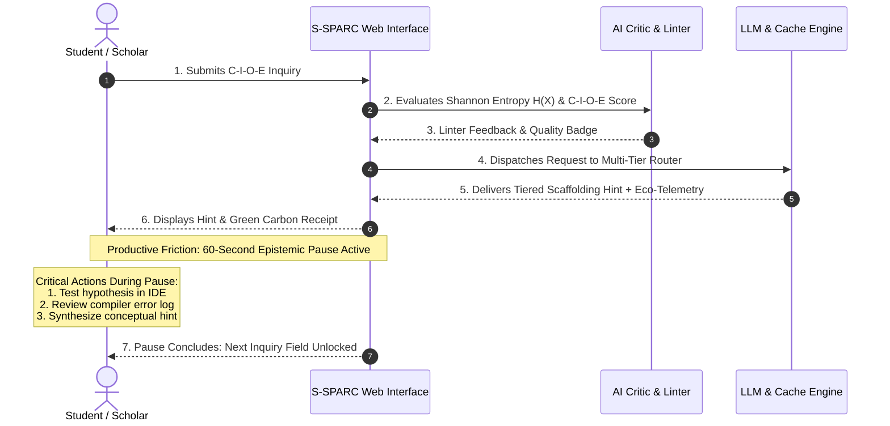
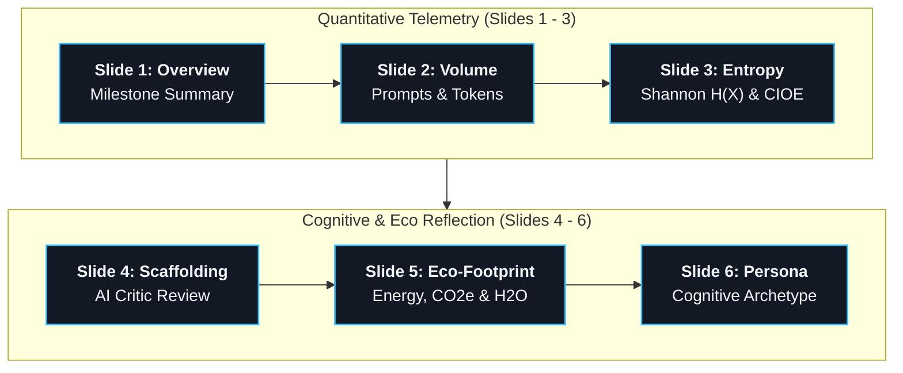
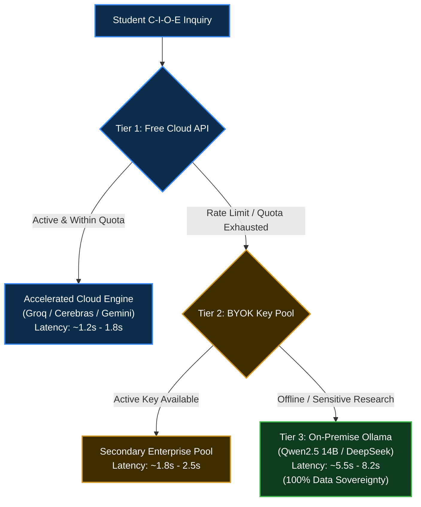
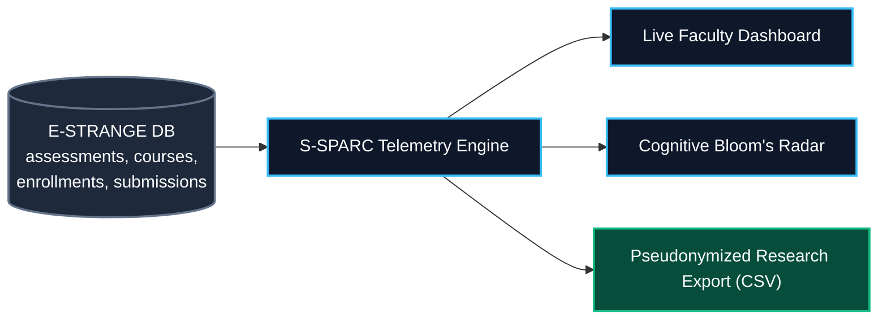
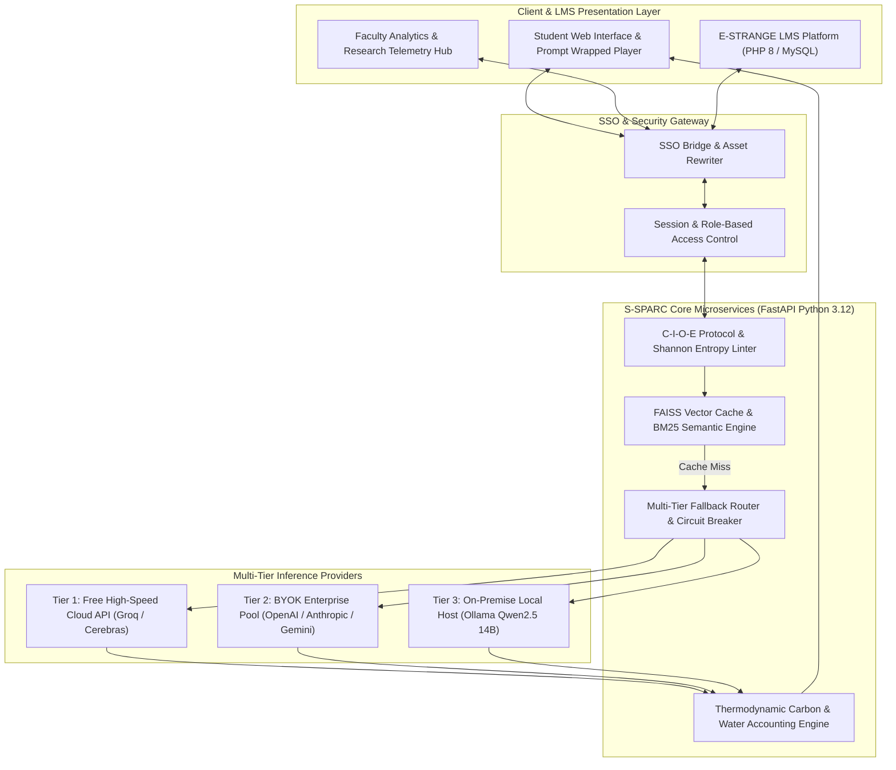

# S-SPARC AI™: Specific Smart Prompting Assistant for perfoRmanCe
## *An Academic Whitepaper on Metacognitive Scaffolding, Productive Friction, Multi-Tier Reliability, Prompt Wrapped Analytics, and Green Computing in Higher Education*

---

[](#)
[](#)
[](#)
[](#)
[](https://python.org)
[](https://fastapi.tiangolo.com)
[](#)
[](#)
[](https://raw.githack.com/06202003/s-sparc/main/docs/index.html)

---

> 🌐 **Live Interactive Documentation Web App**: [**Open S-SPARC Interactive Whitepaper Web App**](https://raw.githack.com/06202003/s-sparc/main/docs/index.html) *(Features interactive Mermaid diagrams with pan/zoom, real-time section filtering, KaTeX math typesetting, responsive sidebar navigation, and dynamic dark/light theme switching)*.

---

# EXECUTIVE SUMMARY

Generative artificial intelligence has introduced a critical dilemma into modern academic scholarship and higher education: **the speed of content generation has outpaced the depth of critical comprehension**. When scholars, educators, and students interact with conventional AI chatbots through rapid, unreflective queries (rapid-fire prompting), two major systemic crises emerge:

1. **Cognitive Atrophy and Epistemic Erosion**: Users become passive consumers of machine-generated text, gradually losing the core scholarly habits of problem framing, contextual critique, systematic decomposition, and grounded reasoning.
2. **Hidden Environmental & Infrastructure Footprint**: Every redundant query dispatched to cloud data centers consumes electrical energy, emits greenhouse gases, and evaporates freshwater for cooling. In institutional lab settings, unconstrained prompt spamming exhausts computational quotas and inflates operating budgets without improving learning outcomes.

**S-SPARC AI™ (Specific Smart Prompting Assistant for perfoRmanCe / Sustainable Smart Personal Assistant for Responsible Consumption)** is an educational framework and intelligent research companion designed to transform generative AI from a passive "answer dispenser" into a **metacognitive dialectical partner**. 

Developed by the **ITMCU Research Team at Maranatha Christian University** and recognized at the **UNU Global Youth AI Future Innovation Competition 2026 (UNU Macau)**, S-SPARC operates on a foundational constructivist premise: *a tutoring AI should make a learner work intentionally for the right reasons, not surrender full answers the moment an inquiry is submitted*.

By structuring inquiries through the **C-I-O-E Protocol**, enforcing intentional **Reflexive Pauses (Productive Friction)**, delivering **3-Tier Progressive Scaffolding**, retrieving verified institutional knowledge at **zero token cost (<45ms)**, analyzing cognitive trajectories via **Shannon Information Density ($H(X)$)**, celebrating reflective milestones via **S-SPARC Prompt Wrapped**, and quantifying the ecological footprint of every query in real time, S-SPARC preserves human intellectual agency while championing green academic computing.

---

# TABLE OF CONTENTS

1. [Philosophical and Constructivist Foundations: Restoring Human Agency](#1-philosophical-and-constructivist-foundations-restoring-human-agency)
2. [Master User Journey: From Prompt Submission to Critical Insight](#2-master-user-journey-from-prompt-submission-to-critical-insight)
3. [The C-I-O-E Inquiring Protocol and Bloom's Taxonomy Integration](#3-the-c-i-o-e-inquiring-protocol-and-blooms-taxonomy-integration)
4. [AI Critic Evaluation, Shannon Entropy H(X), and Socratic Scaffolding Engine](#4-ai-critic-evaluation-shannon-entropy-hx-and-socratic-scaffolding-engine)
5. [The Reflexive Pause and 3-Tier Progressive Scaffolding System](#5-the-reflexive-pause-and-3-tier-progressive-scaffolding-system)
6. [S-SPARC Prompt Wrapped: Longitudinal Metacognitive Storytelling](#6-s-sparc-prompt-wrapped-longitudinal-metacognitive-storytelling)
7. [Sustainable Semantic Memory: Zero-Cost and Zero-Emission Retrieval](#7-sustainable-semantic-memory-zero-cost-and-zero-emission-retrieval)
8. [Multi-Tier Availability, BYOK Engine, and Field Research Data Privacy](#8-multi-tier-availability-byok-engine-and-field-research-data-privacy)
9. [Green Computing and Real-Time Thermodynamic Accounting](#9-green-computing-and-real-time-thermodynamic-accounting)
10. [Faculty Analytics, Cohort Telemetry, and Research CSV Export](#10-faculty-analytics-cohort-telemetry-and-research-csv-export)
11. [Core Production Engineering Stack and System Architecture](#11-core-production-engineering-stack-and-system-architecture)
12. [Empirical Validation: Quasi-Experimental Academic Results (TRL 6)](#12-empirical-validation-quasi-experimental-academic-results-trl-6)
13. [UN Sustainable Development Goals (SDGs) and 12-Month Roadmap](#13-un-sustainable-development-goals-sdgs-and-12-month-roadmap)
14. [Methodological Verification Guide for Social Sciences and Higher Education](#14-methodological-verification-guide-for-social-sciences-and-higher-education)
15. [Research Consortium Attribution and Institutional Affiliation](#15-research-consortium-attribution-and-institutional-affiliation)
16. [Glossary, BibTeX Citation, and Frequently Asked Questions (FAQ)](#16-glossary-bibtex-citation-and-frequently-asked-questions-faq)

---

# 1. PHILOSOPHICAL AND CONSTRUCTIVIST FOUNDATIONS: RESTORING HUMAN AGENCY

In higher education, authentic mastery demands **active cognitive struggle** rather than passive text consumption. Conventional AI chatbots deliver complete, ready-made solutions immediately, creating an illusion of understanding (the "fluency illusion") while eroding independent analytical capability.

S-SPARC grounds its operational AI interaction models in proven educational and cognitive theories:

### Three Core Theoretical Pillars:
1. **Active Knowledge Construction (Piaget / Vygotsky)**: Learners construct internal mental schemas through active reflection and trial. S-SPARC demands reflection and problem decomposition before revealing explanations.
2. **Zone of Proximal Development (ZPD) (Vygotsky)**: S-SPARC targets the optimal cognitive band between unassisted capability and guided assistance, dynamically calibrating hints to the student's demonstrated level of understanding.
3. **Scaffolding and Gradual Release of Responsibility (Bruner / Wood et al.)**: High structural support is provided initially, systematically peeling back assistance as the student demonstrates conceptual competence.

> **Core Foundational Principle: Productive Friction**
> Withholding instant solutions is intentionally engineered to preserve active critical thinking over copy-pasting, transforming AI into a cognitive sounding board rather than a cognitive replacement.

| Dimension | Conventional AI Chatbot Model | S-SPARC Reflexive Pedagogical Model |
| :--- | :--- | :--- |
| **User Role** | Passive consumer of ready-made text | Active problem framer and critical interrogator |
| **Interaction Dynamic** | Unrestricted rapid-fire prompting loop | Structured C-I-O-E inquiry with 60s Reflexive Pause |
| **Scaffolding Depth** | Instant full solution dump | 3-Tier Progressive Hints (Concept $\to$ Blueprint $\to$ Solution) |
| **Information Quality** | Vague, single-line input accepted | Shannon Entropy $H(X)$ & C-I-O-E completeness check |
| **Reflection Mechanism** | None; immediate next prompt | Per-assessment **Prompt Wrapped** 6-slide story player |
| **Environmental Cost** | Invisible, unmeasured cloud footprint | Real-time transparent energy, carbon, and water telemetry |
| **Educational Outcome** | Cognitive offloading and dependency | Independent analytical mastery and grounded reasoning |

---

# 2. MASTER USER JOURNEY: FROM PROMPT SUBMISSION TO CRITICAL INSIGHT

S-SPARC streamlines the dialectical learning process into **5 clear, linear steps**:

```mermaid
flowchart LR
    classDef step1 fill:#0d2d4c,stroke:#388bfd,stroke-width:2px,color:#ffffff;
    classDef step2 fill:#3d2c00,stroke:#d29922,stroke-width:2px,color:#ffffff;
    classDef step3 fill:#0e3a1e,stroke:#3fb950,stroke-width:2px,color:#ffffff;
    classDef step4 fill:#431e03,stroke:#f0883e,stroke-width:2px,color:#ffffff;
    classDef step5 fill:#063a36,stroke:#39c5bb,stroke-width:2px,color:#ffffff;

    S1["<b>STEP 1: Formulate Inquiry</b><br/>User fills 4 guided fields<br/>(Context, Input, Output, Error)"]:::step1
    S2["<b>STEP 2: Smart Quality Check</b><br/>Entropy & C-I-O-E Linter<br/>delivers instant feedback"]:::step2
    S3["<b>STEP 3: Dialectical Answer</b><br/>Delivers progressive hint<br/>+ Green carbon receipt"]:::step3
    S4["<b>STEP 4: 60s Reflexive Pause</b><br/>Screen pauses so student<br/>cross-checks & tests code"]:::step4
    S5["<b>STEP 5: Prompt Wrapped</b><br/>Post-assessment reflection<br/>on cognitive growth"]:::step5

    S1 --> S2 --> S3 --> S4 --> S5
```



### Step-by-Step Experience Walkthrough:

1. **Step 1: Structured Formulation (C-I-O-E Protocol)**
   - Instead of typing an ambiguous prompt, the student fills four guided fields: *Context*, *Input Data*, *Expected Output*, and *Observed Error Trace*.
   - *Result:* Inquiries become well-bounded, specific, and academically rigorous.

2. **Step 2: Instant Cognitive Quality Review**
   - S-SPARC calculates Shannon Entropy $H(X)$ and evaluates C-I-O-E completeness. If the inquiry is too sparse or vague, the assistant delivers immediate refinement suggestions.
   - *Result:* Students learn to formulate precise engineering and scientific questions.

3. **Step 3: Dialectical Response & Green Eco-Receipt**
   - S-SPARC serves a targeted pedagogical hint (Tier 1 Concept or Tier 2 Blueprint) alongside verified institutional knowledge.
   - Accompanying the response is a live **Green Eco-Receipt** displaying electrical energy ($\text{Wh}$), carbon emission ($\text{g CO}_2\text{e}$), and cooling water ($\text{mL}$) consumed.
   - *Result:* High-yield learning with zero hallucination while building sustainability awareness.

4. **Step 4: 60-Second Reflexive Breathing Room**
   - The submission field is locked for 60 seconds following response delivery.
   - *Why:* Prevents mindless spamming, forcing the student to review the hint, test local code, and reflect before asking again.

5. **Step 5: Longitudinal Reflection via Prompt Wrapped**
   - Upon completing an assessment, students unlock an interactive **Prompt Wrapped** story player reviewing their iteration volume, information density, scaffolding progression, environmental efficiency, and cognitive persona archetype.

---

# 3. THE C-I-O-E INQUIRING PROTOCOL AND BLOOM'S TAXONOMY INTEGRATION

S-SPARC replaces unstructured prompting with the **C-I-O-E Protocol**, directly mapped to **Bloom's Revised Taxonomy**:

| Component | Pedagogical Scope | Practical Expectation & Operational Definition |
| :--- | :--- | :--- |
| **[C] Context** | Course Setting & Problem Background | Course module, problem domain, programming environment, or theoretical premise |
| **[I] Input** | Input Parameters & Problem Data | Concrete test cases, variable definitions, dataset excerpts, or code snippet under test |
| **[O] Output** | Expected Target Result | Desired return value, target algorithm behavior, or required analytical format |
| **[E] Error Trace** | Observed Bug, Exception, or Impasse | Exact compiler traceback, runtime exception, logical discrepancy, or reasoning barrier |

### Operational Modes Aligned with Bloom's Taxonomy:
* **C1 / C2: Remember & Understand (Conceptual Validation Mode)**: Delivers analogies, conceptual boundaries, and high-level mapping without direct code or final answers.
* **C3 / C4: Apply & Analyze (Targeted Analytical Mode)**: Delivers step-by-step blueprints, minimal delta hints, and edge case interrogations to guide student-led debugging.
* **C5 / C6: Evaluate & Create (Socratic Scaffolding Mode)**: Interrogates student architecture choices, evaluates computational complexity ($O(N)$), and stimulates innovative synthesis.

---

# 4. AI CRITIC EVALUATION, SHANNON ENTROPY H(X), AND SOCRATIC SCAFFOLDING ENGINE

To provide rigorous, objective feedback on student inquiry quality, S-SPARC integrates an **Information-Theoretic AI Critic Engine**:

### 1. Shannon Information Density Formulation
The Shannon Entropy $H(X)$ measures the lexical diversity, uncertainty, and information content embedded within the student's inquiry:

$$H(X) = -\sum_{i=1}^{n} P(x_i) \log_2 P(x_i)$$

Where $P(x_i)$ represents the empirical probability frequency of word token $x_i$ within the inquiry string. To standardize across prompt lengths, S-SPARC computes **Normalized Entropy** $H_{\text{norm}}$:

$$H_{\text{norm}} = \frac{H(X)}{\log_2 |V|}$$

Where $|V|$ represents the unique vocabulary size of the inquiry. 
* **$H_{\text{norm}} \ge 0.70$ (High Information Density)**: Demonstrates rich technical vocabulary, explicit variables, and structured problem framing.
* **$0.45 \le H_{\text{norm}} < 0.70$ (Moderate Density)**: Acceptable baseline; guided hints encourage adding specific error traces.
* **$H_{\text{norm}} < 0.45$ (Low Density / Spam)**: Triggers an automated prompt refinement suggestion before cloud execution.

### 2. C-I-O-E Protocol Completeness Index
The total C-I-O-E score $S_{\text{CIOE}} \in [0, 100\%]$ is computed as a weighted composite:

$$S_{\text{CIOE}} = 0.25 \cdot S_C + 0.25 \cdot S_I + 0.25 \cdot S_O + 0.25 \cdot S_E$$

Each dimension is scored $[0 - 100\%]$ based on semantic presence, parameter clarity, and technical specificity.

### 3. Automated Socratic Scaffolding & Prompt Rewriting
When an inquiry scores below institutional thresholds, the AI Critic generates a **Socratic Scaffolding Recommendation** and a **Suggested Prompt Rewrite**, illustrating how the student can transform a lazy question into an academically rigorous inquiry.

---

# 5. THE REFLEXIVE PAUSE AND 3-TIER PROGRESSIVE SCAFFOLDING SYSTEM

To prevent students from skipping cognitive struggle, S-SPARC enforces a **3-Tier Progressive Scaffolding Model**:

| Attempt Stage | Pedagogical Hint Level | System Action and Behavioral Expectation |
| :--- | :--- | :--- |
| **1st Attempt** | **Tier 1: Clue on the Concept** | Explains the underlying theoretical principle or common misconception. Contains zero code and zero direct answers. |
| **2nd Attempt** | **Tier 2: Clue on the Blueprint** | Provides an algorithmic sequence, pseudocode outline, or structural blueprint if the student remains stuck. |
| **3rd Attempt** | **Tier 3: Full Detailed Solution** | Reveals the complete solution, code correction, and deep architectural debrief only after two verified independent attempts. |



---

# 6. S-SPARC PROMPT WRAPPED: LONGITUDINAL METACOGNITIVE STORYTELLING

Inspired by modern data-storytelling interfaces, **S-SPARC Prompt Wrapped** is an interactive, 6-slide story player delivered to students upon assessment completion or end-of-term review:



### Prompt Wrapped Slide Breakdown:
1. **Slide 1: Journey Milestone**: Congratulates the student on completing the assessment and outlines their longitudinal learning journey.
2. **Slide 2: Prompting Volume & Iteration Depth**: Visualizes total inquiries, token consumption, and average iteration depth per problem.
3. **Slide 3: Shannon Information Density**: Displays the student's normalized Shannon Entropy ($H_{\text{norm}}$) alongside their average C-I-O-E protocol score.
4. **Slide 4: AI Critic & Scaffolding Breakdown**: Visualizes performance across Context, Input, Output, and Error Trace dimensions, highlighting areas of highest cognitive growth.
5. **Slide 5: Thermodynamic Eco-Telemetry**: Shows exact watt-hours consumed, carbon emitted, water evaporated, and total energy saved via semantic cache hits.
6. **Slide 6: Cognitive Persona Archetype & Badges**: Classifies the student into an empirically grounded cognitive persona archetype:
   - **Algorithmic Architect**: Exceptionally high Shannon entropy, rigorous input/output specs, and structured algorithmic blueprints.
   - **Empirical Investigator**: Deep focus on runtime error traces, iterative delta testing, and experimental validation.
   - **Analytical Refiner**: Methodical step-by-step query refinement with steady progression from Tier 1 to Tier 2 hints.
   - **Methodical Explorer**: Broad conceptual exploration across diverse course modules with balanced C-I-O-E scores.
   - **Deep Thinker**: Low prompt volume but exceptionally high token density per query, reflecting extensive independent reflection before asking.

---

# 7. SUSTAINABLE SEMANTIC MEMORY: ZERO-COST AND ZERO-EMISSION RETRIEVAL

In university courses, students frequently encounter common algorithmic bottlenecks and theoretical edge cases. S-SPARC features a **FAISS Vector Semantic Cache** combined with BM25 Lexical Matching using **Reciprocal Rank Fusion (RRF)**:

| Interaction Type | Empirical Processing Time | Token Cost | Carbon & Energy Footprint | Pedagogical Value |
| :--- | :--- | :--- | :--- | :--- |
| **Semantic Cache Hit (FAISS + BM25)** | **< 45 ms (0.045s)** | **0 Tokens ($0.00)** | **0.00 Wh / 0.00 g $CO_2e$** | Instant canonical answers verified by course instructors. |
| **Tier 1 & Tier 2 Cloud LLM** | **~ 1.2s - 1.8s** | Active Tokens | Measured ($0.14\text{ Wh / query}$) | Dynamic dialectic for novel, unmapped inquiries. |
| **Tier 3 On-Premise Local LLM** | **~ 5.5s - 8.2s** | Local Compute ($0.00) | Local hardware power | 100% offline data sovereignty for private research. |

### Five Rigorous Pre-Verification Checks for Institutional Answers:
1. **Accuracy**: Complete technical and syntactic correctness.
2. **Logical Coherence**: Step-by-step reasoning verified by instructors.
3. **Curricular Alignment**: Strict conformance to the course syllabus and learning objectives.
4. **Readability & Clarity**: Clean, structured formatting with pedagogical explanations.
5. **Scaffolding Integrity**: Strict adherence to hint tiering (no answer leaks in Tier 1 or Tier 2).

---

# 8. MULTI-TIER AVAILABILITY, BYOK ENGINE, AND FIELD RESEARCH DATA PRIVACY

To guarantee high availability across variable network conditions and institutional budget constraints, S-SPARC employs an automated **3-Tier Reliability Router**:



### Bring-Your-Own-Key (BYOK) & Privacy Architecture:
* **Faculty & Student BYOK**: Instructors or advanced research groups can provide dedicated API keys for specialized models while preserving cohort analytics.
* **100% Offline Local Mode**: For confidential qualitative research, human-subject interviews, or air-gapped lab computers, Tier 3 routes all prompts to a local Ollama instance on university hardware, guaranteeing zero data leakage to public clouds.

---

# 9. GREEN COMPUTING AND REAL-TIME THERMODYNAMIC ACCOUNTING

Every prompt processed by S-SPARC computes real-time environmental metrics based on physical data center thermodynamics:

### Mathematical Formulations:
1. **Electrical Energy Consumed ($E_{\text{inference}}$)**:
   $$E_{\text{inference}} = N_{\text{tokens}} \times \kappa \times \text{PUE}$$
   Where $\kappa = 0.00035\text{ Wh/token}$ is the baseline inference energy coefficient, and $\text{PUE} = 1.12$ is the data center Power Usage Effectiveness.

2. **Greenhouse Gas Emissions ($C_{\text{emissions}}$)**:
   $$C_{\text{emissions}} = E_{\text{inference}} \times \text{GEF}$$
   Where $\text{GEF} = 0.475\text{ g CO}_2\text{e/Wh}$ represents the regional electrical grid carbon intensity factor (Indonesian National Grid calibration).

3. **Freshwater Cooling Consumption ($W_{\text{consumption}}$)**:
   $$W_{\text{consumption}} = E_{\text{inference}} \times \text{WUE}$$
   Where $\text{WUE} = 4.65\text{ mL/Wh}$ represents the Water Usage Effectiveness of data center cooling towers.

| Metric Dimension | Typical Per-Query Telemetry | Calibration Benchmark |
| :--- | :--- | :--- |
| **Electrical Energy** | **$0.1428\text{ Wh } (0.000143\text{ kWh})$** | $0.35\text{ Wh per 1,000 tokens} \times 1.12\text{ PUE}$ |
| **Carbon Footprint** | **$0.0678\text{ g } CO_2e$** | $0.475\text{ g } CO_2e\text{/Wh}$ (Indonesian Grid standard) |
| **Cooling Water Used** | **$0.664\text{ mL}$** | Combined direct evaporative and upstream cooling ($4.65\text{ L/kWh}$) |
| **Tree Absorption Equivalent** | **$0.0000031\text{ tree-years}$** | Benchmarked against mature tropical tree ($21.77\text{ kg } CO_2/\text{year}$) |

---

# 10. FACULTY ANALYTICS, COHORT TELEMETRY, AND RESEARCH CSV EXPORT

S-SPARC is integrated directly with the institutional LMS database (**E-STRANGE MySQL Platform**), giving instructors comprehensive insight into student cognitive behavior without manual intervention:



### Faculty Dashboard Features:
1. **Live Cohort Overview**: Real-time monitoring of prompt counts, average Shannon entropy, token usage, and hint tier distribution across all enrolled students.
2. **Struggle vs. Mastery Detection**: Automatically flags students stuck in high iteration loops without improvement, enabling timely pedagogical intervention by teaching assistants.
3. **Bloom's Cognitive Distribution**: Aggregates cohort prompts across Bloom's taxonomic levels to verify whether assessments elicit higher-order thinking (Analyze/Evaluate) or lower-order retrieval (Remember/Understand).
4. **Research-Grade CSV Export**: Generates comprehensive, pseudonymized CSV datasets containing student token counts, entropy metrics, C-I-O-E completeness, hint tiers, and environmental footprints for academic research and institutional reporting.

---

# 11. CORE PRODUCTION ENGINEERING STACK AND SYSTEM ARCHITECTURE



---

# 12. EMPIRICAL VALIDATION: QUASI-EXPERIMENTAL ACADEMIC RESULTS (TRL 6)

S-SPARC underwent a comprehensive **quasi-experimental evaluation** in live undergraduate courses across 7 laboratory sessions at **Maranatha Christian University**, comparing a Control Group (Batch 2024/2025, $N = 52$) with an Intervention Group using S-SPARC (Batch 2025/2026, $N = 68$).

### Academic Performance Comparison Table:

| Academic Assessment Metric | Control Group Mean ($N=52$) | S-SPARC Intervention Mean ($N=68$) | Relative Improvement (%) | Statistical Significance ($p$-value) | Standardized Effect Size (Cohen's $d$) |
| :--- | :--- | :--- | :--- | :--- | :--- |
| **Midterm Examination** | **57.6** | **77.0** | **+33.7%** | **$p < .001$** | **$d = 1.54$ (Transformative)** |
| **Final Examination** | **67.5** | **76.1** | **+12.8%** | **$p < .001$** | **$d = 0.71$ (Moderate-Large)** |
| **Final Course Overall Grade** | **68.9** | **78.5** | **+14.0%** | **$p < .001$** | **$d = 0.81$ (Sustained Growth)** |
| **Daily Homework & Assignments**| **73.0** | **80.4** | **+10.2%** | **$p = .004$** | **$d = 0.56$ (Steady Habits)** |
| **Group Projects (Control Baseline)**| **74.6** | **76.1** | **+2.1%** | **$p = .519$ (ns)** | **$d = 0.12$ (Baseline Stable)** |

### Key Empirical Takeaways:
1. **Breakthrough in Individual Examination ($d = 1.54$)**: Midterm exam scores rose by nearly 20 points, demonstrating that S-SPARC builds authentic, independent problem-solving skills rather than rote copying.
2. **Specific Empowerment of Individual Reasoning**: Group project scores showed no statistically significant shift ($p = .519$), proving that the intervention directly targets and strengthens individual cognitive processing.
3. **~84% Token & Infrastructure Reduction**: Across all 7 lab sessions, ~84% of modeled inference-token demand was answered via semantic memory retrieval at $0.00 API cost.
4. **Debugging Turn Reduction ($7.4 \to 1.8$ turns)**: Average debugging iterations per problem dropped by 75.7%, as students formulated concise inquiries on their first try.
5. **Student Perception Survey**: Scored **4.07 / 5.00** across 27 Likert items ($N = 67$), confirming high satisfaction with structured prompting, reflective pauses, and green awareness.

---

# 13. UN SUSTAINABLE DEVELOPMENT GOALS (SDGS) AND 12-MONTH ROADMAP

### UN SDGs Alignment:
* **SDG 4 (Quality Education)**: Democratizes 1-on-1 pedagogical scaffolding and Bloom's taxonomy in TA-scarce environments.
* **SDG 9 & 10 (Innovation & Reduced Inequalities)**: Local semantic cache and offline local LLMs allow students in resource-constrained environments to learn without expensive API subscriptions.
* **SDG 12 & 13 (Responsible Consumption & Climate Action)**: Real-time carbon, energy, and water tracking fostering sustainable computing habits.
* **SDG 17 (Partnerships for the Goals)**: Vendor-neutral LMS integration (LTI 1.3) enabling cross-university knowledge sharing.

### 12-Month Implementation Roadmap:
* **Phase 1 (Months 0 to 3) - Foundation & Interoperability**: Deploy LTI 1.3 connector for Canvas and Moodle; roll out S-SPARC to additional engineering and computer science courses at Maranatha.
* **Phase 2 (Months 3 to 6) - Multi-Campus Pilot**: Onboard 2 to 3 partner universities via the UNU Macau academic network; conduct cross-institutional empirical trials and introduce multilingual prompt linting.
* **Phase 3 (Months 6 to 12) - Global Scaling**: Release open-source LTI modules, establish institutional consortium pricing, and publish multi-campus longitudinal findings.

---

# 14. METHODOLOGICAL VERIFICATION GUIDE FOR SOCIAL SCIENCES AND HIGHER EDUCATION

| AI Output Type | Inherent Epistemological Risk | Methodological Action Required by the Scholar |
| :--- | :--- | :--- |
| **Theoretical Synthesis** | **Western / Positivist Bias**: LLMs default to mainstream Western conceptualizations. | Cross-examine against local ethnographies and indigenous epistemologies. |
| **Qualitative Code Suggestions** | **Loss of Nuance**: AI overlooks sarcasm, irony, cultural metaphors, and emotional pauses. | Always verify codes against verbatim audio and field observation journals. |
| **Bibliographic Suggestions** | **Hallucinated Citations**: AI may invent plausible-sounding citations and DOIs. | Mandatorily verify every citation on academic databases (Scopus, WoS, Google Scholar). |
| **Policy Implications** | **Technocratic Reductionism**: Assumes neat linear outcomes, ignoring political dynamics. | Contextualize recommendations within actual institutional and power relations. |

---

# 15. RESEARCH CONSORTIUM ATTRIBUTION AND INSTITUTIONAL AFFILIATION

The **S-SPARC AI™ Initiative** was conceptualized and developed by the **ITMCU Research Team** at **Maranatha Christian University**, dedicated to ethical artificial intelligence, constructivist pedagogy, and green computing in higher education.

### Research Team:
* **Yehezkiel David** (Lead Systems Architect & Principal Investigator, Master of Computer Science)
* **Oscar Karnalim, Ph.D.** (Faculty Advisor & Senior Research Fellow)
* **Johanes Mario** (Research Contributor, Bachelor of Informatics Engineering)
* **Archangella Sheilla** (Research Contributor, Bachelor of Informatics Engineering)
* **Dominic Xaviera** (Research Contributor, Bachelor of Informatics Engineering)
* **Joshua Christopher** (Research Contributor, Bachelor of Informatics Engineering)

### Academic Home & Institutional Affiliation:
* **Institution**: **Maranatha Christian University (Universitas Kristen Maranatha)**
* **Faculty**: Faculty of Information Technology / Smart Technology & Engineering, Bandung, Indonesia.
* **Key Research Themes**: Academic Integrity, Educational Computing, Cognitive Scaffolding, Green AI.

### International Honors & Competitions:
* **UNU Global Youth AI Future Innovation Competition 2026**: Organized by the United Nations University (UNU Macau) under the AI for Education Track (SDG 4).
* **AIREA Merit Award at HKEdu**: Recognized at the Hong Kong Education AI Research Forum for zero-cost semantic caching and metacognitive scaffolding.
* **Most Favorite Poster Award at Impact Edu**: Awarded for empirical carbon reduction and student academic performance breakthrough.

### Contact & Inquiries:
* **Inquiries**: `2479011@maranatha.ac.id`, `oscar.karnalim@maranatha.ac.id`

---

# 16. GLOSSARY, BIBTEX CITATION, AND FREQUENTLY ASKED QUESTIONS (FAQ)

### Methodological Glossary:

| System Term | Everyday Scholarly Meaning | Practical Function |
| :--- | :--- | :--- |
| **Reflexive Latency** | Jeda Reflektif (Epistemic Pause) | A 60s pause between prompts to digest answers and verify primary code/data. |
| **Semantic Cache** | Arsip Jejak Konsep (Memory Bank) | Reusable store of verified answers that return instantly at 0 cost (<45ms). |
| **C-I-O-E Protocol** | Formulasi Masalah Terstruktur | Systematic inquiry format ensuring Context, Input, Output, and Error are defined. |
| **Shannon Density** | Indeks Kepadatan Informasi | Metric measuring the richness and lexical specificity of the student's inquiry. |
| **Prompt Wrapped** | Kilas Balik Metakognitif | Spotify-style 6-slide story player reviewing cognitive growth per assessment. |
| **Carbon Intensity** | Jejak Ekologis Riset | Exact calculation of electricity and emissions consumed by inference compute. |

### Frequently Asked Questions (FAQ):

#### Q1: Will using S-SPARC compromise the originality of my thesis or code?
> **Answer**: No. S-SPARC is specifically engineered not to solve assignments or write papers on behalf of students. It functions as a metacognitive dialectical partner that challenges assumptions, points out conceptual bugs, and scaffolds reasoning. The student retains full authorship and intellectual ownership.

#### Q2: Why does S-SPARC enforce a 60-second pause between consecutive prompts?
> **Answer**: This is a deliberate pedagogical mechanism known as Productive Friction. The 60-second pause gives learners sufficient time to read the hint, test logic in their IDE, and reflect on underlying concepts, preventing mindless trial-and-error prompting loops.

#### Q3: Why is local offline processing (Tier 3) slower than cloud inference?
> **Answer**: Cloud inference utilizes accelerated multi-GPU clusters (e.g., Groq LPUs or Nvidia H100s) that respond in ~1.2s - 1.8s. In contrast, Tier 3 executes entirely on the local university server CPU/GPU (Ollama Qwen2.5 14B), which requires ~5.5s - 8.2s. While slower, Tier 3 provides 100% offline data sovereignty and guarantees that confidential qualitative or field data never leaves university infrastructure.

#### Q4: What is S-SPARC Prompt Wrapped and how is it generated?
> **Answer**: S-SPARC Prompt Wrapped is an interactive 6-slide data storytelling player generated automatically per assessment once the submission deadline passes. It aggregates prompt iterations, Shannon entropy, C-I-O-E dimensions, green telemetry, and cognitive persona classifications to encourage longitudinal self-reflection.

#### Q5: How should I cite S-SPARC in academic publications?
> **BibTeX Reference**:
> ```bibtex
> @article{setiawan2026ssparc,
>   title={S-SPARC: Specific Smart Prompting Assistant for perfoRmanCe and Metacognitive Scaffolding in Higher Education},
>   author={Setiawan, Yehezkiel David and Karnalim, Oscar and Mario, Johanes and Sheilla, Archangella and Xaviera, Dominic and Christopher, Joshua},
>   journal={AIREA Academic Whitepaper Series / UNU Global Youth AI},
>   volume={3},
>   number={5},
>   pages={1--32},
>   year={2026},
>   publisher={Maranatha Christian University and S-SPARC Research Consortium}
> }
> ```

---

```
=============================================================================================
  "True technological empowerment does not replace the human intellect; it scaffolds human 
   critical reasoning to achieve sustainable, responsible, and autonomous mastery."
=============================================================================================
```
