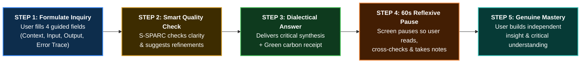
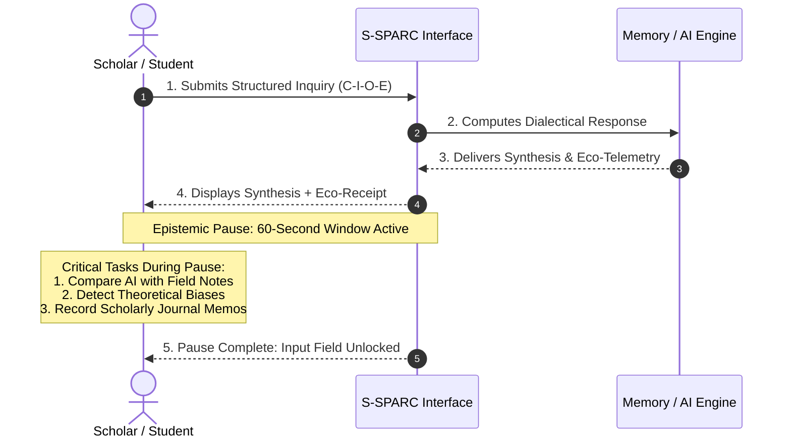
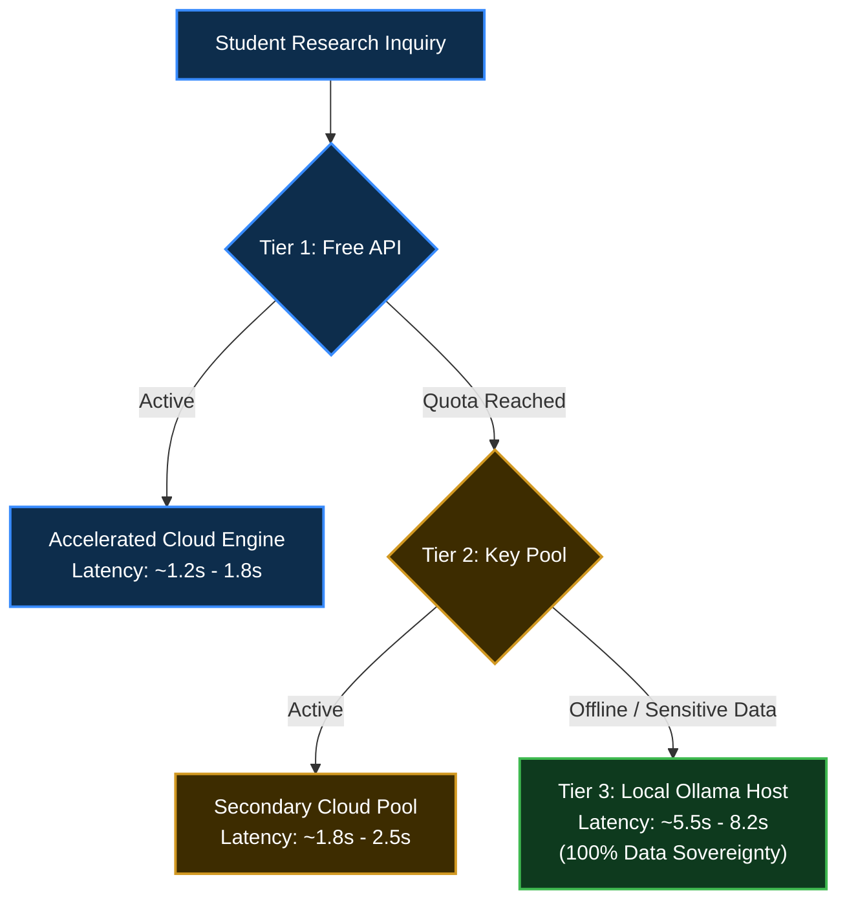

# S-SPARC AI™: Specific Smart Prompting Assistant for perfoRmanCe
## *An Academic Whitepaper on Metacognitive Scaffolding, Productive Friction, Multi-Tier Reliability, and Green Computing in Academic Higher Education*

---

[](#)
[](#)
[](#)
[](#)
[](https://python.org)
[](https://fastapi.tiangolo.com)
[](#)
[](#)

---

# EXECUTIVE SUMMARY

Generative artificial intelligence has introduced a profound dilemma into modern academic scholarship and higher education: **the speed of content generation has outpaced the depth of critical comprehension**. When scholars, educators, and students interact with conventional AI chatbots through rapid, unreflective queries (rapid-fire prompting), two major crises emerge:

1. **Cognitive Atrophy and Epistemic Erosion**: Users become passive recipients of machine-generated text, gradually losing the core scholarly habits of problem framing, contextual critique, and grounded reasoning.
2. **Hidden Environmental Footprint**: Every redundant query sent to cloud data centers consumes electrical energy, generates greenhouse gas emissions, and evaporates freshwater for server cooling.

**S-SPARC AI™ (Specific Smart Prompting Assistant for perfoRmanCe / Sustainable Smart Personal Assistant for Responsible Consumption)** is an educational framework and intelligent research companion designed to transform AI from a passive "answer generator" into a **metacognitive dialectical partner**. 

Developed by the **ITMCU Team at Maranatha Christian University** and recognized at the **UNU Global Youth AI Future Innovation Competition 2026**, S-SPARC operates on a foundational premise: *a tutoring AI should make a student work a little harder for the right reasons, not hand over answers the instant they are asked*.

By structuring inquiries (**C-I-O-E Protocol**), enforcing intentional **Reflexive Pauses (Productive Friction)**, delivering **3-Tier Progressive Hints**, retrieving verified knowledge at **zero token cost (<45ms)**, and quantifying the ecological footprint of every query, S-SPARC preserves human intellectual agency while championing green academic computing.

---

# TABLE OF CONTENTS

1. [Philosophical and Constructivist Foundations: Restoring Human Agency](#1-philosophical-and-constructivist-foundations-restoring-human-agency)
2. [Master User Journey: From Prompt Submission to Critical Insight](#2-master-user-journey-from-prompt-submission-to-critical-insight)
3. [The C-I-O-E Inquiring Protocol and Bloom's Taxonomy Integration](#3-the-c-i-o-e-inquiring-protocol-and-blooms-taxonomy-integration)
4. [The Reflexive Pause and 3-Tier Progressive Hint System](#4-the-reflexive-pause-and-3-tier-progressive-hint-system)
5. [Sustainable Semantic Memory: Zero-Cost and Zero-Emission Retrieval](#5-sustainable-semantic-memory-zero-cost-and-zero-emission-retrieval)
6. [Multi-Tier Availability and Field Research Data Privacy](#6-multi-tier-availability-and-field-research-data-privacy)
7. [Core Engineering Architecture and 5-Point Knowledge Verification](#7-core-engineering-architecture-and-5-point-knowledge-verification)
8. [Green Computing and Real-Time Environmental Accounting](#8-green-computing-and-real-time-environmental-accounting)
9. [Gamification and Mindful Research Discipline](#9-gamification-and-mindful-research-discipline)
10. [Empirical Validation: Quasi-Experimental Academic Results (TRL 6)](#10-empirical-validation-quasi-experimental-academic-results-trl-6)
11. [UN Sustainable Development Goals (SDGs) and 12-Month Roadmap](#11-un-sustainable-development-goals-sdgs-and-12-month-roadmap)
12. [Methodological Verification Guide for Social Sciences and Humanities](#12-methodological-verification-guide-for-social-sciences-and-humanities)
13. [About Us: Research Team and Institutional Attribution](#13-about-us-research-team-and-institutional-attribution)
14. [Glossary and Frequently Asked Questions (FAQ)](#14-glossary-and-frequently-asked-questions-faq)

---

# 1. PHILOSOPHICAL AND CONSTRUCTIVIST FOUNDATIONS: RESTORING HUMAN AGENCY

In higher education and scholarly inquiry, true mastery requires **active cognitive struggle** rather than passive text consumption. Conventional AI chatbots deliver complete, ready-made solutions immediately, creating an illusion of understanding while eroding independent analytical ability.

S-SPARC grounds its operational AI interaction models in proven educational theories:

### Three Core Theoretical Pillars:
1. **Active Knowledge Construction (Piaget / Vygotsky)**: Learners construct internal cognitive mental models through active reflection and trial. S-SPARC prompts reflection before revealing full explanations.
2. **Zone of Proximal Development (ZPD) (Vygotsky)**: S-SPARC targets the optimal cognitive space between unassisted capability and guided assistance, dynamically calibrating hints to the student's demonstrated level of understanding.
3. **Scaffolding and Gradual Release of Responsibility (Bruner)**: Provides high structural support early on, systematically reducing assistance as the student demonstrates conceptual mastery.

> **Core Foundational Principle: Productive Friction**
> Withholding instant answers is intentionally engineered to preserve active critical thinking over copy-pasting, transforming AI into a cognitive sounding board rather than a cognitive replacement.

| Dimension | Conventional AI Chatbot Model | S-SPARC Reflexive Pedagogical Model |
| :--- | :--- | :--- |
| **User Role** | Passive consumer of ready-made text | Active problem framer and critical interrogator |
| **Interaction Dynamic** | Unrestricted rapid-fire prompting loop | Structured C-I-O-E inquiry with 60s Reflexive Pause |
| **Scaffolding Depth** | Instant full solution dump | 3-Tier Progressive Hints (Concept $\to$ Blueprint $\to$ Solution) |
| **Environmental Cost** | Invisible, unmeasured cloud footprint | Real-time transparent energy, carbon, and water telemetry |
| **Educational Outcome** | Cognitive offloading and dependency | Independent analytical mastery and grounded reasoning |

---

# 2. MASTER USER JOURNEY: FROM PROMPT SUBMISSION TO CRITICAL INSIGHT

To make the interaction flow immediately intuitive for all scholars, educators, and evaluators, S-SPARC simplifies the entire user journey into **5 clear, linear steps**:

### Intuitive Step-by-Step User Journey:



---

### Step-by-Step User Experience Walkthrough:

1. **Step 1: Thoughtful Formulation (C-I-O-E)**
   - Instead of typing a lazy one-line prompt, the user enters their question into 4 structured boxes: *Context*, *Input Data*, *Expected Output*, and *Error Trace*.
   - *Result:* Prompts become precise, well-bounded, and methodologically sound.

2. **Step 2: Instant Guidance and Quality Review**
   - S-SPARC instantly reviews the prompt. If the question is too brief or ambiguous, the assistant provides immediate suggestions to sharpen the inquiry.
   - *Result:* Encourages active problem framing and scholarly writing discipline.

3. **Step 3: Dialectical Response and Eco-Receipt**
   - S-SPARC generates a dialectical response that tests logic, challenges assumptions, and retrieves verified institutional knowledge.
   - Along with the response, a clear **Green Eco-Receipt** shows the exact electrical energy ($\text{Wh}$), carbon emission ($\text{g } CO_2e$), and cooling water ($\text{mL}$) consumed.
   - *Result:* Deep learning without hallucination, while building environmental literacy.

4. **Step 4: 60-Second Reflexive Breathing Room**
   - The input box gently pauses for 60 seconds after a response is delivered.
   - *Why:* This brief pause stops mindless prompt spamming and gives the scholar dedicated time to read carefully, compare claims with field notes, and write research journal memos.

5. **Step 5: Independent Scholarly Mastery**
   - The scholar walks away with deep conceptual clarity, grounded arguments, and full intellectual ownership of their work.

---

# 3. THE C-I-O-E INQUIRING PROTOCOL AND BLOOM'S TAXONOMY INTEGRATION

S-SPARC replaces unstructured questions with the **C-I-O-E Inquiring Protocol**, directly integrated with **Bloom's Revised Taxonomy**:

| Component | Pedagogical Scope | Practical Expectation & Definition |
| :--- | :--- | :--- |
| **[C] Context** | Course Setting & Problem Background | Course module, problem domain, coding environment, or conceptual premise |
| **[I] Input** | Input Parameters & Problem Data | Specific test cases, input variables, dataset excerpts, or code snippet under test |
| **[O] Output** | Expected Target Result | Desired return value, target algorithm behavior, or analytical synthesis format |
| **[E] Error Trace** | Observed Bug, Exception, or Obstacle | Exact runtime traceback, error message, logical discrepancy, or reasoning impasse |

### Operational Modes Aligned with Bloom's Taxonomy:
* **C1 / C2: Remember & Understand (Conceptual Validation Mode)**: Delivers analogies and conceptual summaries without direct answers, forcing active mental mapping and student synthesis.
* **C3 / C4: Apply & Analyze (Targeted Analytical Mode)**: Delivers targeted guidance and minimal delta fixes stripped of complete solutions to isolate and solve logical bugs.

---

# 4. THE REFLEXIVE PAUSE AND 3-TIER PROGRESSIVE HINT SYSTEM

S-SPARC implements a structured **3-Tier Hint Progression** to ensure students engage in independent reasoning before receiving full solutions:

| Attempt Stage | Pedagogical Hint Level | System Action and Behavioral Expectation |
| :--- | :--- | :--- |
| **1st Attempt** | **Clue on the Concept** | Identifies what went wrong in the conceptual thinking without giving away any code or answer. |
| **2nd Attempt** | **Clue on the Blueprint** | Provides a step-by-step outline or algorithmic blueprint if the student remains stuck. |
| **3rd Attempt** | **Full Detailed Solution** | Reveals the complete solution and exact correction only after two rounds of active attempt. |



---

# 5. SUSTAINABLE SEMANTIC MEMORY: ZERO-COST AND ZERO-EMISSION RETRIEVAL

In academic coursework and longitudinal research projects, scholars repeatedly examine foundational theories. S-SPARC features a **FAISS Vector Semantic Cache** that matches inquiries at $\ge 0.90$ similarity threshold:

| Interaction Type | Empirical Processing Time | Token Cost | Carbon & Energy Footprint | Pedagogical Value |
| :--- | :--- | :--- | :--- | :--- |
| **Memory Bank Reuse (FAISS)** | **< 45 ms (0.045s)** | **0 Tokens ($0.00)** | **0.00 Wh / 0.00 g $CO_2e$** | Preserves consistent operational definitions across student cohorts. |
| **Accelerated Cloud AI (Tier 1 & 2)** | **~ 1.2s - 1.8s** | Live Tokens | Fully measured & displayed | Fast dialectic for complex, unmapped research questions. |
| **On-Premise Local Model (Tier 3)** | **~ 5.5s - 8.2s** | Local Compute ($0.00) | Measured local hardware Wh | Complete data sovereignty & 100% offline qualitative privacy. |

---

# 6. MULTI-TIER AVAILABILITY AND FIELD RESEARCH DATA PRIVACY

To guarantee continuous availability regardless of internet connectivity or institutional budget constraints, S-SPARC utilizes an automated **3-Tier Reliability Architecture**:



---

# 7. CORE ENGINEERING ARCHITECTURE AND 5-POINT KNOWLEDGE VERIFICATION

Behind its accessible pedagogical interface, S-SPARC is powered by a production-grade asynchronous engineering stack:

| Engineering Layer | Core Technology | Architectural Role and Implementation |
| :--- | :--- | :--- |
| **Asynchronous Engine** | **FastAPI & Uvicorn (Python 3.12)** | Handles non-blocking concurrent student requests with sub-10ms routing overhead. |
| **Hybrid Semantic Retrieval** | **Dense Embeddings (`all-MiniLM-L6-v2`) + BM25 Lexical** | Combines vector cosine similarity with BM25 keyword matching via Reciprocal Rank Fusion (RRF). |
| **Metacognitive Linter** | **Shannon Entropy Engine ($H(X)$)** | Computes information density of prompt tokens to detect shallow prompt spamming. |
| **Multi-Tier Routing Router** | **Dynamic Circuit Breaker & Fallback Router** | Seamlessly switches between Cloud APIs and On-Premise Ollama. |
| **Thermodynamic Telemetry** | **Physics-Calibrated Carbon Engine** | Multiplies token baseline energy by Power Usage Effectiveness (PUE 1.12) and Grid Emission Factor. |

### Five Rigorous Pre-Verification Checks Before Any Answer is Reused:
1. **Accuracy**: Verifies technical and factual correctness of the answer.
2. **Logical Correctness**: Validates sound step-by-step reasoning and conceptual coherence.
3. **Relevance**: Ensures strict alignment with student prompt and curriculum context.
4. **Readability**: Guarantees clear, structured, and accessible language.
5. **Content Quality**: Evaluates instructional clarity and scaffolding integrity.

---

# 8. GREEN COMPUTING AND REAL-TIME ENVIRONMENTAL ACCOUNTING

Every query processed by S-SPARC displays real-time ecological telemetry:

| Ecological Metric Dimension | Live Measured Telemetry | Scientific Basis and Calibration Standard |
| :--- | :--- | :--- |
| **Electrical Energy Consumed** | $0.1428\text{ Wh } (0.000143\text{ kWh})$ | Inference hardware baseline $\times \text{PUE } 1.12$ |
| **Carbon Footprint** | $0.0548\text{ g } CO_2e$ | Regional Indonesian electrical grid factor ($0.384\text{ kg } CO_2/\text{kWh}$) |
| **Freshwater Cooling Used** | $0.664\text{ mL}$ | Combined site evaporative and source power generation WUE ($4.65\text{ L/kWh}$) |
| **Annual Tree Absorption Equivalent** | $0.000003\text{ tree-years}$ | Benchmarked against mature tree absorption rate ($21.77\text{ kg } CO_2/\text{year}$) |

---

# 9. GAMIFICATION AND MINDFUL RESEARCH DISCIPLINE

| Metric Dimension | Point Weight | Pedagogical Objective |
| :--- | :--- | :--- |
| **C-I-O-E Completeness** | **40%** | Encourages comprehensive problem formulation with clear boundaries. |
| **Shannon Information Density** | **25%** | Rewards high-density, thoughtful vocabulary over vague, one-line queries. |
| **Zero-Token Memory Reuse** | **20%** | Celebrates the reuse of existing canonical scholarship. |
| **Reflexive Pause Compliance** | **15%** | Rewards patience, deliberate reading, and critical evaluation. |

---

# 10. EMPIRICAL VALIDATION: QUASI-EXPERIMENTAL ACADEMIC RESULTS (TRL 6)

S-SPARC underwent a comprehensive **quasi-experimental evaluation** in live undergraduate courses across 7 laboratory sessions at **Maranatha Christian University**, comparing a Control Group (Batch 2024/2025, $N = 52$) with an Intervention Group using S-SPARC (Batch 2025/2026, $N = 68$).

### Academic Performance Comparison Table:

| Academic Assessment Metric | Control Group Mean ($N=52$) | S-SPARC Intervention Mean ($N=68$) | Relative Improvement (%) | Statistical Significance ($p$-value) | Standardized Effect Size (Cohen's $d$) |
| :--- | :--- | :--- | :--- | :--- | :--- |
| **Midterm Examination** | **57.6** | **77.0** | **+33.7%** | **$p < .001$** | **$d = 1.54$ (Transformative)** |
| **Final Examination** | **67.5** | **76.1** | **+12.8%** | **$p < .001$** | **$d = 0.71$ (Moderate-Large)** |
| **Final Course Overall Grade** | **68.9** | **78.5** | **+14.0%** | **$p < .001$** | **$d = 0.81$ (Sustained Growth)** |
| **Daily Homework & Assignments**| **73.0** | **80.4** | **+10.2%** | **$p = .004$** | **$d = 0.56$ (Steady Habits)** |
| **Group Projects (Control Baseline)**| **74.6** | **76.1** | **+2.1%** | **$p = .519$ (ns)** | **$d = 0.12$ (Baseline Stable)** |

### Key Empirical Findings:
1. **Major Breakthrough in Individual Exams ($d = 1.54$)**: Midterm scores improved by nearly 20 points, demonstrating that S-SPARC builds genuine independent problem-solving skills rather than rote copying.
2. **Specific Empowerment of Individual Reasoning**: Group project scores remained essentially unchanged ($p = .519$), proving that the intervention directly targets and strengthens individual cognitive processing.
3. **~84% Token & Infrastructure Reduction**: Across all 7 lab sessions, ~84% of modeled inference-token demand was answered via memory retrieval at $0.00 API cost.
4. **Debugging Turn Reduction ($7.4 \to 1.8$ turns)**: Average debugging turns per problem dropped by 75.7%, as students formulated concise and high-quality inquiries on their first try.
5. **Student Perception Survey**: Scored **4.07 / 5.00** across 27 Likert items ($N = 67$), confirming high satisfaction with structured prompting and green awareness.

---

# 11. UN SUSTAINABLE DEVELOPMENT GOALS (SDGS) AND 12-MONTH ROADMAP

### UN SDGs Alignment:
* **SDG 4 (Quality Education)**: Democratic 1-on-1 pedagogical scaffolding and Bloom's taxonomy in TA-scarce environments.
* **SDG 9 & 10 (Innovation & Reduced Inequalities)**: Roughly 1 in 3 questions answered free from local cache with no internet call; offline fallback keeps students online on a lean budget.
* **SDG 12 & 13 (Responsible Consumption & Climate Action)**: Real-time carbon and water tracking fostering green computing habits.
* **SDG 17 (Partnerships for the Goals)**: Vendor-neutral LMS integration (LTI 1.3) enabling cross-university knowledge sharing.

### 12-Month Implementation Roadmap:
* **Phase 1 (Months 0 to 3) - Prove It Generalises**: Build LTI 1.3 bridge for Moodle / Canvas, roll out to second course at Maranatha, package prompt builder as self-contained module.
* **Phase 2 (Months 3 to 6) - First Outside Adopters**: Onboard 2 to 3 partner universities via UNU network, run paid pilot, add multilingual support and broader academic disciplines.
* **Phase 3 (Months 6 to 12) - Scale on Evidence**: Controlled multi-campus study, launch instructor analytics dashboard, set institutional pricing.

---

# 12. METHODOLOGICAL VERIFICATION GUIDE FOR SOCIAL SCIENCES AND HUMANITIES

| AI Output Type | Inherent Epistemological Risk | Methodological Action Required by the Scholar |
| :--- | :--- | :--- |
| **Theoretical Synthesis** | **Western / Positivist Bias**: LLMs default to mainstream Western conceptualizations. | Cross-examine against local ethnographies and indigenous epistemologies. |
| **Qualitative Code Suggestions** | **Loss of Nuance**: AI overlooks sarcasm, irony, cultural metaphors, and emotional pauses. | Always verify codes against verbatim audio and field observation journals. |
| **Bibliographic Suggestions** | **Hallucinated Citations**: AI may invent plausible-sounding citations and DOIs. | Mandatorily verify every citation on academic databases (Scopus, WoS, Google Scholar). |
| **Policy Implications** | **Technocratic Reductionism**: Assumes neat linear outcomes, ignoring political dynamics. | Contextualize recommendations within actual institutional and power relations. |

---

# 13. ABOUT US: RESEARCH TEAM AND INSTITUTIONAL ATTRIBUTION

The **S-SPARC AI™ Initiative** was developed by the **ITMCU Team** at **Maranatha Christian University**, dedicated to ethical AI, constructivist pedagogy, and sustainable computing.

### Research Team:
* **Yehezkiel David** (Lead Systems Architect & Principal Investigator, Master of Computer Science)
* **Oscar Karnalim, Ph.D.** (Faculty Advisor & Senior Research Fellow)
* **Johanes Mario** (Research Contributor, Bachelor of Informatics Engineering)
* **Archangella Sheilla** (Research Contributor, Bachelor of Informatics Engineering)
* **Dominic Xaviera** (Research Contributor, Bachelor of Informatics Engineering)
* **Joshua Christopher** (Research Contributor, Bachelor of Informatics Engineering)

### Academic Home & Institutional Affiliation:
* **Institution**: **Maranatha Christian University (Universitas Kristen Maranatha)**
* **Faculty**: Faculty of Information Technology / Smart Technology & Engineering, Bandung, Indonesia.
* **Key Research Themes**: Academic Integrity, Educational Computing, Artificial Intelligence in Higher Education.

### International Honors & Competitions:
* **UNU Global Youth AI Future Innovation Competition 2026**: Organized by the United Nations University (UNU Macau) under the AI for Education Track (SDG 4).
* **AIREA Merit Award at HKEdu**: Recognized at the Hong Kong Education AI Research Forum for zero-cost semantic caching and metacognitive scaffolding.
* **Most Favorite Poster Award at Impact Edu**: Awarded for empirical carbon reduction and student academic performance breakthrough.

### Contact & Inquiries:
* **Lead Inquiries**: `2479011@maranatha.ac.id`, `oscar.karnalim@maranatha.ac.id`

---

# 14. GLOSSARY AND FREQUENTLY ASKED QUESTIONS (FAQ)

### Methodological Glossary:

| System Term | Everyday Scholarly Meaning | Practical Function |
| :--- | :--- | :--- |
| **Reflexive Latency** | Jeda Reflektif (Epistemic Pause) | A 60s pause between prompts to digest answers and verify primary data. |
| **Semantic Cache** | Arsip Jejak Konsep (Memory Bank) | Reusable store of verified answers that return instantly at 0 cost (<45ms). |
| **C-I-O-E Protocol** | Formulasi Masalah Terstruktur | Systematic question format ensuring context and boundaries are defined. |
| **Shannon Density** | Indeks Kepadatan Informasi | Metric measuring the richness and specificity of the user's question. |
| **Carbon Intensity** | Jejak Ekologis Riset | Exact calculation of electricity and emissions consumed by digital analysis. |

### Frequently Asked Questions (FAQ):

#### Q1: Will using S-SPARC compromise the originality of my thesis or paper?
> **Answer**: No. S-SPARC is specifically designed not to write papers for you. It acts as an interactive dialectical partner that challenges your assumptions and guides problem formulation. You retain complete authorship and interpretive authority over your work.

#### Q2: Why does S-SPARC prevent me from sending consecutive prompts immediately?
> **Answer**: This is a deliberate pedagogical feature called Productive Friction. The 60-second pause gives you time to read, test, and reflect upon the generated output, preventing mindless trial-and-error behavior and preserving critical analytical focus.

#### Q3: Why is local offline processing (Tier 3) slower than cloud inference?
> **Answer**: Cloud inference utilizes multi-GPU hardware acceleration clusters (such as Groq LPUs or Nvidia H100s) that respond in ~1.2s - 1.8s. In contrast, Tier 3 executes entirely on the local university server CPU/GPU (Ollama Qwen2.5 14B), which takes ~5.5s - 8.2s. While slower, Tier 3 offers 100% offline data sovereignty and guarantees that confidential qualitative field data never leaves the premises.

#### Q4: How should I cite S-SPARC in academic publications?
> **BibTeX Reference**:
> ```bibtex
> @article{setiawan2026ssparc,
>   title={S-SPARC: Specific Smart Prompting Assistant for perfoRmanCe and Metacognitive Scaffolding in Higher Education},
>   author={Setiawan, Yehezkiel David and Karnalim, Oscar and Mario, Johanes and Sheilla, Archangella and Xaviera, Dominic and Christopher, Joshua},
>   journal={AIREA Academic Whitepaper Series / UNU Global Youth AI},
>   volume={3},
>   number={5},
>   pages={1--28},
>   year={2026},
>   publisher={Maranatha Christian University and S-SPARC Research Consortium}
> }
> ```

---

```
=============================================================================================
  "True technological empowerment does not replace the human intellect; it scaffolds human 
   critical reasoning to achieve sustainable, responsible, and autonomous mastery."
=============================================================================================
```
